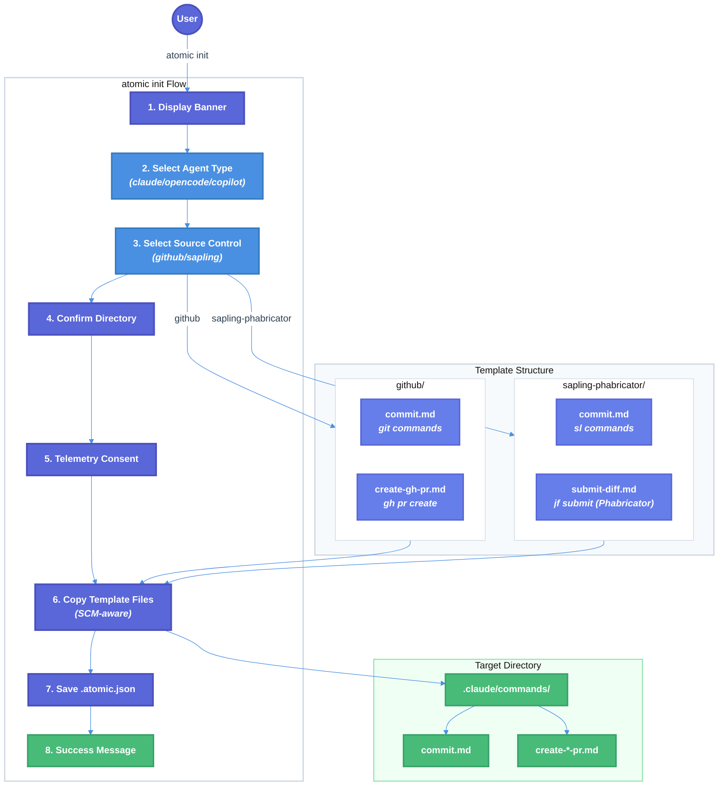

# Source Control Type Selection Technical Design Document

| Document Metadata      | Details        |
| ---------------------- | -------------- |
| Author(s)              | flora131       |
| Status                 | Draft (WIP)    |
| Team / Owner           | bastani/atomic |
| Created / Last Updated | 2026-02-11     |

## 1. Executive Summary

This RFC proposes extending the `atomic init` flow to include source control type selection, initially supporting **GitHub/Git** and **Sapling with Phabricator**, with future extensibility for Azure DevOps. The `/gh-commit` and `/gh-create-pr` disk-based command files are Git/GitHub-specific, limiting users of alternative SCM tools like Meta's Sapling with Phabricator code review.

The proposed solution introduces an SCM selection prompt during initialization that copies the appropriate SCM-specific command files to the user's configuration directory. This enables Sapling users to use native `sl` commands with Phabricator diff submission while maintaining the same developer experience.

**Key changes:**

- ~~**Remove SCM-related skills (`commit`, `create-gh-pr`) from `BUILTIN_SKILLS`**~~ — **COMPLETED** in the TUI merge (commit `aefdf73`). These skills are already removed from `BUILTIN_SKILLS` and exist only as disk-based `gh-commit.md` / `gh-create-pr.md` files.
- Add source control selection prompt after agent selection in `atomic init`
- Create Sapling-specific command file variants (`commit.md` with Sapling commands, `submit-diff.md` for Phabricator)
- **Windows support:** Auto-detect Windows via `isWindows()` and use Windows-specific Sapling templates with full executable path (`& 'C:\Program Files\Sapling\sl.exe'`) to avoid PowerShell `sl` alias conflict
- Implement SCM-aware file copying logic during initialization
- Store SCM selection in `.atomic.json` config for future reference

**Note on Sapling + Phabricator:** Sapling integrates with Phabricator (not GitHub) for code review when configured with the `fbcodereview` extension. Diffs are submitted to Phabricator using `jf submit` (Meta's internal submission tool) or `arc diff` (open-source Arcanist), and commits are linked via `Differential Revision:` lines in commit messages. Note: there is no top-level `sl submit` CLI command in open-source Sapling — submission is handled by external tools (`jf`, `arc`) or the ISL (Interactive Smartlog) web UI.

**Research Reference:** [research/docs/2026-02-10-source-control-type-selection.md](../research/docs/2026-02-10-source-control-type-selection.md)

## 2. Context and Motivation

### 2.1 Current State

The atomic CLI uses a well-structured agent configuration system that copies command files during `atomic init`. The recent TUI merge (`lavaman131/feature/tui`, commit `aefdf73`) introduced significant architectural changes including a simplified CLI surface, new TUI framework, and removal of embedded SCM skills.

**Architecture (Post-TUI Merge):**

- **CLI Framework:** Commander.js v14 (`src/cli.ts`) — migration already completed
- **Agent Config:** `src/config.ts` defines agent types (Claude, OpenCode, Copilot) with their config folders
- **Init Flow:** `src/commands/init.ts` handles interactive setup with `@clack/prompts`
- **Chat TUI:** `src/ui/chat.tsx` with OpenTUI (`@opentui/core` v0.1.79, `@opentui/react` v0.1.79)
- **CLI Commands:** `init` (default), `chat`, `config set`, `update`, `uninstall`
- **No `run-agent.ts`:** The `atomic run <agent>` command was removed. Users now use `atomic chat -a <agent>`.

**Current Agent Configuration** (`src/config.ts:5-24`):

```typescript
export interface AgentConfig {
    name: string; // Display name
    cmd: string; // Command to execute
    additional_flags: string[]; // Extra flags when spawning agent
    folder: string; // Config folder (.claude, .opencode, .github)
    install_url: string; // URL for installation instructions
    exclude: string[]; // Paths to exclude when copying
    additional_files: string[]; // Extra files to copy (CLAUDE.md, etc.)
    preserve_files: string[]; // Files to skip if user has customized
    merge_files: string[]; // Files to merge (.mcp.json)
}
```

**Current Command File Locations (Post-TUI Merge — note `gh-` prefix):**

| Agent    | Commands Location    | SCM-Specific Commands                                              |
| -------- | -------------------- | ------------------------------------------------------------------ |
| Claude   | `.claude/commands/`  | `gh-commit.md`, `gh-create-pr.md`                                  |
| OpenCode | `.opencode/command/` | `gh-commit.md`, `gh-create-pr.md`                                  |
| Copilot  | `.github/skills/`    | `gh-commit/SKILL.md`, `gh-create-pr/SKILL.md` (empty placeholders) |

**SCM Commands Analysis (from research):**

| Command         | Git Operations Used                                                        |
| --------------- | -------------------------------------------------------------------------- |
| `/gh-commit`    | `git status`, `git branch`, `git diff`, `git add`, `git commit`, `git log` |
| `/gh-create-pr` | `git push`, `gh pr create`                                                 |

**Built-in Skills Status in `skill-commands.ts` (Post-TUI Merge):**

The SCM-related skills (`commit`, `create-gh-pr`) have **already been removed** from `BUILTIN_SKILLS` and `SKILL_DEFINITIONS` in the TUI merge. The current `BUILTIN_SKILLS` array (`src/ui/commands/skill-commands.ts:72-1101`) contains only **5 non-SCM skills**:

| Skill                   | Lines    | Description                               |
| ----------------------- | -------- | ----------------------------------------- |
| `research-codebase`     | 73-279   | Document codebase with research directory |
| `create-spec`           | 280-518  | Create execution plan from research       |
| `explain-code`          | 519-726  | Explain code functionality                |
| `prompt-engineer`       | 727-903  | Create/improve prompts (pinned)           |
| `testing-anti-patterns` | 904-1100 | Identify testing anti-patterns (pinned)   |

`SKILL_DEFINITIONS` (lines 1113-1135) contains only 3 entries: `research-codebase`, `create-spec`, `explain-code`.

`PINNED_BUILTIN_SKILLS` (lines 1345-1348) contains: `prompt-engineer`, `testing-anti-patterns`.

The disk-based skill discovery system (lines 1331-1581) with priority resolution is fully implemented: pinned builtin > project > user > builtin (non-pinned).

**Limitations:**

1. Command files are Git/GitHub-specific with no alternative for Sapling users
2. No mechanism to select or configure SCM type during initialization
3. Users must manually modify command files to use Sapling
4. Command files are duplicated across agent folders with identical Git-based content

### 2.2 The Problem

- **User Impact:** Developers using Sapling SCM with Phabricator cannot use `/gh-commit` or `/gh-create-pr` commands without manual modification
- **Business Impact:** Meta and other companies using Sapling with Phabricator internally cannot adopt atomic without friction
- **Technical Debt:** Disk-based command files (`gh-commit.md`, `gh-create-pr.md`) contain hardcoded `git` commands that should be abstracted based on SCM choice

**Research Finding:** Only 2 disk-based commands currently use SCM-specific operations:

1. `/gh-commit` (`gh-commit.md`) — Uses `git status`, `git add`, `git commit`, `git log`, `git diff`
2. `/gh-create-pr` (`gh-create-pr.md`) — Uses `git push`, `gh pr create`

**Sapling + Phabricator Equivalents:**

1. `/commit` (`commit.md`) — Uses `sl status`, `sl add`, `sl commit`, `sl smartlog`, `sl diff`
2. `/submit-diff` (`submit-diff.md`) — Uses `jf submit` (or `arc diff`) to create/update Phabricator diffs

**Reference:** [Research Section "Commands That Use Source Control Tools"](../research/docs/2026-02-10-source-control-type-selection.md)

## 3. Goals and Non-Goals

### 3.1 Functional Goals

- [x] **Remove SCM-related skills from `BUILTIN_SKILLS`** in `skill-commands.ts` (`commit`, `create-gh-pr`) — **COMPLETED** in TUI merge
- [x] **Remove SCM-related entries from `SKILL_DEFINITIONS`** array (legacy references) — **COMPLETED** in TUI merge
- [ ] Add SCM type selection prompt to `atomic init` flow (after agent selection)
- [ ] Create Sapling-specific command file variants for `/commit` and `/submit-diff` (Phabricator)
- [ ] Implement SCM-aware file copying that places correct command files based on selection
- [ ] Store selected SCM type in `.atomic.json` configuration for future reference
- [ ] Auto-create config directory if it doesn't exist during init
- [ ] Support pre-selected SCM via `--scm` flag for non-interactive usage
- [ ] Update Ralph workflow to be SCM-aware using runtime detection from `.atomic.json`

### 3.2 Non-Goals (Out of Scope)

- [ ] We will NOT implement Azure DevOps support in this version (future extensibility only)
- [ ] We will NOT implement Sapling with GitHub (`sl pr`) — this spec supports **Sapling + Phabricator only**
- [ ] We will NOT implement auto-detection of SCM type (explicit user selection only)
- [ ] We will NOT support hybrid Sapling-on-Git repositories (Sapling running on top of a Git repo)
- [ ] We will NOT migrate existing installations to new SCM type (manual re-init required)
- [ ] We will NOT modify general-purpose commands (`/research-codebase`, `/create-spec`, etc.)
- [ ] We will NOT modify non-SCM skills in `BUILTIN_SKILLS` (e.g., `prompt-engineer`, `testing-anti-patterns`)

## 4. Proposed Solution (High-Level Design)

### 4.1 System Architecture Diagram



### 4.2 Architectural Pattern

**Template-based SCM Selection:** We extend the existing template copying pattern to include SCM-specific command file variants. The init flow gains a new step that determines which command file variants to copy.

**Key Design Decisions:**

1. **Explicit Selection:** Users explicitly choose their SCM type (no auto-detection)
2. **Template Separation:** SCM-specific commands stored in separate template directories
3. **Non-SCM Skills Unchanged:** Non-SCM skills remain in `BUILTIN_SKILLS` (no disk-based migration needed)
4. **Config Persistence:** SCM selection stored for future reference/re-initialization

**Reference:** [Research Section "Proposed Template Directory Structure - Option B"](../research/docs/2026-02-10-source-control-type-selection.md)

### 4.3 Key Components

| Component          | Current                                          | Proposed                                                  | Justification                            |
| ------------------ | ------------------------------------------------ | --------------------------------------------------------- | ---------------------------------------- |
| **Builtin Skills** | SCM skills already removed from `BUILTIN_SKILLS` | Disk-based `gh-commit.md`/`gh-create-pr.md` already exist | **DONE** — enables SCM-variant selection |
| SCM Config         | N/A                                              | `src/config.ts` - `SCM_CONFIG` object                     | Centralized SCM definitions              |
| Init Flow          | Agent selection only                             | Agent + SCM selection                                     | Enable SCM-specific commands             |
| Template Structure | Single command files per agent                   | SCM-variant directories in `templates/scm/`               | Clean separation of variants             |
| File Copy Logic    | `copyDirPreserving()` recursive copy             | SCM-aware selective copy via `copyScmCommands()`          | Copy correct variant based on selection  |
| Config Storage     | N/A                                              | `.atomic.json` in project root                            | Persist SCM selection                    |

## 5. Detailed Design

### 5.1 SCM Configuration Extension

**File:** `src/config.ts`

```typescript
// New type for source control systems
export type SourceControlType = "github" | "sapling-phabricator";
// Future: | 'azure-devops'

export interface ScmConfig {
    /** Internal identifier */
    name: string;
    /** Display name for prompts */
    displayName: string;
    /** Primary CLI tool (git or sl) */
    cliTool: string;
    /** Code review tool (gh, jf submit, arc diff, etc.) */
    reviewTool: string;
    /** Code review system (github, phabricator) */
    reviewSystem: string;
    /** Directory marker for potential future auto-detection */
    detectDir: string;
    /** Code review command file name */
    reviewCommandFile: string;
    /** Required configuration files */
    requiredConfigFiles?: string[];
}

export const SCM_CONFIG: Record<SourceControlType, ScmConfig> = {
    github: {
        name: "github",
        displayName: "GitHub / Git",
        cliTool: "git",
        reviewTool: "gh",
        reviewSystem: "github",
        detectDir: ".git",
        reviewCommandFile: "create-gh-pr.md",
    },
    "sapling-phabricator": {
        name: "sapling-phabricator",
        displayName: "Sapling + Phabricator",
        cliTool: "sl",
        reviewTool: "jf submit",
        reviewSystem: "phabricator",
        detectDir: ".sl",
        reviewCommandFile: "submit-diff.md",
        requiredConfigFiles: [".arcconfig", "~/.arcrc"],
    },
};

// Commands that have SCM-specific variants
export const SCM_SPECIFIC_COMMANDS = ["commit"];

// Helper functions
export function getScmKeys(): SourceControlType[] {
    return Object.keys(SCM_CONFIG) as SourceControlType[];
}

export function isValidScm(key: string): key is SourceControlType {
    return key in SCM_CONFIG;
}

export function getScmConfig(key: SourceControlType): ScmConfig {
    return SCM_CONFIG[key];
}
```

**Phabricator Configuration Notes:**

Sapling + Phabricator requires additional configuration files:

1. **`.arcconfig`** (in repository root):

```json
{
    "conduit_uri": "https://phabricator.example.com/api/",
    "project_id": "your-project-id"
}
```

2. **`~/.arcrc`** (in home directory):

```json
{
    "hosts": {
        "https://phabricator.example.com/api/": {
            "user": "username",
            "oauth": "your-oauth-token"
        }
    }
}
```

3. **Sapling config** (`~/.sapling/config` or `.hg/hgrc`):

```ini
[extensions]
fbcodereview =

[phabricator]
arcrc_host = https://phabricator.example.com/api/
graphql_host = https://phabricator.example.com/graphql
```

**Reference:** [Research Section "Proposed Configuration Extensions"](../research/docs/2026-02-10-source-control-type-selection.md)

### 5.2 Template Directory Structure

Adopt **Option B** from research - separate template directories per SCM, with **Windows-specific variants** for Sapling to handle the PowerShell `sl` alias conflict:

```
templates/
├── scm/
│   ├── github/
│   │   ├── .claude/
│   │   │   └── commands/
│   │   │       ├── commit.md           # Git-based commit
│   │   │       └── create-gh-pr.md     # gh pr create
│   │   ├── .opencode/
│   │   │   └── command/
│   │   │       ├── commit.md
│   │   │       └── create-gh-pr.md
│   │   └── .github/
│   │       └── skills/
│   │           ├── commit/
│   │           │   └── SKILL.md
│   │           └── create-gh-pr/
│   │               └── SKILL.md
│   │
│   ├── sapling-phabricator/
│   │   ├── .claude/
│   │   │   └── commands/
│   │   │       ├── commit.md           # Sapling-based commit (sl commands)
│   │   │       └── submit-diff.md      # jf submit (Phabricator)
│   │   ├── .opencode/
│   │   │   └── command/
│   │   │       ├── commit.md
│   │   │       └── submit-diff.md
│   │   └── .github/
│   │       └── skills/
│   │           ├── commit/
│   │           │   └── SKILL.md
│   │           └── submit-diff/
│   │               └── SKILL.md
│   │
│   └── sapling-phabricator-windows/    # Windows-specific variants
│       ├── .claude/
│       │   └── commands/
│       │       ├── commit.md           # Uses full path: & 'C:\Program Files\Sapling\sl.exe'
│       │       └── submit-diff.md      # Uses full path for sl.exe
│       ├── .opencode/
│       │   └── command/
│       │       ├── commit.md
│       │       └── submit-diff.md
│       └── .github/
│           └── skills/
│               ├── commit/
│               │   └── SKILL.md
│               └── submit-diff/
│                   └── SKILL.md
```

**Rationale:**

- Clean separation between SCM variants
- Non-SCM skills (e.g., `research-codebase`, `create-spec`, `prompt-engineer`) remain in `BUILTIN_SKILLS` and do not require disk-based templates
- Easy to add new SCM types (e.g., Azure DevOps) later
- Mirrors existing agent folder structure within each SCM directory
- `sapling-phabricator` naming makes the code review system explicit
- **Windows-specific Sapling templates** use full executable path to avoid PowerShell `sl` alias conflict

### 5.2.1 Windows Support for Sapling

**The Problem:** On Windows PowerShell, `sl` is a built-in alias for `Set-Location` (equivalent to `cd`). When an agent executes `sl status`, PowerShell interprets this as `Set-Location status` instead of invoking Sapling.

**Solution:** Create Windows-specific Sapling command files that use the full executable path:

```powershell
# Instead of: sl status
# Use: & 'C:\Program Files\Sapling\sl.exe' status
```

**Leveraging Existing Platform Detection:**

The codebase already has robust Windows detection in `src/utils/detect.ts`:

```typescript
// Existing functions we will use
export function isWindows(): boolean {
    return process.platform === "win32";
}

export function getOppositeScriptExtension(): string {
    return isWindows() ? ".sh" : ".ps1";
}
```

The init flow already uses `getOppositeScriptExtension()` to skip platform-inappropriate scripts. We extend this pattern for SCM template selection.

**SCM Template Resolution Logic:**

```typescript
/**
 * Get the appropriate SCM template directory based on OS and SCM selection.
 *
 * For Sapling on Windows, uses the windows-specific variant that includes
 * full paths to avoid the PowerShell `sl` alias conflict.
 */
function getScmTemplatePath(scmType: SourceControlType): string {
    if (scmType === "sapling-phabricator" && isWindows()) {
        return "sapling-phabricator-windows";
    }
    return scmType;
}
```

**Windows Sapling Command Invocation Pattern:**

All Windows Sapling command files use the full executable path with the PowerShell call operator:

```powershell
# Invoke Sapling commands using call operator with full path
& 'C:\Program Files\Sapling\sl.exe' status
& 'C:\Program Files\Sapling\sl.exe' commit -m "message"
jf submit
```

In the Markdown command files, this translates to:

```markdown
## Sapling Commands (Windows)

> **Note:** On Windows, Sapling is invoked via full path to avoid PowerShell alias conflicts.

- Sapling status: !`& 'C:\Program Files\Sapling\sl.exe' status`
- Current bookmark: !`& 'C:\Program Files\Sapling\sl.exe' bookmark`
```

### 5.3 Init Flow Extension

**File:** `src/commands/init.ts`

**Extended InitOptions Interface:**

```typescript
interface InitOptions {
    showBanner?: boolean;
    preSelectedAgent?: AgentKey;
    preSelectedScm?: SourceControlType; // NEW
    configNotFoundMessage?: string;
    force?: boolean;
    yes?: boolean;
}
```

**SCM Selection Prompt** (add after agent selection at line 135, before directory confirmation at line 142 in `initCommand()`):

```typescript
import {
    SCM_CONFIG,
    type SourceControlType,
    getScmKeys,
    isValidScm,
} from "../config";

// ... existing agent selection code ...

// NEW: Select source control type (after agent selection, before directory confirmation)
let scmType: SourceControlType;

if (options.preSelectedScm) {
    // Pre-selected SCM - validate and skip selection prompt
    if (!isValidScm(options.preSelectedScm)) {
        cancel(`Unknown source control: ${options.preSelectedScm}`);
        process.exit(1);
    }
    scmType = options.preSelectedScm;
    log.info(`Using ${SCM_CONFIG[scmType].displayName} for source control...`);
} else if (autoConfirm) {
    // Auto-confirm mode defaults to GitHub
    scmType = "github";
    log.info("Defaulting to GitHub/Git for source control...");
} else {
    // Interactive selection
    const scmOptions = getScmKeys().map((key) => ({
        value: key,
        label: SCM_CONFIG[key].displayName,
        hint: `Uses ${SCM_CONFIG[key].cliTool} + ${SCM_CONFIG[key].reviewSystem}`,
    }));

    const selectedScm = await select({
        message: "Select your source control system:",
        options: scmOptions,
    });

    if (isCancel(selectedScm)) {
        cancel("Operation cancelled.");
        process.exit(0);
    }

    scmType = selectedScm as SourceControlType;
}

// ... continue with directory confirmation ...
```

### 5.4 SCM-Aware File Copy Logic

**File:** `src/commands/init.ts`

New function to copy SCM-specific command files with **automatic Windows detection**:

```typescript
import { join } from "path";
import { SCM_CONFIG, type SourceControlType } from "../config";
import { isWindows } from "../utils/detect";

interface CopyScmCommandsOptions {
    scmType: SourceControlType;
    agentFolder: string; // e.g., ".claude"
    commandsSubfolder: string; // e.g., "commands" or "command"
    targetDir: string; // Project root
    configRoot: string; // Template root
}

/**
 * Get the appropriate SCM template directory based on OS and SCM selection.
 *
 * For Sapling on Windows, uses the windows-specific variant that includes
 * full paths to avoid the PowerShell `sl` alias conflict.
 *
 * This follows the existing pattern in the codebase where platform detection
 * is handled via `isWindows()` from `src/utils/detect.ts`.
 */
function getScmTemplatePath(scmType: SourceControlType): string {
    // Windows requires special handling for Sapling due to PowerShell `sl` alias
    if (scmType === "sapling-phabricator" && isWindows()) {
        return "sapling-phabricator-windows";
    }
    return scmType;
}

/**
 * Copy SCM-specific command files based on user's SCM selection.
 *
 * This copies from templates/scm/{scmTemplatePath}/{agentFolder}/{commandsSubfolder}/
 * to {targetDir}/{agentFolder}/{commandsSubfolder}/
 *
 * On Windows with Sapling, automatically uses Windows-specific templates
 * that invoke sl.exe via full path to avoid PowerShell alias conflicts.
 */
async function copyScmCommands(options: CopyScmCommandsOptions): Promise<void> {
    const { scmType, agentFolder, commandsSubfolder, targetDir, configRoot } =
        options;

    // Resolve platform-specific template path
    const scmTemplateDir = getScmTemplatePath(scmType);

    const scmTemplatePath = join(
        configRoot,
        "templates",
        "scm",
        scmTemplateDir,
        agentFolder,
        commandsSubfolder,
    );

    const targetPath = join(targetDir, agentFolder, commandsSubfolder);

    // Check if SCM template directory exists
    if (!(await pathExists(scmTemplatePath))) {
        // No SCM-specific version exists; non-SCM skills are provided via BUILTIN_SKILLS
        return;
    }

    // Log platform-specific selection in debug mode
    if (process.env.DEBUG === "1") {
        if (scmType === "sapling-phabricator" && isWindows()) {
            console.log(
                `[DEBUG] Using Windows-specific Sapling templates (full path to sl.exe)`,
            );
        }
        console.log(`[DEBUG] Copying SCM templates from: ${scmTemplatePath}`);
    }

    // Copy SCM-specific command files (overwrites base commands)
    await copyDirPreserving(scmTemplatePath, targetPath);
}

/**
 * Get the commands subfolder name for each agent type.
 */
function getCommandsSubfolder(agentKey: AgentKey): string {
    switch (agentKey) {
        case "claude":
            return "commands";
        case "opencode":
            return "command";
        case "copilot":
            return "skills";
        default:
            return "commands";
    }
}
```

**Integration into main init flow:**

```typescript
// After copying base template folder
await copyDirPreserving(sourceFolder, targetFolder, {
    exclude: agent.exclude,
});

// NEW: Copy SCM-specific command files (overwrites base versions)
await copyScmCommands({
    scmType,
    agentFolder: agent.folder,
    commandsSubfolder: getCommandsSubfolder(agentKey),
    targetDir,
    configRoot,
});

// Save SCM selection to config
await saveAtomicConfig(targetDir, { scm: scmType, agent: agentKey });
```

### 5.5 Atomic Config File

**File:** `src/utils/atomic-config.ts` (new file)

```typescript
import { join } from "path";
import { readFile, writeFile } from "fs/promises";
import type { SourceControlType } from "../config";
import type { AgentKey } from "../config";

const CONFIG_FILENAME = ".atomic.json";

export interface AtomicConfig {
    /** Version of config schema */
    version?: number;
    /** Selected agent type */
    agent?: AgentKey;
    /** Selected source control type */
    scm?: SourceControlType;
    /** Timestamp of last init */
    lastUpdated?: string;
}

/**
 * Read atomic config from project directory.
 */
export async function readAtomicConfig(
    projectDir: string,
): Promise<AtomicConfig | null> {
    const configPath = join(projectDir, CONFIG_FILENAME);
    try {
        const content = await readFile(configPath, "utf-8");
        return JSON.parse(content) as AtomicConfig;
    } catch {
        return null;
    }
}

/**
 * Save atomic config to project directory.
 */
export async function saveAtomicConfig(
    projectDir: string,
    updates: Partial<AtomicConfig>,
): Promise<void> {
    const configPath = join(projectDir, CONFIG_FILENAME);
    const existing = (await readAtomicConfig(projectDir)) ?? {};

    const newConfig: AtomicConfig = {
        ...existing,
        ...updates,
        version: 1,
        lastUpdated: new Date().toISOString(),
    };

    await writeFile(
        configPath,
        JSON.stringify(newConfig, null, 2) + "\n",
        "utf-8",
    );
}

/**
 * Get the selected SCM type from atomic config, or null if not set.
 */
export async function getSelectedScm(
    projectDir: string,
): Promise<SourceControlType | null> {
    const config = await readAtomicConfig(projectDir);
    return config?.scm ?? null;
}
```

**Example `.atomic.json` file:**

```json
{
    "version": 1,
    "agent": "claude",
    "scm": "sapling-phabricator",
    "lastUpdated": "2026-02-10T12:00:00.000Z"
}
```

### 5.6 Sapling Command File: commit.md

**File:** `templates/scm/sapling-phabricator/.claude/commands/commit.md`

```markdown
---
description: Create well-formatted commits with conventional commit format using Sapling.
model: opus
allowed-tools: Bash(sl add:*), Bash(sl status:*), Bash(sl commit:*), Bash(sl diff:*), Bash(sl smartlog:*), Bash(sl amend:*), Bash(sl absorb:*)
argument-hint: [message] | --amend
---

# Smart Sapling Commit

Create well-formatted commit: $ARGUMENTS

## Current Repository State

- Sapling status: !`sl status`
- Current bookmark: !`sl bookmark`
- Recent commits (smartlog): !`sl smartlog -l 5`
- Pending changes: !`sl diff --stat`

## What This Command Does

1. Checks which files have changes with `sl status`
2. If there are untracked files to include, adds them with `sl add`
3. Performs a `sl diff` to understand what changes are being committed
4. Analyzes the diff to determine if multiple distinct logical changes are present
5. If multiple distinct changes are detected, suggests breaking the commit into multiple smaller commits
6. For each commit (or the single commit if not split), creates a commit message using conventional commit format

## Key Sapling Differences from Git

- **No staging area**: Sapling commits all pending changes directly (no separate "git add" step for staging)
- **Amend with auto-restack**: `sl amend` automatically rebases descendant commits
- **Smartlog**: Use `sl smartlog` or `sl ssl` for graphical commit history with diff status
- **Absorb**: Use `sl absorb` to intelligently integrate pending changes into the right commits in a stack
- **Stacked Diffs**: Each commit in a stack becomes a separate Phabricator diff when submitted

## Sapling Commit Commands Reference

| Command                  | Description                                     |
| ------------------------ | ----------------------------------------------- |
| `sl commit -m "message"` | Create a new commit with message                |
| `sl commit -A`           | Add untracked files and commit                  |
| `sl amend`               | Amend current commit (auto-rebases descendants) |
| `sl amend --to COMMIT`   | Amend changes to a specific commit in stack     |
| `sl absorb`              | Intelligently absorb changes into stack commits |
| `sl fold --from .^`      | Combine parent commit into current              |

## Best Practices for Commits

- Follow the Conventional Commits specification as described below.
- Keep commits small and focused - each commit becomes a separate Phabricator diff
- Use `sl amend` freely - Sapling handles rebasing automatically

# Conventional Commits 1.0.0

## Summary

The Conventional Commits specification is a lightweight convention on top of commit messages. It provides an easy set of rules for creating an explicit commit history.

The commit message should be structured as follows:
```

<type>[optional scope]: <description>

[optional body]

[optional footer(s)]

```

## Commit Types

1. **fix:** patches a bug in your codebase (correlates with PATCH in SemVer)
2. **feat:** introduces a new feature (correlates with MINOR in SemVer)
3. **BREAKING CHANGE:** introduces a breaking API change (correlates with MAJOR in SemVer)
4. Other types: `build:`, `chore:`, `ci:`, `docs:`, `style:`, `refactor:`, `perf:`, `test:`

## Examples

### Simple commit
```

docs: correct spelling of CHANGELOG

```

### Commit with scope
```

feat(lang): add Polish language

```

### Breaking change
```

feat!: send an email to the customer when a product is shipped

BREAKING CHANGE: `extends` key in config file is now used for extending other config files

```

## Important Notes

- By default, pre-commit checks (defined in `.pre-commit-config.yaml`) will run to ensure code quality
- IMPORTANT: DO NOT SKIP pre-commit checks
- ALWAYS attribute AI-Assisted Code Authorship
- Before committing, the command will review the diff to ensure the message matches the changes
- When submitting to Phabricator, each commit becomes a separate diff with `Differential Revision:` line added
```

**Reference:** [Research Section "Git → Sapling Command Mapping for /commit"](../research/docs/2026-02-10-source-control-type-selection.md) and [Sapling Reference Guide](../research/docs/sapling-reference.md)

### 5.7 Sapling Command File: submit-diff.md (Phabricator)

**File:** `templates/scm/sapling-phabricator/.claude/commands/submit-diff.md`

````markdown
---
description: Submit commits as Phabricator diffs for code review using Sapling.
model: opus
allowed-tools: Bash(sl:*), Bash(jf:*), Glob, Grep, NotebookRead, Read, SlashCommand
argument-hint: [--update "message"]
---

# Submit Diff Command (Sapling + Phabricator)

Submit commits to Phabricator for code review using `jf submit` (Meta) or `arc diff` (open-source Phabricator).

## Current Repository State

- Sapling status: !`sl status`
- Current bookmark: !`sl bookmark`
- Recent commits with diff status: !`sl ssl`
- Pending changes: !`sl diff --stat`

## Behavior

1. If there are uncommitted changes, first run `/commit` to create a commit
2. Submit commits to Phabricator using `jf submit` (or `arc diff` for open-source Phabricator)
3. Each commit in the stack becomes a separate Phabricator diff (D12345)
4. Commit messages are updated with `Differential Revision:` link

## Sapling + Phabricator Workflow

The `jf submit` command (Meta's internal tool) submits commits to Phabricator for code review. For open-source Phabricator deployments, `arc diff` serves the same purpose. Note: there is no top-level `sl submit` CLI command in Sapling — submission is handled by these external tools or the ISL web UI.

The submission process:

- Creates a new diff if none exists for the commit
- Updates existing diff if one is already linked (via `Differential Revision:` in commit message)
- Handles stacked diffs with proper dependency relationships

### Common Operations

| Task                           | Command                                  |
| ------------------------------ | ---------------------------------------- |
| Submit current commit          | `jf submit`                              |
| Submit as draft                | Via ISL web UI only (no CLI flag)        |
| Update diff after amend        | `sl amend && jf submit`                  |
| View diff status               | `sl ssl` (shows diff status in smartlog) |
| Check sync status              | `sl log -T '{syncstatus}\n' -r .`        |
| Get diff ID                    | `sl log -T '{phabdiff}\n' -r .`          |
| View changes since last submit | `sl diff --since-last-submit`            |

### Diff Status Values

The `{phabstatus}` template keyword shows:

- `Needs Review` - Awaiting reviewer feedback
- `Accepted` - Ready to land
- `Needs Revision` - Reviewer requested changes
- `Needs Final Review` - Waiting for final approval
- `Committed` - Diff has been landed
- `Committing` - Landing recently succeeded
- `Abandoned` - Diff was closed without landing
- `Unpublished` - Draft diff
- `Landing` - Currently being landed
- `Recently Failed to Land` - Landing attempt failed

## Stacked Diffs

Sapling naturally supports stacked commits. When submitting:

- Each commit in the stack gets its own Phabricator diff (D12345, D12346, D12347)
- Diffs are linked with proper dependency relationships
- Reviewers can review each diff independently

```bash
# Create a stack
sl commit -m "feat: add base functionality"
sl commit -m "feat: add validation layer"
sl commit -m "feat: add error handling"

# Submit entire stack
jf submit
```
````

## Prerequisites

1. **`.arcconfig`** must exist in repository root with Phabricator URL
2. **`~/.arcrc`** must contain authentication credentials
3. **`fbcodereview`** extension must be enabled in Sapling config

## Configuration Verification

```bash
# Verify .arcconfig exists
cat .arcconfig

# Verify authentication
sl log -T '{phabstatus}\n' -r .  # Should not error
```

## After Diff is Approved

Once a diff is accepted in Phabricator:

1. The diff can be "landed" (merged to main branch)
2. Sapling automatically marks landed commits as hidden
3. Use `sl ssl` to verify the diff shows as `Committed`

## Notes

- Unlike GitHub PRs, Phabricator diffs are tied to commits via the `Differential Revision:` line
- Use `sl diff --since-last-submit` to see what changed since last submission
- The ISL (Interactive Smartlog) web UI also supports submitting diffs

````

**Reference:** [Sapling Reference Guide - Phabricator Integration](../research/docs/sapling-reference.md)

### 5.7.1 Windows-Specific Sapling Command Files

On Windows, Sapling command files use the full executable path to avoid the PowerShell `sl` alias conflict. These are automatically selected when `isWindows()` returns `true` during `atomic init`.

**File:** `templates/scm/sapling-phabricator-windows/.claude/commands/commit.md`

```markdown
---
description: Create well-formatted commits with conventional commit format using Sapling (Windows).
model: opus
allowed-tools: Bash(& 'C:\\Program Files\\Sapling\\sl.exe':*), Bash(sl.exe:*)
argument-hint: [message] | --amend
---

# Smart Sapling Commit (Windows)

Create well-formatted commit: $ARGUMENTS

> **Windows Note:** This command uses the full path to `sl.exe` to avoid conflicts with PowerShell's built-in `sl` alias for `Set-Location`.

## Current Repository State

- Sapling status: !`& 'C:\Program Files\Sapling\sl.exe' status`
- Current bookmark: !`& 'C:\Program Files\Sapling\sl.exe' bookmark`
- Recent commits (smartlog): !`& 'C:\Program Files\Sapling\sl.exe' smartlog -l 5`
- Pending changes: !`& 'C:\Program Files\Sapling\sl.exe' diff --stat`

## What This Command Does

1. Checks which files have changes with `& 'C:\Program Files\Sapling\sl.exe' status`
2. If there are untracked files to include, adds them with `& 'C:\Program Files\Sapling\sl.exe' add`
3. Performs a diff to understand what changes are being committed
4. Analyzes the diff to determine if multiple distinct logical changes are present
5. If multiple distinct changes are detected, suggests breaking the commit into multiple smaller commits
6. For each commit (or the single commit if not split), creates a commit message using conventional commit format

## Key Sapling Differences from Git

- **No staging area**: Sapling commits all pending changes directly (no separate "git add" step for staging)
- **Amend with auto-restack**: `sl amend` automatically rebases descendant commits
- **Smartlog**: Use `sl smartlog` or `sl ssl` for graphical commit history with diff status
- **Absorb**: Use `sl absorb` to intelligently integrate pending changes into the right commits in a stack
- **Stacked Diffs**: Each commit in a stack becomes a separate Phabricator diff when submitted

## Sapling Commit Commands Reference (Windows)

| Command | Description |
|---------|-------------|
| `& 'C:\Program Files\Sapling\sl.exe' commit -m "message"` | Create a new commit with message |
| `& 'C:\Program Files\Sapling\sl.exe' commit -A` | Add untracked files and commit |
| `& 'C:\Program Files\Sapling\sl.exe' amend` | Amend current commit (auto-rebases descendants) |
| `& 'C:\Program Files\Sapling\sl.exe' amend --to COMMIT` | Amend changes to a specific commit in stack |
| `& 'C:\Program Files\Sapling\sl.exe' absorb` | Intelligently absorb changes into stack commits |
| `& 'C:\Program Files\Sapling\sl.exe' fold --from .^` | Combine parent commit into current |

## Best Practices for Commits

- Follow the Conventional Commits specification
- Keep commits small and focused - each commit becomes a separate Phabricator diff
- Use `sl amend` freely - Sapling handles rebasing automatically

[... Conventional Commits specification same as Unix version ...]
````

**File:** `templates/scm/sapling-phabricator-windows/.claude/commands/submit-diff.md`

````markdown
---
description: Submit commits as Phabricator diffs for code review using Sapling (Windows).
model: opus
allowed-tools: Bash(& 'C:\\Program Files\\Sapling\\sl.exe':*), Bash(sl.exe:*), Bash(jf:*), Glob, Grep, NotebookRead, Read, SlashCommand
argument-hint: [--update "message"]
---

# Submit Diff Command (Sapling + Phabricator - Windows)

Submit commits to Phabricator for code review using `jf submit` (Meta) or `arc diff` (open-source Phabricator).

> **Windows Note:** This command uses the full path to `sl.exe` to avoid conflicts with PowerShell's built-in `sl` alias.

## Current Repository State

- Sapling status: !`& 'C:\Program Files\Sapling\sl.exe' status`
- Current bookmark: !`& 'C:\Program Files\Sapling\sl.exe' bookmark`
- Recent commits with diff status: !`& 'C:\Program Files\Sapling\sl.exe' ssl`
- Pending changes: !`& 'C:\Program Files\Sapling\sl.exe' diff --stat`

## Behavior

1. If there are uncommitted changes, first run `/commit` to create a commit
2. Submit commits to Phabricator using `jf submit` (or `arc diff` for open-source Phabricator)
3. Each commit in the stack becomes a separate Phabricator diff (D12345)
4. Commit messages are updated with `Differential Revision:` link

## Sapling + Phabricator Workflow (Windows)

The submit command submits commits to Phabricator for code review:

- Creates a new diff if none exists for the commit
- Updates existing diff if one is already linked (via `Differential Revision:` in commit message)
- Handles stacked diffs with proper dependency relationships

### Common Operations (Windows)

| Task                    | Command                                                            |
| ----------------------- | ------------------------------------------------------------------ |
| Submit current commit   | `jf submit`                                                        |
| Submit as draft         | Via ISL web UI only (no CLI flag)                                  |
| Update diff after amend | `& 'C:\Program Files\Sapling\sl.exe' amend; jf submit`             |
| View diff status        | `& 'C:\Program Files\Sapling\sl.exe' ssl`                          |
| Check sync status       | `& 'C:\Program Files\Sapling\sl.exe' log -T '{syncstatus}\n' -r .` |

## Prerequisites

1. **`.arcconfig`** must exist in repository root with Phabricator URL
2. **`~/.arcrc`** must contain authentication credentials
3. **`fbcodereview`** extension must be enabled in Sapling config

## Configuration Verification (Windows)

```powershell
# Verify Sapling installation
& 'C:\Program Files\Sapling\sl.exe' version

# Verify .arcconfig exists
Get-Content .arcconfig

# Verify authentication
& 'C:\Program Files\Sapling\sl.exe' log -T '{phabstatus}\n' -r .
```
````

## Notes

- Unlike GitHub PRs, Phabricator diffs are tied to commits via the `Differential Revision:` line
- Use `& 'C:\Program Files\Sapling\sl.exe' diff --since-last-submit` to see what changed since last submission
- The ISL (Interactive Smartlog) web UI also supports submitting diffs and works identically on Windows

````

**Key Differences in Windows Command Files:**

| Aspect | Unix Version | Windows Version |
|--------|--------------|-----------------|
| Command invocation | `sl status` | `& 'C:\Program Files\Sapling\sl.exe' status` |
| Allowed tools | `Bash(sl:*)` | `Bash(& 'C:\\Program Files\\Sapling\\sl.exe':*)` |
| Path separator | N/A | Backslashes with proper escaping |
| Shell syntax | Bash | PowerShell |

### 5.7.2 Copilot SKILL.md Files for Sapling+Phabricator

> **Important:** Copilot CLI has **no built-in Sapling or Phabricator support** — it only supports Git natively. Unlike the existing GitHub/Git stubs (`.github/skills/gh-commit/SKILL.md`, `.github/skills/gh-create-pr/SKILL.md`) which can be empty because Copilot falls back to native git capabilities, the Sapling+Phabricator SKILL.md files **must contain full instructions**. Without content, Copilot will default to `git` commands and fail in a Sapling repository.

**File:** `templates/scm/sapling-phabricator/.github/skills/commit/SKILL.md`

```markdown
---
name: sapling-commit
description: Create well-formatted commits using Sapling SCM (sl commands). Use this skill when the user asks to commit changes in a Sapling repository, or when you detect a .sl/ directory indicating Sapling is in use.
---

# Smart Sapling Commit

Create well-formatted commits using Sapling SCM with conventional commit format.

## Detecting Sapling Repository

If a `.sl/` directory exists at the repository root, this is a Sapling repository. Use `sl` commands instead of `git`.

## Current Repository State

Run these commands to understand the current state:

```bash
sl status
sl bookmark
sl smartlog -l 5
sl diff --stat
````

## Commit Workflow

1. Check which files have changes with `sl status`
2. If there are untracked files to include, add them with `sl add`
3. Run `sl diff` to understand what changes are being committed
4. Analyze the diff for distinct logical changes — split into multiple commits if needed
5. Create a commit using conventional commit format: `sl commit -m "<type>: <description>"`

## Key Sapling Differences from Git

- **No staging area**: Sapling commits all pending changes directly (no `git add` staging step)
- **Amend with auto-restack**: `sl amend` automatically rebases descendant commits
- **Smartlog**: Use `sl smartlog` or `sl ssl` for graphical commit history with diff status
- **Absorb**: Use `sl absorb` to intelligently integrate pending changes into the right commits in a stack
- **Stacked Diffs**: Each commit in a stack becomes a separate Phabricator diff when submitted

## Sapling Commit Commands

| Command                  | Description                                     |
| ------------------------ | ----------------------------------------------- |
| `sl commit -m "message"` | Create a new commit with message                |
| `sl commit -A`           | Add untracked files and commit                  |
| `sl amend`               | Amend current commit (auto-rebases descendants) |
| `sl amend --to COMMIT`   | Amend changes to a specific commit in stack     |
| `sl absorb`              | Intelligently absorb changes into stack commits |
| `sl fold --from .^`      | Combine parent commit into current              |

## Conventional Commits Format

Use the format: `<type>[optional scope]: <description>`

Types: `feat:`, `fix:`, `build:`, `chore:`, `ci:`, `docs:`, `style:`, `refactor:`, `perf:`, `test:`

## Best Practices

- Keep commits small and focused — each commit becomes a separate Phabricator diff
- Use `sl amend` freely — Sapling handles rebasing automatically
- IMPORTANT: DO NOT SKIP pre-commit checks
- ALWAYS attribute AI-Assisted Code Authorship

````

**File:** `templates/scm/sapling-phabricator/.github/skills/submit-diff/SKILL.md`

```markdown
---
name: sapling-submit-diff
description: Submit commits as Phabricator diffs for code review. Use this skill when the user asks to submit code for review, create a diff, or push changes in a Sapling+Phabricator repository.
---

# Submit Diff (Sapling + Phabricator)

Submit commits to Phabricator for code review using `jf submit` (Meta) or `arc diff` (open-source Phabricator).

## Current Repository State

Run these commands to understand the current state:

```bash
sl status
sl bookmark
sl ssl
sl diff --stat
````

## Submission Workflow

1. If there are uncommitted changes, first commit them using `sl commit`
2. Submit commits to Phabricator:
    ```bash
    jf submit
    ```
3. Each commit in the stack becomes a separate Phabricator diff (D12345)
4. Commit messages are automatically updated with `Differential Revision:` link

## Common Operations

| Task                           | Command                                  |
| ------------------------------ | ---------------------------------------- |
| Submit current commit          | `jf submit`                              |
| Update diff after amend        | `sl amend && jf submit`                  |
| View diff status               | `sl ssl` (shows diff status in smartlog) |
| Check sync status              | `sl log -T '{syncstatus}\n' -r .`        |
| Get diff ID                    | `sl log -T '{phabdiff}\n' -r .`          |
| View changes since last submit | `sl diff --since-last-submit`            |

## Stacked Diffs

Sapling naturally supports stacked commits. When submitting:

- Each commit in the stack gets its own Phabricator diff
- Diffs are linked with proper dependency relationships
- Reviewers can review each diff independently

## After Diff is Approved

Once a diff is accepted in Phabricator:

1. The diff can be "landed" (merged to main branch)
2. Sapling automatically marks landed commits as hidden
3. Use `sl ssl` to verify the diff shows as `Committed`

## Prerequisites

1. `.arcconfig` must exist in repository root with Phabricator URL
2. `~/.arcrc` must contain authentication credentials
3. `fbcodereview` extension must be enabled in Sapling config

````

**File:** `templates/scm/sapling-phabricator-windows/.github/skills/commit/SKILL.md`

```markdown
---
name: sapling-commit
description: Create well-formatted commits using Sapling SCM on Windows. Use this skill when the user asks to commit changes in a Sapling repository on Windows, or when you detect a .sl/ directory indicating Sapling is in use.
---

# Smart Sapling Commit (Windows)

Create well-formatted commits using Sapling SCM with conventional commit format.

> **Windows Note:** Use the full path to `sl.exe` to avoid conflicts with PowerShell's built-in `sl` alias for `Set-Location`.

## Detecting Sapling Repository

If a `.sl/` directory exists at the repository root, this is a Sapling repository. Use Sapling commands instead of `git`.

## Current Repository State

Run these commands to understand the current state:

```powershell
& 'C:\Program Files\Sapling\sl.exe' status
& 'C:\Program Files\Sapling\sl.exe' bookmark
& 'C:\Program Files\Sapling\sl.exe' smartlog -l 5
& 'C:\Program Files\Sapling\sl.exe' diff --stat
````

## Commit Workflow

1. Check which files have changes with `& 'C:\Program Files\Sapling\sl.exe' status`
2. If there are untracked files to include, add them with `& 'C:\Program Files\Sapling\sl.exe' add`
3. Run `& 'C:\Program Files\Sapling\sl.exe' diff` to understand what changes are being committed
4. Analyze the diff for distinct logical changes — split into multiple commits if needed
5. Create a commit: `& 'C:\Program Files\Sapling\sl.exe' commit -m "<type>: <description>"`

## Key Sapling Differences from Git

- **No staging area**: Sapling commits all pending changes directly (no `git add` staging step)
- **Amend with auto-restack**: `sl amend` automatically rebases descendant commits
- **Smartlog**: Use `sl smartlog` or `sl ssl` for graphical commit history with diff status
- **Absorb**: Use `sl absorb` to intelligently integrate pending changes into the right commits in a stack

## Sapling Commit Commands (Windows)

| Command                                                   | Description                                     |
| --------------------------------------------------------- | ----------------------------------------------- |
| `& 'C:\Program Files\Sapling\sl.exe' commit -m "message"` | Create a new commit                             |
| `& 'C:\Program Files\Sapling\sl.exe' commit -A`           | Add untracked files and commit                  |
| `& 'C:\Program Files\Sapling\sl.exe' amend`               | Amend current commit (auto-rebases descendants) |
| `& 'C:\Program Files\Sapling\sl.exe' absorb`              | Intelligently absorb changes into stack commits |

## Conventional Commits Format

Use the format: `<type>[optional scope]: <description>`

Types: `feat:`, `fix:`, `build:`, `chore:`, `ci:`, `docs:`, `style:`, `refactor:`, `perf:`, `test:`

````

**File:** `templates/scm/sapling-phabricator-windows/.github/skills/submit-diff/SKILL.md`

```markdown
---
name: sapling-submit-diff
description: Submit commits as Phabricator diffs for code review on Windows. Use this skill when the user asks to submit code for review, create a diff, or push changes in a Sapling+Phabricator repository on Windows.
---

# Submit Diff (Sapling + Phabricator - Windows)

Submit commits to Phabricator for code review using `jf submit` (Meta) or `arc diff` (open-source Phabricator).

> **Windows Note:** Sapling commands use the full path to `sl.exe` to avoid PowerShell's `sl` alias conflict.

## Current Repository State

```powershell
& 'C:\Program Files\Sapling\sl.exe' status
& 'C:\Program Files\Sapling\sl.exe' bookmark
& 'C:\Program Files\Sapling\sl.exe' ssl
& 'C:\Program Files\Sapling\sl.exe' diff --stat
````

## Submission Workflow

1. If there are uncommitted changes, first commit them
2. Submit commits to Phabricator:
    ```powershell
    jf submit
    ```
3. Each commit in the stack becomes a separate Phabricator diff (D12345)

## Common Operations (Windows)

| Task                    | Command                                                            |
| ----------------------- | ------------------------------------------------------------------ |
| Submit current commit   | `jf submit`                                                        |
| Update diff after amend | `& 'C:\Program Files\Sapling\sl.exe' amend; jf submit`             |
| View diff status        | `& 'C:\Program Files\Sapling\sl.exe' ssl`                          |
| Check sync status       | `& 'C:\Program Files\Sapling\sl.exe' log -T '{syncstatus}\n' -r .` |

## Prerequisites

1. `.arcconfig` must exist in repository root with Phabricator URL
2. `~/.arcrc` must contain authentication credentials
3. `fbcodereview` extension must be enabled in Sapling config

## Configuration Verification

```powershell
& 'C:\Program Files\Sapling\sl.exe' version
Get-Content .arcconfig
& 'C:\Program Files\Sapling\sl.exe' log -T '{phabstatus}\n' -r .
```

````

### 5.8 Commands Summary

Based on research analysis and the current codebase state (post-TUI merge), here is the full command classification:

| Command               | Category       | Uses SCM? | GitHub Variant        | Sapling+Phabricator Variant | Current Status / Action                   |
| --------------------- | -------------- | --------- | --------------------- | --------------------------- | ----------------------------------------- |
| `gh-commit`           | disk-based     | **YES**   | `gh-commit.md` (git)  | `commit.md` (sl)            | **Already disk-based** — needs SCM variant |
| `gh-create-pr`        | disk-based     | **YES**   | `gh-create-pr.md`     | N/A                         | **Already disk-based** — GitHub-only       |
| `submit-diff`         | disk-based     | **YES**   | N/A                   | `submit-diff.md` (jf submit)| NEW: Phabricator diff submission          |
| `research-codebase`   | builtin skill  | No        | -                     | -                           | Keep in BUILTIN_SKILLS (no SCM dependency) |
| `create-spec`         | builtin skill  | No        | -                     | -                           | Keep in BUILTIN_SKILLS (no SCM dependency) |
| `explain-code`        | builtin skill  | No        | -                     | -                           | Keep in BUILTIN_SKILLS (no SCM dependency) |
| `prompt-engineer`     | pinned builtin | No        | -                     | -                           | Keep in BUILTIN_SKILLS (pinned)           |
| `testing-anti-patterns` | pinned builtin | No      | -                     | -                           | Keep in BUILTIN_SKILLS (pinned)           |
| `/help`, `/theme`, etc. | builtin      | No        | -                     | -                           | No change (UI commands)                   |
| `/ralph`              | workflow       | **YES**   | `/commit` (git log)   | `/commit` (sl smartlog)     | Currently uses `/commit` only; PR/diff submission NOT yet implemented |

**Note:** `implement-feature` is no longer a separate skill — it is now handled through the Ralph workflow's two-step SDK session model.

**Current State:** The `commit` and `create-gh-pr` skills have **already been removed** from `BUILTIN_SKILLS` in `skill-commands.ts` (completed in TUI merge, commit `aefdf73`). They now exist only as disk-based `gh-commit.md` / `gh-create-pr.md` files. The disk-based skill discovery system (lines 1331-1581 in `skill-commands.ts`) handles loading these files with priority resolution.

**What Remains:** Create SCM-specific template variants in `templates/scm/` so the init flow can copy the correct variant based on the user's SCM selection. For GitHub users, the existing `gh-commit.md` / `gh-create-pr.md` files serve as the source. For Sapling+Phabricator users, new `commit.md` / `submit-diff.md` files will be created.

**Sapling + Phabricator Notes:**
- The `submit-diff` command replaces `gh-create-pr` for Phabricator workflows
- Phabricator uses "diffs" (D12345) instead of "pull requests"
- Each commit becomes a separate diff when submitted via `jf submit`

**Reference:** [Research Section "Commands Summary Table"](../research/docs/2026-02-10-source-control-type-selection.md)

### 5.9 Migration from Built-in to Disk-Based Skills — ✅ COMPLETED

> **Status: COMPLETED in TUI merge (commit `aefdf73`).** No further action required for this section.

The SCM-related skills have **already been removed** from `BUILTIN_SKILLS` and `SKILL_DEFINITIONS` in `skill-commands.ts`:

| Skill | Previous Location | Current Location |
|-------|-------------------|------------------|
| `commit` → `gh-commit` | Was in `BUILTIN_SKILLS` | `.claude/commands/gh-commit.md` (244 lines, disk-based) |
| `create-gh-pr` → `gh-create-pr` | Was in `BUILTIN_SKILLS` | `.claude/commands/gh-create-pr.md` (14 lines, disk-based) |

**What was completed:**
- ✅ `commit` and `create-gh-pr` removed from `BUILTIN_SKILLS` array
- ✅ Corresponding entries removed from `SKILL_DEFINITIONS` array
- ✅ Command files renamed with `gh-` prefix (`gh-commit.md`, `gh-create-pr.md`)
- ✅ Disk-based skill discovery system fully implemented (lines 1331-1581)
- ✅ Priority resolution: pinned builtin > project > user > builtin (non-pinned)
- ✅ Files replicated for all agent types (Claude, OpenCode, Copilot) — **Note:** For **GitHub/Git**, Copilot SKILL.md files (`.github/skills/gh-commit/SKILL.md`, `.github/skills/gh-create-pr/SKILL.md`) are intentionally empty (0 bytes) stubs because Copilot CLI has native git/GitHub support and handles commit/PR through built-in capabilities. The Atomic CLI's `loadSkillContent()` fallback (`skill-commands.ts:1497-1512`) delegates to the agent's native skill system when disk files are empty. **However, for Sapling+Phabricator**, Copilot SKILL.md files **must contain full instructions** because Copilot CLI has no built-in Sapling or Phabricator support — it is Git-only. See Section 5.7.2 for the complete Copilot SKILL.md templates.

**Remaining work (this spec):**
1. Move existing `gh-commit.md` / `gh-create-pr.md` into `templates/scm/github/` directories
2. Create Sapling variants (`commit.md`, `submit-diff.md`) in `templates/scm/sapling-phabricator/` directories for Claude and OpenCode
3. Create Copilot Sapling SKILL.md files with **full instructions** (see Section 5.7.2) — cannot be empty stubs
4. Create Windows-specific Sapling variants in `templates/scm/sapling-phabricator-windows/` for all three agents
5. Implement SCM selection in init flow to copy the correct variant

### 5.10 Ralph Workflow SCM-Awareness

Ralph currently only uses `/commit` for committing changes and `git log` for history. Ralph does **NOT** create PRs or submit diffs, and this spec does not propose adding that functionality.

The only change needed is making `buildImplementFeaturePrompt()` in `src/graph/nodes/ralph-nodes.ts` SCM-aware for its history and commit command references:

**Current State of `src/graph/nodes/ralph-nodes.ts`** (147 lines, 3 exported functions):

| Function | Lines | Purpose |
|----------|-------|---------|
| `buildSpecToTasksPrompt(specContent)` | 10-50 | Creates prompt to decompose a spec into ordered task JSON |
| `buildTaskListPreamble(tasks)` | 53-68 | Creates preamble with task list JSON for context reinsertion after clearing |
| `buildImplementFeaturePrompt()` | 71-147 | Master prompt for single feature implementation loop |

#### Implementation Approach

**Update `buildImplementFeaturePrompt()` for SCM-aware history and commit commands:**

```typescript
// src/graph/nodes/ralph-nodes.ts

import { getSelectedScm } from '../../utils/atomic-config';
import type { SourceControlType } from '../../config';

/**
 * Get SCM-appropriate history command for the implement feature prompt.
 */
export function getHistoryCommand(scm: SourceControlType): string {
  return scm === 'sapling-phabricator'
    ? 'sl smartlog -l 10'
    : 'git log --oneline -10';
}

/**
 * Get SCM-appropriate commit command reference for the implement feature prompt.
 */
export function getCommitCommandReference(scm: SourceControlType): string {
  return scm === 'sapling-phabricator'
    ? '/commit (uses sl commit)'
    : '/gh-commit (uses git commit)';
}

/**
 * Build the implement feature prompt with SCM-aware commands.
 * Defaults to GitHub/Git if SCM type is not provided.
 */
export function buildImplementFeaturePrompt(scm: SourceControlType = 'github'): string {
  const historyCmd = getHistoryCommand(scm);
  const commitRef = getCommitCommandReference(scm);

  return `# Implement Feature
...
- Getting up to speed: Use \`${historyCmd}\` to see recent commits
...
- After implementing, use ${commitRef} to commit your changes
...`;
}
````

No changes are needed to `workflow-commands.ts`, `RalphWorkflowState`, or `CommandContext`. PR creation and diff submission remain out of scope for the Ralph workflow.

### 5.11 CLI Interface Updates

> **Architecture Note:** The TUI merge replaced `atomic run <agent>` with `atomic chat -a <agent>`. There is no `run-agent.ts` file — the chat command at `src/cli.ts:94-155` handles interactive sessions. The `init` command is the default command (`src/cli.ts:75-91`).

**Current CLI Commands** (`src/cli.ts`):

| Command                  | Lines   | Description                                                         |
| ------------------------ | ------- | ------------------------------------------------------------------- |
| `atomic` / `atomic init` | 75-91   | Default command — interactive setup (agent selection, file copying) |
| `atomic chat`            | 94-155  | Interactive chat session with a coding agent                        |
| `atomic config set`      | 163-170 | Set configuration values (parent `config` at 158-162)               |
| `atomic update`          | 173-178 | Self-update binary installations                                    |
| `atomic uninstall`       | 181-194 | Remove atomic installation                                          |

**Updated `init` command structure (with SCM flag):**

```
atomic                                         # Interactive setup (default → init)
atomic init                                    # Full interactive setup (now includes SCM)
atomic init --scm <type>                       # Setup with pre-selected SCM (NEW)
atomic init -a <agent> --scm <type>            # Full pre-selection (NEW)
atomic init -a <agent> --scm <type> --yes      # Non-interactive (NEW)
```

**Updated `chat` command (no changes to chat itself, but auto-init may prompt for SCM):**

```
atomic chat                                    # Chat with Claude (default agent)
atomic chat -a opencode                        # Chat with OpenCode
atomic chat -a copilot --workflow              # Chat with workflow mode
atomic chat "fix the typecheck errors"         # Chat with initial prompt
```

**Implementation — Add `--scm` option to `init` command** (`src/cli.ts:75-91`):

```typescript
// Add SCM option to init command
program
    .command("init", { isDefault: true })
    .description("Interactive setup with agent selection")
    .option(
        "-a, --agent <name>",
        `Pre-select agent to configure (${agentChoices})`,
    )
    .option(
        "-s, --scm <type>",
        "Pre-select source control type (github, sapling-phabricator)", // NEW
    )
    .action(async (localOpts) => {
        const globalOpts = program.opts();

        await initCommand({
            showBanner: globalOpts.banner !== false,
            preSelectedAgent: localOpts.agent as AgentKey | undefined,
            preSelectedScm: localOpts.scm as SourceControlType | undefined, // NEW
            force: globalOpts.force,
            yes: globalOpts.yes,
        });
    });
```

**Updated help text:**

```
Usage: atomic init [options]

Interactive setup with agent selection

Options:
  -a, --agent <name>    Pre-select agent to configure (claude, opencode, copilot)
  -s, --scm <type>      Pre-select source control type (github, sapling-phabricator)  (NEW)
  -h, --help            Display help for command

Examples:
  $ atomic init                                    # Interactive (prompts for agent + SCM)
  $ atomic init --scm sapling-phabricator          # Pre-select Sapling+Phabricator
  $ atomic init -a claude -s sapling-phabricator   # Claude + Sapling+Phabricator
  $ atomic init -a claude -s github --yes          # Non-interactive, all defaults
```

**Auto-init behavior in `chat` command:**

When `atomic chat -a <agent>` is run and the agent's config folder doesn't exist, the chat command should trigger the full init flow including the SCM selection prompt. This ensures Sapling users get the correct command variants on first use. The chat command itself does not need a `--scm` flag — users who need non-interactive setup should run `atomic init` first.

## 6. Alternatives Considered

| Option                                            | Pros                                           | Cons                                              | Reason for Rejection                                 |
| ------------------------------------------------- | ---------------------------------------------- | ------------------------------------------------- | ---------------------------------------------------- |
| **A: Auto-detect SCM from .git/.sl**              | Zero user friction, "just works"               | Ambiguous for Sapling-on-Git repos, less explicit | Hybrid repos make detection unreliable               |
| **B: Single command with SCM flag**               | Less file duplication                          | Complexity in command files, harder to maintain   | Violates single-responsibility principle             |
| **C: Runtime SCM detection in commands**          | No init changes, dynamic behavior              | Commands become complex, harder to customize      | Moves complexity to wrong layer                      |
| **D: Template variants (Selected)**               | Clean separation, easy to maintain, extensible | More template files to manage                     | **Selected:** Best balance of simplicity and clarity |
| **E: Embedded SCM variants in skill-commands.ts** | Single source of truth                         | Large file, harder to customize                   | Disk-based commands are more user-editable           |

**Reference:** [Research Section "Open Questions"](../research/docs/2026-02-10-source-control-type-selection.md)

## 7. Cross-Cutting Concerns

### 7.1 Security and Privacy

- **Local storage** - SCM selection is stored locally in `.atomic.json`
- **No network requests** - Selection is purely local configuration
- **Input Validation** - SCM type validated via `isValidScm()` type guard
- **Credential handling:**
    - GitHub: Uses `gh` CLI authentication
    - Sapling + Phabricator: Uses `.arcrc` credentials (OAuth tokens stored locally)
- **Command Allowlists** - Each SCM variant specifies appropriate `allowed-tools` in frontmatter
- **Phabricator tokens** - Never stored in atomic config; uses existing `.arcrc` file

### 7.2 Observability Strategy

- **Debug mode** - `DEBUG=1` will log SCM selection and file copy operations
- **Logging** - `log.info()` messages when SCM selection is made
- **Telemetry** - Track SCM type selection in telemetry (optional/anonymized)

```typescript
// Extend telemetry to include SCM type
trackAtomicCommand("init", agentKey as AgentType, true, { scm: scmType });
```

- **Preferences File** - `.atomic.json` provides audit trail of configuration choices

### 7.3 Behavior Matrix

| Scenario                                      | Behavior                                                   |
| --------------------------------------------- | ---------------------------------------------------------- |
| `atomic init` without `--scm`                 | Prompts for SCM selection (new step after agent selection) |
| Re-running init with different SCM            | Overwrites command files with new SCM variant              |
| Auto-confirm (`--yes`) mode                   | Sets SCM to GitHub (most common default)                   |
| `atomic chat -a <agent>` with existing config | Uses existing commands (no SCM check)                      |
| `atomic chat -a <agent>` without config       | Runs full init flow including SCM selection prompt         |

### 7.4 Extensibility for Future SCM Types

The architecture supports adding new SCM types by:

1. Adding entry to `SCM_CONFIG` in `src/config.ts`
2. Creating variant files in the templates directory
3. No changes required to init flow logic

**Future additions:**

```typescript
// Future addition to SCM_CONFIG - Azure DevOps
"azure-devops": {
  name: "azure-devops",
  displayName: "Azure DevOps",
  cliTool: "git",
  reviewTool: "az repos",
  reviewSystem: "azure-devops",
  detectDir: ".git",
  reviewCommandFile: "create-ado-pr.md",
}
```

New template directories:

```
templates/scm/azure-devops/
├── .claude/commands/
│   ├── commit.md           # Same as github (uses git)
│   └── create-ado-pr.md    # Uses az repos pr create
```

## 8. Migration, Rollout, and Testing

### 8.1 Deployment Strategy

> **Prerequisite (COMPLETED):** SCM skills already removed from `BUILTIN_SKILLS` in TUI merge.

- [ ] **Phase 1:** Add SCM config types and helpers to `src/config.ts` (no external dependencies)
- [ ] **Phase 2:** Create `src/utils/atomic-config.ts` for `.atomic.json` persistence (depends on Phase 1)
- [ ] **Phase 3:** Create `templates/scm/` directory structure with all SCM variants (depends on Phase 1)
- [ ] **Phase 4:** Modify `src/commands/init.ts` — add SCM selection prompt and `copyScmCommands()` (depends on Phases 1-3)
- [ ] **Phase 5:** Modify `src/cli.ts` — add `--scm` flag, wire to init flow (depends on Phase 4)
- [ ] **Phase 6:** Update `src/graph/nodes/ralph-nodes.ts` — SCM-aware prompts and URL extraction (depends on Phase 2)
- [ ] **Phase 7:** Add tests for all new functionality (depends on Phases 1-6)
- [ ] **Phase 8:** Update documentation and README (depends on Phase 7)

### 8.2 Test Plan

#### Unit Tests

```typescript
// tests/scm-config.test.ts
describe("SCM Configuration", () => {
    test("getScmKeys returns all SCM types", () => {
        expect(getScmKeys()).toEqual(["github", "sapling-phabricator"]);
    });

    test("isValidScm validates known SCM types", () => {
        expect(isValidScm("github")).toBe(true);
        expect(isValidScm("sapling-phabricator")).toBe(true);
        expect(isValidScm("sapling")).toBe(false); // Old name not valid
        expect(isValidScm("unknown")).toBe(false);
    });

    test("SCM_CONFIG contains required fields", () => {
        for (const key of getScmKeys()) {
            const config = SCM_CONFIG[key];
            expect(config.name).toBeDefined();
            expect(config.displayName).toBeDefined();
            expect(config.cliTool).toBeDefined();
            expect(config.reviewTool).toBeDefined();
            expect(config.reviewSystem).toBeDefined();
        }
    });

    test("Sapling+Phabricator has required config files", () => {
        const config = SCM_CONFIG["sapling-phabricator"];
        expect(config.requiredConfigFiles).toContain(".arcconfig");
        expect(config.requiredConfigFiles).toContain("~/.arcrc");
    });
});

// tests/atomic-config.test.ts
describe("Atomic Config", () => {
    test("saves and reads SCM selection", async () => {
        await saveAtomicConfig(tempDir, { scm: "sapling-phabricator" });
        const config = await readAtomicConfig(tempDir);
        expect(config?.scm).toBe("sapling-phabricator");
    });
});
```

#### Integration Tests

| Test Case                     | Command                                    | Expected                                                 |
| ----------------------------- | ------------------------------------------ | -------------------------------------------------------- |
| Default SCM (interactive)     | `atomic init` (select GitHub)              | Copies github command variants                           |
| Sapling+Phabricator selection | `atomic init` (select Sapling+Phabricator) | Copies sapling-phabricator command variants              |
| Pre-selected SCM              | `atomic init --scm sapling-phabricator`    | Skips SCM prompt, uses Sapling+Phabricator               |
| Auto-confirm mode             | `atomic init --yes`                        | Sets SCM to GitHub                                       |
| Config persistence            | Run init, check `.atomic.json`             | SCM selection saved                                      |
| Re-init with different SCM    | Init GitHub, then init Sapling+Phabricator | Command files updated to Sapling                         |
| Non-SCM skills unaffected     | Init with any SCM                          | `research-codebase` skill still works via BUILTIN_SKILLS |
| Auto-init prompts for SCM     | `atomic chat -a claude` (no `.claude/`)    | Runs full init flow with SCM selection prompt            |
| Auto-init with pre-selected   | `atomic init -a claude --scm github --yes` | Non-interactive init, uses GitHub                        |

#### Windows-Specific Tests

```typescript
// tests/scm-windows.test.ts
describe("Windows SCM Template Selection", () => {
    test("getScmTemplatePath returns windows variant on Windows", () => {
        // Mock isWindows() to return true
        jest.spyOn(detect, "isWindows").mockReturnValue(true);

        expect(getScmTemplatePath("sapling-phabricator")).toBe(
            "sapling-phabricator-windows",
        );
        expect(getScmTemplatePath("github")).toBe("github"); // GitHub unchanged
    });

    test("getScmTemplatePath returns standard variant on Unix", () => {
        jest.spyOn(detect, "isWindows").mockReturnValue(false);

        expect(getScmTemplatePath("sapling-phabricator")).toBe(
            "sapling-phabricator",
        );
    });

    test("Windows Sapling commit.md uses full path", async () => {
        const content = await readFile(
            "templates/scm/sapling-phabricator-windows/.claude/commands/commit.md",
            "utf-8",
        );

        expect(content).toContain("& 'C:\\Program Files\\Sapling\\sl.exe'");
        expect(content).not.toMatch(/^sl\s/m); // No bare 'sl' commands
    });

    test("Windows command files have proper allowed-tools escaping", async () => {
        const content = await readFile(
            "templates/scm/sapling-phabricator-windows/.claude/commands/commit.md",
            "utf-8",
        );

        // Verify double-backslash escaping in YAML frontmatter
        expect(content).toContain(
            "Bash(& 'C:\\\\Program Files\\\\Sapling\\\\sl.exe':*)",
        );
    });
});
```

| Test Case                            | Platform | Command                                    | Expected                                           |
| ------------------------------------ | -------- | ------------------------------------------ | -------------------------------------------------- |
| Windows Sapling auto-detection       | Windows  | `atomic init` (select Sapling+Phabricator) | Copies `sapling-phabricator-windows` templates     |
| Windows commit.md uses full path     | Windows  | Check copied `commit.md`                   | Contains `& 'C:\Program Files\Sapling\sl.exe'`     |
| Unix Sapling uses standard templates | macOS    | `atomic init` (select Sapling+Phabricator) | Copies `sapling-phabricator` templates (bare `sl`) |
| GitHub unaffected by platform        | Both     | `atomic init` (select GitHub)              | Same templates on both platforms                   |

#### End-to-End Tests

- [ ] Full init flow with GitHub selection → verify `commit.md` has `git` commands
- [ ] Full init flow with Sapling+Phabricator selection → verify `commit.md` has `sl` commands
- [ ] Verify `create-gh-pr.md` copied for GitHub, `submit-diff.md` for Sapling+Phabricator
- [ ] Verify `submit-diff.md` references Phabricator concepts (diffs, D12345, Differential Revision)
- [ ] **Windows:** Verify Sapling commands use full path `& 'C:\Program Files\Sapling\sl.exe'`
- [ ] **Windows:** Verify no bare `sl` commands in Windows Sapling templates
- [ ] Test on Windows, macOS, Linux

### 8.3 Rollback Plan

If issues arise:

1. Remove SCM selection prompt from init flow
2. Revert to copying current (GitHub-only) command files
3. The `.atomic.json` config file is benign and can remain

## 9. Open Questions / Unresolved Issues

These questions should be resolved before marking the document "Approved":

- [x] **Command Naming:** Should Sapling code review command be `create-sl-pr.md` or `submit-diff.md`?
    - **Decision:** Use `submit-diff.md` for Phabricator workflows since Phabricator uses "diffs" not "pull requests"

- [x] **CLI Flag:** Should we add `--scm <type>` flag to init command for scripting?
    - **Decision:** Yes. Add `-s, --scm <type>` to the `init` command in `src/cli.ts:75-91`, following the same pattern as `-a, --agent <name>`. See Section 5.11 for implementation details.

- [x] **Ralph Workflow:** Should `/ralph` be extended to create PRs/submit diffs with SCM-awareness?
    - **Decision:** No. Ralph will only support commit functionality with SCM-aware history and commit commands (e.g., `git log` vs `sl smartlog`, `/gh-commit` vs `/commit`). PR creation and diff submission are out of scope. See Section 5.10.

- [x] **Built-in Skills:** Should we make the embedded skills in `skill-commands.ts` SCM-aware?
    - **Decision:** No. Instead, **remove SCM-related skills** (`commit`, `create-gh-pr`) from `BUILTIN_SKILLS` entirely. They will be supported purely as disk-based `.md` files in `templates/scm/`, which enables SCM-variant selection during init. See Section 5.9 for migration details.

- [x] **Hybrid Repos:** How to handle Sapling-on-Git repositories?
    - **Decision:** Not supported. This spec only supports native Sapling with Phabricator. Hybrid Sapling-on-Git configurations are explicitly out of scope.

- [x] **`.atomic.json` in `.gitignore`:** Should we auto-add `.atomic.json` to `.gitignore` since it's user-specific configuration?
    - **Decision:** No. Keep it tracked in version control so the team shares the same SCM configuration. This ensures consistent behavior across developers.

- [x] **SCM selection during auto-init:** When `atomic chat -a claude` triggers auto-init and config folder is missing, should it prompt for SCM or default to GitHub?
    - **Decision:** Run the full init flow including SCM selection prompt. SCM-specific commands (`commit`, `create-gh-pr`/`submit-diff`) exist only as disk-based files, so users must select their SCM to get the correct command variants. For non-interactive/scripted usage, use `atomic init -a claude --scm github --yes`.

- [x] **Phabricator Configuration Validation:** Should `atomic init` validate that `.arcconfig` and `~/.arcrc` exist when Sapling+Phabricator is selected?
    - **Decision:** Yes. After copying Sapling command files, check for `.arcconfig` in the project root and warn (not error) if missing. Include setup instructions in the warning message referencing Section 5.1 Phabricator Configuration Notes. Do NOT check `~/.arcrc` (user home directory — too invasive).

- [x] **Sapling + GitHub Support:** Should we also support Sapling with GitHub (`sl pr`) in addition to Phabricator?
    - **Decision:** No. This spec focuses exclusively on **Sapling + Phabricator**. Sapling-on-Git (using `sl pr` with GitHub) is explicitly out of scope and will not be implemented.

- [x] **Windows PowerShell `sl` Alias Conflict:** How do we handle the PowerShell built-in `sl` alias for `Set-Location` that conflicts with Sapling's `sl` command?
    - **Decision:** Create Windows-specific Sapling command files (`sapling-phabricator-windows/`) that use the full executable path `& 'C:\Program Files\Sapling\sl.exe'` instead of bare `sl` commands. The init flow auto-detects Windows via the existing `isWindows()` function from `src/utils/detect.ts` and selects the appropriate template directory. This requires no user setup and works out of the box. See Section 5.2.1 for full details.

**Reference:** [Research Section "Open Questions"](../research/docs/2026-02-10-source-control-type-selection.md)

## 10. Implementation Checklist

> **Note:** Phase 0 (removing SCM skills from BUILTIN_SKILLS) was **completed in the TUI merge** (commit `aefdf73`). The checklist below starts from Phase 1.

### ~~Phase 0: Remove SCM Skills from BUILTIN_SKILLS~~ — ✅ COMPLETED

~~All items completed in TUI merge (commit `aefdf73`):~~

- [x] ~~Remove `commit` skill from `BUILTIN_SKILLS` in `skill-commands.ts`~~
- [x] ~~Remove `create-gh-pr` skill from `BUILTIN_SKILLS` in `skill-commands.ts`~~
- [x] ~~Remove corresponding entries from `SKILL_DEFINITIONS`~~
- [x] ~~Rename disk-based files with `gh-` prefix (`gh-commit.md`, `gh-create-pr.md`)~~
- [x] ~~Implement disk-based skill discovery (lines 1331-1581 in `skill-commands.ts`)~~

### Phase 1: Configuration

**File:** `src/config.ts` (83 lines)

- [ ] Add `SourceControlType` type after line 24 (after `AgentConfig` interface)
- [ ] Add `ScmConfig` interface
- [ ] Add `SCM_CONFIG` constant with `github` and `sapling-phabricator` entries
- [ ] Add helper functions: `getScmKeys()`, `isValidScm()`, `getScmConfig()`
- [ ] Add `SCM_SPECIFIC_COMMANDS` constant
- [ ] Verify exports work with existing `getAgentKeys()` / `isValidAgent()` pattern

### Phase 2: Config Persistence

**New file:** `src/utils/atomic-config.ts`

- [ ] Create the file with `AtomicConfig` interface
- [ ] Implement `readAtomicConfig(projectDir)` function
- [ ] Implement `saveAtomicConfig(projectDir, updates)` function
- [ ] Implement `getSelectedScm(projectDir)` convenience function
- [ ] Add unit tests in `tests/utils/atomic-config.test.ts`

### Phase 3: Template Structure

**New directory:** `templates/scm/`

- [ ] Create `templates/scm/github/` with subdirectories for each agent:
    - `.claude/commands/` — `commit.md` (adapted from existing `gh-commit.md`), `create-gh-pr.md`
    - `.opencode/command/` — same files
    - `.github/skills/` — `commit/SKILL.md`, `create-gh-pr/SKILL.md`
- [ ] Create `templates/scm/sapling-phabricator/` with same agent subdirectories:
    - `.claude/commands/` — `commit.md` (Sapling/sl), `submit-diff.md` (Phabricator)
    - `.opencode/command/` — same files
    - `.github/skills/` — `commit/SKILL.md`, `submit-diff/SKILL.md` (**must have full content** — see Section 5.7.2)
- [ ] Create `templates/scm/sapling-phabricator-windows/` — Windows-specific Sapling templates using full `& 'C:\Program Files\Sapling\sl.exe'` path
    - Applies to all three agents: `.claude/commands/`, `.opencode/command/`, `.github/skills/`
- [ ] Write Sapling `commit.md` content per Section 5.6 (Claude/OpenCode)
- [ ] Write Sapling `submit-diff.md` content per Section 5.7 (Claude/OpenCode)
- [ ] Write Copilot Sapling SKILL.md files with full instructions per Section 5.7.2 (cannot be empty stubs — Copilot has no native Sapling support)
- [ ] Write Windows Sapling command files per Section 5.7.1 (Claude/OpenCode) and Section 5.7.2 (Copilot)

### Phase 4: Init Flow Modifications

**File:** `src/commands/init.ts` (301 lines)

- [ ] Import `SCM_CONFIG`, `SourceControlType`, `getScmKeys`, `isValidScm` from `../config`
- [ ] Import `isWindows` from `../utils/detect` (already imported at line 23)
- [ ] Import `saveAtomicConfig` from `../utils/atomic-config`
- [ ] Add `preSelectedScm?: SourceControlType` to `InitOptions` interface (line 27-35)
- [ ] Add SCM selection prompt after agent selection (after line 135, before directory confirmation at line 142)
- [ ] Implement `getScmTemplatePath(scmType)` — returns `sapling-phabricator-windows` when `isWindows()` is true
- [ ] Implement `copyScmCommands(options)` — copies SCM-specific command files
- [ ] Implement `getCommandsSubfolder(agentKey)` — returns `commands`/`command`/`skills` per agent
- [ ] Integrate `copyScmCommands()` call after the main `copyDirPreserving()` call
- [ ] Call `saveAtomicConfig(targetDir, { scm: scmType, agent: agentKey })` after file copying
- [ ] Update success `note()` message to include selected SCM type
- [ ] Handle `autoConfirm` mode: set SCM to `'github'` when `--yes` is used

### Phase 5: CLI Integration

**File:** `src/cli.ts` (280 lines)

- [ ] Add `-s, --scm <type>` option to `init` command (after line 79)
- [ ] Pass `localOpts.scm` as `preSelectedScm` to `initCommand()` (line 85-90)
- [ ] Import `SourceControlType` from `./config`
- [ ] Update help text examples to show `--scm` usage
- [ ] Validate SCM type via `isValidScm()` before passing to init
- [ ] Handle `--yes` + `--scm` combination for non-interactive mode

### Phase 6: Ralph Workflow SCM-Awareness

**File:** `src/graph/nodes/ralph-nodes.ts` (147 lines)

- [ ] Import `getSelectedScm` from `../../utils/atomic-config` and `SourceControlType` from `../../config`
- [ ] Add `getHistoryCommand(scm)` — returns `sl smartlog -l 10` or `git log --oneline -10`
- [ ] Add `getCommitCommandReference(scm)` — returns `/commit` or `/gh-commit` reference
- [ ] Update `buildImplementFeaturePrompt()` signature to accept optional `scm` parameter
- [ ] Replace hardcoded `git log --oneline -20` (line 91) with SCM-aware history command
- [ ] Replace hardcoded `/commit` reference (line 143) with SCM-aware commit reference

### Phase 7: Testing

- [ ] Unit tests: SCM config functions (`getScmKeys`, `isValidScm`, `getScmConfig`)
- [ ] Unit tests: `AtomicConfig` persistence (`readAtomicConfig`, `saveAtomicConfig`)
- [ ] Unit tests: `getScmTemplatePath()` with Windows mock
- [ ] Unit tests: `getHistoryCommand()` and `getCommitCommandReference()` helpers
- [ ] Integration tests: init flow with GitHub selection → verify correct files copied
- [ ] Integration tests: init flow with Sapling+Phabricator → verify correct files copied
- [ ] Integration tests: `--scm` flag pre-selection
- [ ] Integration tests: `--yes` mode sets SCM to GitHub
- [ ] Windows tests: Sapling template auto-selection
- [ ] Update any existing tests that assume GitHub-only behavior

### Phase 8: Documentation

- [ ] Update README with SCM selection information
- [ ] Add Sapling+Phabricator usage examples
- [ ] Document `--scm` CLI flag
- [ ] Document `.atomic.json` config file format
- [ ] Document command file customization for other SCMs

## 11. File Structure (Post-Implementation)

```
atomic/
├── src/
│   ├── cli.ts                         # MODIFIED: Add --scm flag to init command (280 lines)
│   ├── config.ts                      # MODIFIED: Add SourceControlType, SCM_CONFIG (83 lines → ~130 lines)
│   ├── commands/
│   │   ├── init.ts                    # MODIFIED: Add SCM selection + copyScmCommands() (301 lines)
│   │   └── chat.ts                    # EXISTING: No changes (auto-init handled elsewhere)
│   ├── graph/
│   │   ├── nodes/
│   │   │   └── ralph-nodes.ts         # MODIFIED: SCM-aware history/commit commands (147 lines → ~180 lines)
│   │   ├── nodes.ts                   # EXISTING: Node factories (agentNode, toolNode, etc.)
│   │   └── annotation.ts              # EXISTING: RalphWorkflowState (prUrl field reused for diff URLs)
│   ├── ui/
│   │   └── commands/
│   │       ├── skill-commands.ts      # EXISTING: No changes needed (SCM skills already removed)
│   │       ├── registry.ts            # EXISTING: CommandContext with streamAndWait, clearContext
│   │       └── workflow-commands.ts   # EXISTING: No changes needed
│   └── utils/
│       ├── atomic-config.ts           # NEW: .atomic.json read/write/getSelectedScm
│       ├── detect.ts                  # EXISTING: isWindows(), isCommandInstalled() (139 lines)
│       └── copy.ts                    # EXISTING: copyFile, copyDir, copyDirPreserving, pathExists
│
├── templates/
│   └── scm/                           # NEW: SCM-specific command file variants
│       ├── github/
│       │   ├── .claude/commands/
│       │   │   ├── commit.md          # Adapted from current gh-commit.md (git commands)
│       │   │   └── create-gh-pr.md    # Adapted from current gh-create-pr.md
│       │   ├── .opencode/command/
│       │   │   ├── commit.md
│       │   │   └── create-gh-pr.md
│       │   └── .github/skills/
│       │       ├── commit/SKILL.md
│       │       └── create-gh-pr/SKILL.md
│       │
│       ├── sapling-phabricator/       # Unix/macOS variant (bare `sl` commands)
│       │   ├── .claude/commands/
│       │   │   ├── commit.md          # sl status, sl commit, sl amend, sl absorb
│       │   │   └── submit-diff.md     # jf submit (Phabricator diff submission)
│       │   ├── .opencode/command/
│       │   │   ├── commit.md
│       │   │   └── submit-diff.md
│       │   └── .github/skills/
│       │       ├── commit/SKILL.md    # FULL CONTENT required (Copilot has no native Sapling support)
│       │       └── submit-diff/SKILL.md  # FULL CONTENT required (see Section 5.7.2)
│       │
│       └── sapling-phabricator-windows/  # Windows variant (auto-selected via isWindows())
│           ├── .claude/commands/
│           │   ├── commit.md          # & 'C:\Program Files\Sapling\sl.exe' commands
│           │   └── submit-diff.md     # Full path to avoid PowerShell sl alias
│           ├── .opencode/command/
│           │   ├── commit.md
│           │   └── submit-diff.md
│           └── .github/skills/
│               ├── commit/SKILL.md    # FULL CONTENT required (Windows sl.exe path variant)
│               └── submit-diff/SKILL.md  # FULL CONTENT required (see Section 5.7.2)
│
├── .claude/commands/                  # Current SCM commands (will be reorganized into templates/scm/)
│   ├── gh-commit.md                   # → templates/scm/github/.claude/commands/commit.md
│   └── gh-create-pr.md               # → templates/scm/github/.claude/commands/create-gh-pr.md
│
├── .opencode/command/                 # Current SCM commands (same reorganization)
│   ├── gh-commit.md                   # → templates/scm/github/.opencode/command/commit.md
│   └── gh-create-pr.md               # → templates/scm/github/.opencode/command/create-gh-pr.md
│
├── .atomic.json                       # NEW: Project-level config (agent, scm, version)
│
└── tests/
    ├── scm-config.test.ts             # NEW: SCM_CONFIG, getScmKeys, isValidScm tests
    ├── scm-windows.test.ts            # NEW: Windows template selection tests
    ├── utils/
    │   └── atomic-config.test.ts      # NEW: .atomic.json persistence tests
    └── init-scm.test.ts               # NEW: Init flow with SCM selection integration tests
```

## 12. Code References

### Files to Modify (with current line numbers)

| File                             | Lines   | What to Do                                                                                                                    |
| -------------------------------- | ------- | ----------------------------------------------------------------------------------------------------------------------------- |
| `src/config.ts`                  | 5-24    | `AgentConfig` interface — pattern for `ScmConfig`. Add `SourceControlType`, `ScmConfig`, `SCM_CONFIG` after line 82.          |
| `src/config.ts`                  | 29-70   | `AGENT_CONFIG` — pattern for `SCM_CONFIG` object structure.                                                                   |
| `src/cli.ts`                     | 75-91   | `init` command definition — add `--scm <type>` option after the `--agent` option (line 79).                                   |
| `src/commands/init.ts`           | 27-35   | `InitOptions` interface — add `preSelectedScm?: SourceControlType`.                                                           |
| `src/commands/init.ts`           | 104-135 | Agent selection prompt — SCM selection goes **after** this block (after line 135, before directory confirmation at line 142). |
| `src/commands/init.ts`           | 49-79   | `copyDirPreserving()` function — used by `copyScmCommands()` for template copying.                                            |
| `src/commands/init.ts`           | 84-300  | Main `initCommand()` function — integrate SCM selection and file copying.                                                     |
| `src/graph/nodes/ralph-nodes.ts` | 71-147  | `buildImplementFeaturePrompt()` — references `git log` at line 91, `/commit` at line 143. Make SCM-aware.                     |
| `src/graph/annotation.ts`        | 463-543 | `RalphWorkflowState` interface definition — defines workflow state structure.                                                 |
| `src/graph/annotation.ts`        | 549-589 | `RalphStateAnnotation` schema — annotation definitions including `prUrl` at line 569 for Phabricator diff URLs.               |
| `src/ui/commands/registry.ts`    | —       | `CommandContext` interface — `streamAndWait()`, `clearContext()`, `updateWorkflowState()` used by Ralph.                      |
| `src/utils/detect.ts`            | 53      | `isWindows()` — used for Sapling template selection.                                                                          |
| `src/utils/detect.ts`            | 11-13   | `isCommandInstalled(cmd)` — potentially useful for Phabricator config validation.                                             |

### Existing Implementation (Already Completed — Reference Only)

| File                                | Lines     | Status                                                                                      |
| ----------------------------------- | --------- | ------------------------------------------------------------------------------------------- |
| `src/ui/commands/skill-commands.ts` | 72-1101   | `BUILTIN_SKILLS` — SCM skills **already removed**. Only 5 non-SCM skills remain.            |
| `src/ui/commands/skill-commands.ts` | 1113-1135 | `SKILL_DEFINITIONS` — only 3 entries remain (research-codebase, create-spec, explain-code). |
| `src/ui/commands/skill-commands.ts` | 1345-1348 | `PINNED_BUILTIN_SKILLS` — prompt-engineer, testing-anti-patterns. No SCM skills.            |
| `src/ui/commands/skill-commands.ts` | 1331-1581 | Disk-based skill discovery system — fully implemented with priority resolution.             |

### New Files to Create

| File                                         | Purpose                                         |
| -------------------------------------------- | ----------------------------------------------- |
| `src/utils/atomic-config.ts`                 | `.atomic.json` read/write, `getSelectedScm()`   |
| `templates/scm/github/`                      | GitHub/Git command file variants for all agents |
| `templates/scm/sapling-phabricator/`         | Sapling+Phabricator command files (Unix/macOS)  |
| `templates/scm/sapling-phabricator-windows/` | Windows-specific Sapling command files          |
| `tests/scm-config.test.ts`                   | SCM config unit tests                           |
| `tests/scm-windows.test.ts`                  | Windows template selection tests                |
| `tests/utils/atomic-config.test.ts`          | Config persistence tests                        |
| `tests/init-scm.test.ts`                     | Init flow integration tests                     |

### Research References

- [research/docs/2026-02-10-source-control-type-selection.md](../research/docs/2026-02-10-source-control-type-selection.md) — Primary research document
- [research/docs/sapling-reference.md](../research/docs/sapling-reference.md) — Complete Git → Sapling command mapping

### External References

- [Sapling SCM Documentation](https://sapling-scm.com/docs/)
- [Facebook Sapling Repository](https://github.com/facebook/sapling)
- [Sapling Phabricator Integration](https://sapling-scm.com/docs/addons/phabricator) — fbcodereview extension
- [Phabricator Documentation](https://secure.phabricator.com/book/phabricator/)
- [Arcanist Configuration](https://secure.phabricator.com/book/phabricator/article/arcanist/) — .arcconfig and .arcrc setup

### Related Specs

- [specs/2026-01-25-commander-js-migration.md](./2026-01-25-commander-js-migration.md) — CLI framework migration (**COMPLETED** — Commander.js v14 already in use)
- [specs/2026-01-19-cli-auto-init-agent.md](./2026-01-19-cli-auto-init-agent.md) — Auto-init design (SCM selection during auto-init)

## 13. Appendix: Sapling + Phabricator Reference

### Key Sapling Commands for Phabricator

| Command                                 | Description                                                                            |
| --------------------------------------- | -------------------------------------------------------------------------------------- |
| `jf submit`                             | Submit commits to Phabricator as diffs (Meta internal; use `arc diff` for open-source) |
| `sl ssl`                                | Super smartlog - shows commit graph with diff status                                   |
| `sl diff --since-last-submit`           | View changes since last Phabricator submission                                         |
| `sl log -T '{phabstatus}\n' -r .`       | Get diff status (Needs Review, Accepted, etc.)                                         |
| `sl log -T '{phabdiff}\n' -r .`         | Get diff ID (D12345)                                                                   |
| `sl log -T '{syncstatus}\n' -r .`       | Check if local is in sync with Phabricator                                             |
| `sl log -T '{phabsignalstatus}\n' -r .` | Get diff signal status (CI status)                                                     |
| `sl log -T '{phabcommit}\n' -r .`       | Get remote commit hash in Phabricator                                                  |
| `sl amend`                              | Amend current commit (auto-rebases descendants)                                        |
| `sl absorb`                             | Intelligently integrate changes into stack commits                                     |

### Phabricator Diff Status Values

| Status                    | Meaning                         |
| ------------------------- | ------------------------------- |
| `Needs Review`            | Awaiting reviewer feedback      |
| `Accepted`                | Approved, ready to land         |
| `Needs Revision`          | Reviewer requested changes      |
| `Needs Final Review`      | Waiting for final approval      |
| `Committed`               | Diff has been landed            |
| `Committing`              | Landing recently succeeded      |
| `Abandoned`               | Diff was closed without landing |
| `Unpublished`             | Draft diff                      |
| `Landing`                 | Currently being landed          |
| `Recently Failed to Land` | Landing attempt failed          |

### Commit Message Format with Phabricator

After submission, Sapling automatically adds the Phabricator link to the commit message:

```
feat: add user authentication

This commit adds JWT-based authentication to the API.

Differential Revision: https://phabricator.example.com/D12345
```

### Stacked Diffs Workflow

```bash
# Create a stack of commits
sl commit -m "feat: add base API endpoint"
sl commit -m "feat: add request validation"
sl commit -m "feat: add response formatting"

# Submit entire stack to Phabricator
jf submit

# Each commit gets its own diff: D12345, D12346, D12347
# Diffs are automatically linked with dependencies

# After reviewer feedback, amend and resubmit
sl amend
jf submit

# View stack status
sl ssl
```

### Required Configuration Files

**`.arcconfig`** (repository root):

```json
{
    "conduit_uri": "https://phabricator.example.com/api/",
    "project_id": "myproject"
}
```

**`~/.arcrc`** (home directory):

```json
{
    "hosts": {
        "https://phabricator.example.com/api/": {
            "user": "your-username",
            "oauth": "cli-XXXXXXXXXXXXX"
        }
    }
}
```

**Sapling Config** (`~/.sapling/config`):

```ini
[extensions]
fbcodereview =

[phabricator]
arcrc_host = https://phabricator.example.com/api/
graphql_host = https://phabricator.example.com/graphql

[fbcodereview]
hide-landed-commits = true
```
