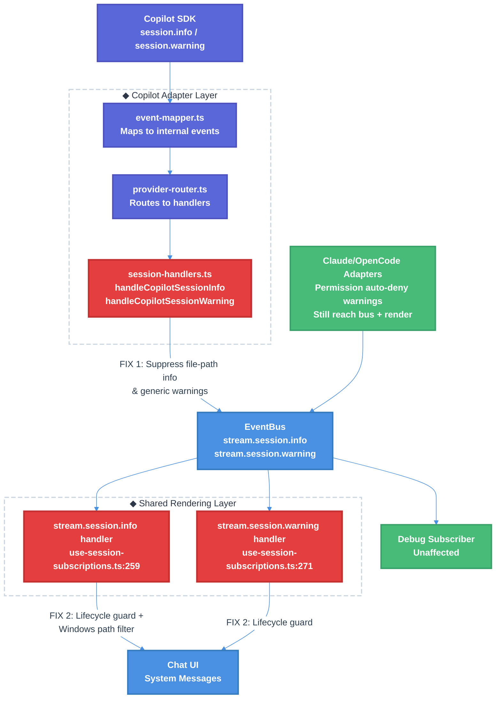

# Copilot Post-Stream File & Warning Rendering Bug Fix Technical Design Document / RFC

| Document Metadata      | Details                                      |
| ---------------------- | -------------------------------------------- |
| Author(s)              | Copilot                                      |
| Status                 | In Review (RFC)                               |
| Team / Owner           | Atomic CLI / Streaming Runtime               |
| Created / Last Updated | Phase-tracked (updated as decisions resolve) |

## 1. Executive Summary

After a Copilot SDK conversation stream completes (the `⣿ Reasoned for Xs` completion summary renders), file-write paths appear as `● C:\path\to\file` lines and warning messages appear as `⚠ message` lines below the summary. These are visual artifacts caused by unguarded `session.info` and `session.warning` bus subscription handlers that bypass the stream lifecycle pipeline. This RFC proposes a layered fix: (1) suppress Copilot-specific file-path and generic operational events at the adapter layer before they reach the bus, (2) add lifecycle guards (`shouldProcessStreamLifecycleEvent`) to the shared rendering handlers for defense-in-depth, and (3) harden the existing file-path heuristic to cover Windows paths. The fix is scoped to prevent regressions for Claude and OpenCode providers, which synthesize user-facing `session.warning` events for sub-agent permission auto-deny notifications.

(Ref: `research/docs/2026-03-12-copilot-post-stream-file-warning-rendering-bug.md`)

## 2. Context and Motivation

### 2.1 Current State

- **Architecture:** All three agent SDK providers (Copilot, Claude, OpenCode) normalize session events through provider-specific adapters into a shared `EventBus`. The bus publishes `stream.session.info` and `stream.session.warning` events that are consumed by `useBusSubscription` hooks in `use-session-subscriptions.ts`, which append system messages to the chat UI. (Ref: `research/docs/2026-03-02-copilot-sdk-ui-alignment.md`, `research/docs/2026-02-26-streaming-architecture-event-bus-migration.md`)
- **Event pipeline for info/warning:**
  ```
  Copilot SDK → session.info/warning event
    → event-mapper.ts:413-424 (maps to internal event)
    → provider-router.ts:234-249 (routes to handler)
    → session-handlers.ts:315-347 (publishes BusEvent)
    → EventBus.publish()
    → use-session-subscriptions.ts:259-279 (renders system message)
  ```
- **Lifecycle guards:** Every other session-level bus subscription handler (`stream.session.start`, `stream.turn.start/end`, `stream.session.idle`, `stream.session.error`, `stream.session.compaction`) uses `shouldProcessStreamLifecycleEvent(activeStreamRunIdRef, event.runId)` and/or `isStreamingRef` guards. The `stream.session.info` and `stream.session.warning` handlers are the only two that lack these guards. (Ref: `research/docs/2026-03-12-copilot-post-stream-file-warning-rendering-bug.md:97-103`)
- **File-path filter gap:** The existing `session.info` handler has a heuristic filter for Unix bare paths (`message.startsWith("/") && !message.includes(" ")`) but does **not** detect Windows paths like `C:\dev\file.ts`. (Ref: `research/docs/2026-03-12-copilot-post-stream-file-warning-rendering-bug.md:57`)

### 2.2 The Problem

- **User Impact:** After a Copilot stream completes, users see extraneous `● C:\path\to\file` and `⚠ warning` lines below the completion summary, creating visual clutter and confusion.
  ```
  ●
  Created a minimal Verus devcontainer with two files:
  - .devcontainer/devcontainer.json — ...
  - .devcontainer/setup.sh — ...
  ⣿ Reasoned for 56s · ↓ 1.3k tokens · thought for 5s
  ● C:\dev\example-project\.devcontainer\setup.sh          ← BUG
  ● C:\dev\example-project\.devcontainer\devcontainer.json  ← BUG
  ```
- **Technical Debt:** The `stream.session.info` and `stream.session.warning` bus event types were post-spec additions (not in the original 19 `BusEventType` spec surface). They bypass the `StreamPipelineConsumer` mapping pipeline, staleness filter, and `BatchDispatcher` coalescing — operating as raw direct subscriptions with minimal guards. (Ref: `research/docs/2026-02-26-streaming-event-bus-spec-audit.md`)
- **Cross-provider risk:** The rendering handlers are shared across all providers. A blanket suppression would also hide Claude and OpenCode's synthesized `session.warning` events for sub-agent permission auto-deny — a user-facing feature. (Ref: `research/docs/2026-03-06-claude-agent-sdk-event-schema.md`, `research/docs/2026-03-06-opencode-sdk-event-schema-reference.md`)

## 3. Goals and Non-Goals

### 3.1 Functional Goals

- [ ] Eliminate post-stream `● filepath` rendering artifacts for Copilot SDK sessions.
- [ ] Eliminate post-stream `⚠ warning` rendering artifacts for Copilot SDK sessions.
- [ ] Preserve user-facing `session.warning` rendering for Claude and OpenCode permission auto-deny notifications.
- [ ] Add lifecycle guards to `session.info` and `session.warning` handlers consistent with all other session handlers.
- [ ] Harden the existing file-path detection heuristic to cover Windows absolute paths.
- [ ] Add unit tests for the new guard logic and file-path detection, following the extracted-handler test pattern.
- [ ] Ensure debug subscriber continues to receive all raw bus events for observability.

### 3.2 Non-Goals (Out of Scope)

- [ ] We will NOT refactor the entire `use-session-subscriptions.ts` file or change the bus subscription architecture.
- [ ] We will NOT migrate `session.info`/`session.warning` events into the `StreamPipelineConsumer` mapping pipeline.
- [ ] We will NOT change Claude or OpenCode adapter behavior for session events.
- [ ] We will NOT suppress `session.info`/`session.warning` events from the debug subscriber.

## 4. Proposed Solution (High-Level Design)

### 4.1 System Architecture Diagram



### 4.2 Architectural Pattern

**Layered Defense-in-Depth Suppression:** The fix operates at two independent layers:

1. **Adapter layer (Copilot-specific):** Suppress unwanted events at the source before they enter the shared bus, using the existing provider-scoped handler pattern. This is the primary fix.
2. **Rendering layer (shared, all providers):** Add lifecycle guards and improve content filtering as defense-in-depth. This ensures that even if future provider changes introduce similar events, they cannot render after stream completion.

### 4.3 Key Components

| Component | Responsibility | Change | Justification |
|---|---|---|---|
| `session-handlers.ts` (Copilot) | Publishes session events to bus | Suppress file-path info and generic warning events | Provider-scoped; prevents Copilot-specific noise from reaching bus without affecting Claude/OpenCode |
| `use-session-subscriptions.ts` (shared) | Renders system messages from bus events | Add `shouldProcessStreamLifecycleEvent` guard + Windows path filter | Defense-in-depth; aligns with every other handler in the file |
| `stream.ts` helpers (shared) | Pure guard functions | No change needed — existing `shouldProcessStreamLifecycleEvent` is reused | Consistent with existing patterns |
| New: `session-info-filters.ts` (shared) | File-path detection utility | Extract and export `isLikelyFilePath` for cross-module reuse | Reuses existing `isLikelyFilesystemPath` pattern from `discovery-events.ts:159` |

## 5. Detailed Design

### 5.1 Layer 1: Copilot Adapter Suppression (`session-handlers.ts`)

Suppress Copilot-specific file-path info events and generic operational warning events in the Copilot adapter's session handlers. This prevents these events from being published to the bus at all.

**File:** `src/services/events/adapters/providers/copilot/session-handlers.ts`

#### 5.1.1 `handleCopilotSessionInfo` (lines 315-330)

Add a guard that suppresses events whose `message` field is a bare file path. Use the `isLikelyFilePath` utility (extracted in 5.3).

```typescript
import { isLikelyFilePath } from "@/lib/ui/session-info-filters.ts";

export function handleCopilotSessionInfo(
  context: CopilotSessionHandlerContext,
  event: AgentEvent<"session.info">,
): void {
  const data = event.data as SessionInfoEventData;
  const message = data?.message ?? "";
  const infoType = data?.infoType ?? "general";

  // Suppress file-path info messages — these are operational metadata,
  // not user-facing. File operations are visible via tool-result parts.
  if (isLikelyFilePath(message.trim())) return;

  context.publishEvent({
    type: "stream.session.info",
    data: { infoType, message },
  });
}
```

#### 5.1.2 `handleCopilotSessionWarning` (lines 332-347)

Suppress generic operational warnings from the Copilot SDK. These carry internal SDK messages that are not meaningful in the TUI.

```typescript
export function handleCopilotSessionWarning(
  context: CopilotSessionHandlerContext,
  event: AgentEvent<"session.warning">,
): void {
  // Copilot SDK warnings are operational metadata (e.g., rate limit hints,
  // internal SDK state). They are not user-facing and create visual artifacts
  // when rendered after stream completion. Suppress entirely.
  // Note: Claude/OpenCode use their own adapter paths for user-facing warnings.
}
```

**Design decision:** The `session.warning` handler is fully no-op'd for Copilot because the Copilot SDK does not emit user-actionable warnings. If future Copilot SDK versions introduce actionable warnings, a `warningType`-based filter can be added here.

### 5.2 Layer 2: Shared Rendering Guards (`use-session-subscriptions.ts`)

Add lifecycle guards to the `stream.session.info` and `stream.session.warning` handlers, consistent with every other handler in the file. Also improve the file-path content filter.

**File:** `src/state/chat/stream/use-session-subscriptions.ts`

#### 5.2.1 `stream.session.info` handler (lines 259-269)

```typescript
import { isLikelyFilePath } from "@/lib/ui/session-info-filters.ts";

useBusSubscription("stream.session.info", (event) => {
  // Lifecycle guard — only process during active stream (defense-in-depth)
  if (!shouldProcessStreamLifecycleEvent(activeStreamRunIdRef.current, event.runId)) return;

  const { message, infoType } = event.data;
  if (infoType === "cancellation") return;
  if (infoType === "snapshot") return;
  if (!message) return;
  // Suppress file-path messages (replaces old incomplete Unix-only filter)
  if (isLikelyFilePath(message.trim())) return;

  setMessagesWindowed((prev) => [
    ...prev,
    createMessage("system", `${STATUS.active} ${message}`),
  ]);
});
```

#### 5.2.2 `stream.session.warning` handler (lines 271-279)

```typescript
useBusSubscription("stream.session.warning", (event) => {
  // Lifecycle guard — only process during active stream (defense-in-depth)
  if (!shouldProcessStreamLifecycleEvent(activeStreamRunIdRef.current, event.runId)) return;

  const { message } = event.data;
  if (message) {
    setMessagesWindowed((prev) => [
      ...prev,
      createMessage("system", `${MISC.warning} ${message}`),
    ]);
  }
});
```

**Note:** The shared `session.warning` handler body is preserved (not no-op'd) to continue rendering Claude/OpenCode permission auto-deny warnings during active streams. The lifecycle guard alone prevents post-stream artifacts.

### 5.3 Extracted Utility: `isLikelyFilePath` (`session-info-filters.ts`)

Extract a reusable file-path detection function. This follows the existing `isLikelyFilesystemPath` pattern in `src/services/config/discovery-events.ts:159-166` but is exported for cross-module use.

**New file:** `src/lib/ui/session-info-filters.ts`

```typescript
/**
 * Determines whether a trimmed string is likely a bare filesystem path.
 *
 * Used to suppress file-path info messages from agent SDKs that are
 * operational metadata rather than user-facing content.
 *
 * Covers:
 * - Windows absolute paths: C:\dev\file.ts
 * - POSIX absolute paths: /home/user/file.ts
 * - Home-relative paths: ~/project/file.ts
 * - Relative paths with directory separators: ./file.ts, ../dir/file.ts
 */
export function isLikelyFilePath(value: string): boolean {
  if (value.length === 0) return false;
  // Must not contain spaces (bare paths only, not sentences)
  if (value.includes(" ")) return false;
  // Windows absolute path (e.g., C:\dev\file.ts)
  if (/^[A-Za-z]:\\/.test(value)) return true;
  // POSIX absolute path with at least one separator
  if (value.startsWith("/") && value.includes("/")) return true;
  // Home-relative path
  if (value.startsWith("~/")) return true;
  // Dot-relative path
  if (/^\.{1,2}[\\/]/.test(value)) return true;
  return false;
}
```

### 5.4 State Management

No new state is introduced. The fix reuses existing refs:
- `activeStreamRunIdRef` (already available in `useStreamSessionSubscriptions` closure scope)
- `isStreamingRef` (already available but not needed — `shouldProcessStreamLifecycleEvent` is sufficient)

### 5.5 Data Flow (Post-Fix)

```
Copilot SDK
    │
    ├── session.info { message: "C:\\dev\\file.ts", infoType: "general" }
    │       │
    │       ▼
    │   event-mapper.ts → session.info internal event
    │       │
    │       ▼
    │   provider-router.ts → handleCopilotSessionInfo()
    │       │
    │       ▼
    │   session-handlers.ts → isLikelyFilePath("C:\\dev\\file.ts") → TRUE
    │       │
    │       ▼
    │   ❌ SUPPRESSED at adapter layer — event never reaches bus
    │
    └── session.warning { message: "...", warningType: "general" }
            │
            ▼
        session-handlers.ts → SUPPRESSED (handler body is no-op)
            │
            ▼
        ❌ SUPPRESSED at adapter layer

Claude/OpenCode
    │
    └── session.warning { message: "Auto-denied X ...", warningType: "permission_denied" }
            │
            ▼
        aux-event-handlers.ts → publishEvent("stream.session.warning")
            │
            ▼
        EventBus → use-session-subscriptions.ts
            │
            ▼
        shouldProcessStreamLifecycleEvent() → TRUE (during active stream)
            │
            ▼
        ✅ RENDERED: "⚠ Auto-denied X ..."
```

## 6. Alternatives Considered

| Option | Pros | Cons | Reason for Rejection |
|---|---|---|---|
| **A2: No-op both shared handlers entirely** (from research) | Simplest change — 2 lines | **Breaks Claude/OpenCode** — hides permission auto-deny warnings that are user-facing | Cross-provider regression; violates non-goal of preserving Claude/OpenCode behavior |
| **A1: File-path filter only in shared handler** (from research) | Targeted content filter | Does not fix `session.warning` artifacts; still renders file paths during streaming (less impactful but still noisy) | Incomplete — only addresses half the symptom |
| **C: Lifecycle guards only** (from research) | Fixes timing bug; simple | Still renders file-path info messages during active streaming | Doesn't address the core issue — file paths should never render |
| **B: Suppress at Copilot adapter only** (from research) | Copilot-scoped; no cross-provider risk | No defense-in-depth — other providers could introduce similar bugs | Incomplete — doesn't protect against future regressions |
| **Selected: B + C + path filter (Layered)** | Provider-safe, defense-in-depth, future-proof | Slightly more code than any single option | **Selected:** The combination addresses both the source (Copilot adapter) and the symptom (shared rendering), without breaking other providers |

## 7. Cross-Cutting Concerns

### 7.1 Cross-Provider Safety

| Provider | `session.info` source | `session.warning` source | Impact of this fix |
|---|---|---|---|
| **Copilot** | SDK emits file paths (`infoType: "general"`) | SDK emits operational warnings (`warningType: "general"`) | ✅ Suppressed at adapter — no rendering artifacts |
| **Claude** | Adapter handler exists but SDK does not natively emit | Synthesized for permission auto-deny (`warningType: "permission_denied"`) | ✅ Unaffected — Claude adapter is not modified; shared handler preserved with lifecycle guard |
| **OpenCode** | Adapter handler exists but SDK does not natively emit | Synthesized for permission auto-deny (`warningType: "permission_denied"`) | ✅ Unaffected — OpenCode adapter is not modified; shared handler preserved with lifecycle guard |

(Ref: `research/docs/2026-03-06-copilot-sdk-session-events-schema-reference.md`, `research/docs/2026-03-06-claude-agent-sdk-event-schema.md`, `research/docs/2026-03-06-opencode-sdk-event-schema-reference.md`)

### 7.2 Observability

- **Debug subscriber:** Unaffected. The debug subscriber listens to raw bus events via `bus.onAll()` and operates independently of the rendering subscription handlers. For Layer 1 suppression (Copilot adapter), the events never reach the bus, so they also won't appear in the debug subscriber — but this is acceptable because these events carry no diagnostic value beyond confirming file writes, which are already logged by the tool-result pipeline.
- **Event coverage policy:** The `event-coverage-policy.ts:59-60` entries for `stream.session.info` and `stream.session.warning` with `disposition: "mapped"` remain accurate — the events are still mapped by all three provider adapters; Copilot simply filters some before publishing.

### 7.3 Spec Compliance

The `stream.session.info` and `stream.session.warning` bus event types are **post-spec additions** — they are not part of the original 19 `BusEventType` surface documented in the streaming architecture spec. There are no spec-mandated handling requirements for these events. (Ref: `research/docs/2026-02-26-streaming-event-bus-spec-audit.md`)

Adding lifecycle guards aligns these handlers with the spec's implicit contract: session events should respect the active stream run and not produce UI artifacts after stream completion.

## 8. Migration, Rollout, and Testing

### 8.1 Deployment Strategy

- [ ] Phase 1: Implement and test all changes in a single PR.
- [ ] Phase 2: Manual verification with Copilot SDK sessions — confirm file-path lines no longer appear after completion.
- [ ] Phase 3: Manual verification with Claude/OpenCode sessions — confirm permission auto-deny warnings still render during active streams.

### 8.2 Test Plan

Tests follow the **extracted handler + unit test pattern** established in `tests/screens/chat-screen.turn-lifecycle.test.ts` and `tests/screens/chat-screen.stream-lifecycle-run-guard.test.ts`.

#### 8.2.1 Unit Tests: `isLikelyFilePath`

**New file:** `tests/lib/ui/session-info-filters.test.ts`

| Test Case | Input | Expected |
|---|---|---|
| Windows absolute path | `C:\dev\file.ts` | `true` |
| Windows path with spaces (sentence) | `C:\dev\file.ts is a file` | `false` |
| POSIX absolute path | `/home/user/file.ts` | `true` |
| Home-relative path | `~/project/file.ts` | `true` |
| Dot-relative path | `./src/index.ts` | `true` |
| Parent-relative path | `../dir/file.ts` | `true` |
| Plain text message | `Created 2 files` | `false` |
| Empty string | `` | `false` |
| Bare slash command | `/help` | `false` (no second separator) |
| URL-like string | `https://example.com` | `false` |

#### 8.2.2 Unit Tests: Copilot Adapter Suppression

**New file:** `tests/services/events/adapters/providers/copilot/session-handlers.session-info-suppression.test.ts`

| Test Case | Expected |
|---|---|
| `session.info` with file path message → does NOT publish to bus | `publishEvent` not called |
| `session.info` with non-file-path message → publishes to bus | `publishEvent` called with correct payload |
| `session.warning` → does NOT publish to bus | `publishEvent` not called |

#### 8.2.3 Unit Tests: Shared Handler Lifecycle Guards

**New file:** `tests/state/chat/stream/use-session-subscriptions.session-info-guards.test.ts`

Following the extracted-handler pattern:

| Test Case | Expected |
|---|---|
| `session.info` event with matching `runId` and non-file-path message → renders system message | `setMessagesWindowed` called |
| `session.info` event with stale `runId` → suppressed | `setMessagesWindowed` not called |
| `session.info` event with `null` activeRunId → suppressed | `setMessagesWindowed` not called |
| `session.info` event with file-path message → suppressed | `setMessagesWindowed` not called |
| `session.warning` event with matching `runId` → renders system message | `setMessagesWindowed` called |
| `session.warning` event with stale `runId` → suppressed | `setMessagesWindowed` not called |

### 8.3 Files to Modify

| File | Change | Risk |
|---|---|---|
| `src/services/events/adapters/providers/copilot/session-handlers.ts` | Add file-path guard to `handleCopilotSessionInfo`; no-op `handleCopilotSessionWarning` | Low — Copilot-scoped |
| `src/state/chat/stream/use-session-subscriptions.ts` | Add `shouldProcessStreamLifecycleEvent` guard + `isLikelyFilePath` filter to both handlers | Low — aligns with existing pattern |
| **New:** `src/lib/ui/session-info-filters.ts` | Extract `isLikelyFilePath` utility | None — new file |
| **New:** `tests/lib/ui/session-info-filters.test.ts` | Unit tests for `isLikelyFilePath` | None — test file |
| **New:** `tests/services/events/adapters/providers/copilot/session-handlers.session-info-suppression.test.ts` | Unit tests for adapter suppression | None — test file |
| **New:** `tests/state/chat/stream/use-session-subscriptions.session-info-guards.test.ts` | Unit tests for shared handler guards | None — test file |

## 9. Resolved Questions

- [x] **Q1:** Copilot `handleCopilotSessionWarning` → **Fully no-op'd.** No known user-facing warnings from the Copilot SDK; simpler implementation. If future Copilot SDK versions introduce actionable warnings, a `warningType` allowlist can be added.
- [x] **Q2:** Old Unix path filter (`message.startsWith("/") && !message.includes(" ")`) → **Remove and replace with `isLikelyFilePath`.** The old filter was an earlier incomplete fix for the same bug class that only caught Unix paths. Consolidating into `isLikelyFilePath` provides a single source of truth.
- [x] **Q3:** `isLikelyFilePath` location → **New module `src/lib/ui/session-info-filters.ts`.** Clean separation following the `lib/ui` convention. Avoids coupling the telemetry module (`discovery-events.ts`) to a UI rendering concern.
- [x] **Q4:** Lifecycle guard strategy → **`shouldProcessStreamLifecycleEvent` alone is sufficient.** This matches the existing pattern used by 5+ other handlers (`stream.turn.end`, `stream.session.error`, `stream.session.compaction`, etc.). No need for an additional `isStreamingRef` check.
