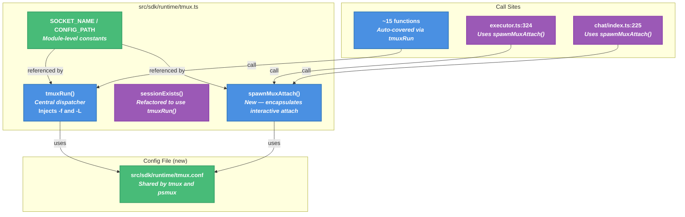

# tmux UX Improvements Technical Design Document

| Document Metadata      | Details     |
| ---------------------- | ----------- |
| Author(s)              | flora131    |
| Status                 | Draft (WIP) |
| Team / Owner           | Atomic CLI  |
| Created / Last Updated | 2026-04-10  |

## 1. Executive Summary

Atomic spawns coding agent sessions inside tmux panes, but ships no tmux configuration. Users unfamiliar with tmux cannot scroll, lose crash output, and have no way to find detached sessions. This spec proposes: (1) bundling a curated tmux config with mouse support, vi-mode, and clipboard integration; (2) injecting it via `-f` on all tmux invocations; (3) isolating Atomic sessions on a dedicated `-L atomic` socket; and (4) printing reattach instructions.

**Agent-specific impact:** The UX improvements (mouse scroll, vi-mode, clipboard, expanded scrollback) primarily benefit **Claude Code**, which is the only agent driven by direct tmux pane interaction (`sendLiteralText`/`capturePane`). OpenCode and Copilot run HTTP servers inside their panes and are controlled via SDK API calls — users do not interact with their tmux panes directly. For those agents, the main benefit is **operational**: socket isolation (Atomic sessions no longer pollute `tmux ls`).

## 2. Context and Motivation

### 2.1 Current State

All tmux commands flow through `tmuxRun()` in `src/sdk/runtime/tmux.ts:71-86`. This central dispatcher calls `Bun.spawnSync([binary, ...args])` with no `-f` (config) or `-L` (socket) flags. Sessions land in the user's default tmux server and inherit whatever config (or no config) the user has.

Four call sites bypass `tmuxRun()` and call `Bun.spawnSync`/`Bun.spawn` directly:

- `sessionExists()` at `src/sdk/runtime/tmux.ts:320-329`
- `attachSession()` at `src/sdk/runtime/tmux.ts:334-349`
- Executor attach at `src/sdk/runtime/executor.ts:324-330`
- Chat attach at `src/commands/cli/chat/index.ts:225-228`

**References:** [research/docs/2026-04-10-tmux-ux-implementation-guide.md](../research/docs/2026-04-10-tmux-ux-implementation-guide.md), [research/web/2026-04-10-tmux-ux-improvements.md](../research/web/2026-04-10-tmux-ux-improvements.md)

### 2.2 The Problem

- **User Impact (Claude Code):** Users cannot scroll in Claude's pane, lose crash output, and cannot find detached sessions (because `-L atomic` isn't used yet, so sessions mix with personal tmux). This is the primary UX pain point since Claude is driven entirely through pane interaction.
- **User Impact (OpenCode & Copilot):** These agents communicate via HTTP APIs, so users don't interact with their tmux panes directly. The impact is limited to session clutter (Atomic sessions mixing with personal tmux).
- **Developer Impact:** Window titles get overwritten by running processes, making it hard to identify agent panes during debugging.
- **Operational Risk:** Crashed workflows leave orphaned tmux sessions that are hard to discover (sessions mix with user's personal tmux). Socket isolation (`-L atomic`) addresses discoverability; manual cleanup via `tmux -L atomic ls` / `kill-session` is sufficient given the rarity of hard crashes.

## 3. Goals and Non-Goals

### 3.1 Functional Goals

- [x] Ship a bundled `tmux.conf` that enables mouse scroll, vi-mode, clipboard, and stable window names (shared by tmux and psmux — verified config-compatible)
- [x] Inject config via `-f <path>` on all tmux invocations automatically
- [x] Isolate Atomic sessions on a dedicated socket via `-L atomic`
- [x] Print reattach instructions after session creation (using `SOCKET_NAME` constant, not hardcoded)
- [ ] ~~Detect and handle orphaned sessions on the dedicated socket at startup~~ — **Removed:** The `-L atomic` socket makes stale sessions easy to discover manually (`tmux -L atomic ls`). Automated cleanup risks killing legitimate active sessions from concurrent Atomic instances, since UUID-based session naming means multiple workflows coexist safely. Hard-crash orphans are rare and low-cost (idle tmux sessions consuming minimal resources).

### 3.2 Non-Goals (Out of Scope)

- [ ] Custom theming or user-overridable tmux config (future iteration)
- [ ] Building a full tmux UX framework
- [ ] Detach/reattach keybinding hints in the status bar (session lifecycle is fully managed)
- [ ] Separate `psmux.conf` (psmux is fully tmux-config-compatible; split only if divergence is needed)
- [ ] Automatic psmux validation testing in CI (manual for now)

## 4. Proposed Solution (High-Level Design)

### 4.1 System Architecture Diagram



### 4.2 Architectural Pattern

**Single-point injection:** The `-f` and `-L` flags (sourced from `CONFIG_PATH` and `SOCKET_NAME` constants) are prepended to the args array inside `tmuxRun()`, which automatically covers ~15 exported functions. `sessionExists()` is refactored to use `tmuxRun()` (eliminating one bypass). The remaining 3 attach bypass sites are consolidated into `spawnMuxAttach()`.

### 4.3 Key Components

| Component                     | Responsibility                                                                                     | Location                          | Change Type   |
| ----------------------------- | -------------------------------------------------------------------------------------------------- | --------------------------------- | ------------- |
| `tmux.conf`                   | Bundled config (mouse, vi, clipboard, status bar) — shared by tmux and psmux (verified compatible) | `src/sdk/runtime/tmux.conf`       | New file      |
| `SOCKET_NAME` / `CONFIG_PATH` | Module-level constants for socket name and config path                                             | `src/sdk/runtime/tmux.ts`         | New constants |
| `tmuxRun()`                   | Inject `-f` and `-L` flags using constants                                                         | `src/sdk/runtime/tmux.ts:71-86`   | Modify        |
| `sessionExists()`             | Refactor to use `tmuxRun()` (eliminates bypass)                                                    | `src/sdk/runtime/tmux.ts:320-329` | Modify        |
| `spawnMuxAttach()`            | Encapsulate interactive attach-session spawn (binary + flags + stdio)                              | `src/sdk/runtime/tmux.ts`         | New function  |
| Bypass updates                | Replace 3 attach call sites with `spawnMuxAttach()`                                                | See §5.2                          | Modify        |
| Reattach message              | Print connection info after session creation (uses `SOCKET_NAME` constant)                         | `executor.ts`, `chat/index.ts`    | New code      |

## 5. Detailed Design

### 5.1 Config File

#### `src/sdk/runtime/tmux.conf`

A single config file shared by both tmux and psmux. psmux is fully tmux-config-compatible (verified: `-f` flag, `set-option`/`bind-key` syntax, and all options below are supported). A separate `psmux.conf` is unnecessary unless the two diverge in the future.

```conf
# Atomic tmux configuration — injected automatically via -f
# Shared by tmux (macOS/Linux) and psmux (Windows)
#
# True color + passthrough for rich TUI rendering
set-option -sa terminal-overrides ",xterm*:Tc"
set -g set-clipboard on
set -g allow-passthrough on

# Mouse mode — scroll works out of the box
set-option -g mouse on

# Prevent processes from overwriting window titles
set-option -g allow-rename off

# Sane defaults (inlined from tmux-sensible)
set -g escape-time 0
set -g history-limit 50000
set -g display-time 4000
set -g status-interval 5
set -g focus-events on
setw -g aggressive-resize on

# Status bar — minimal
set -g status-left " "
set -g status-right " #{session_name} | %H:%M "
set -g status-right-length 60
set -g status-style "bg=#1e1e2e,fg=#cdd6f4"
set -g status-right-style "fg=#6c7086"

# Pane splitting
bind - split-window -v -c "#{pane_current_path}"
bind | split-window -h -c "#{pane_current_path}"

# Pane resizing
bind -r l resize-pane -R 5
bind -r h resize-pane -L 5
bind -r k resize-pane -U 5
bind -r j resize-pane -D 5

# Vi-mode
set-window-option -g mode-keys vi
bind-key -T copy-mode-vi v send-keys -X begin-selection
bind-key -T copy-mode-vi C-v send-keys -X rectangle-toggle
bind-key -T copy-mode-vi y send-keys -X copy-selection-and-cancel

# OSC52 copy-mode improvements
unbind -T copy-mode-vi MouseDragEnd1Pane
bind -T copy-mode-vi MouseDown1Pane send-keys -X clear-selection \; select-pane
```

### 5.2 Code Changes

#### 5.2.1 New constants and `spawnMuxAttach()`

```ts
// src/sdk/runtime/tmux.ts — new module-level constants
import { join } from "path";

/** Dedicated tmux socket name — isolates Atomic sessions from the user's default server. */
export const SOCKET_NAME = "atomic";

/** Path to the bundled tmux config (shared by tmux and psmux). */
const CONFIG_PATH = join(import.meta.dir, "tmux.conf");

/**
 * Spawn an interactive attach-session process.
 * Encapsulates binary resolution, config injection, and socket isolation.
 * Used by all attach call sites (attachSession, executor, chat).
 */
export function spawnMuxAttach(sessionName: string): Subprocess {
    const binary = getMuxBinary();
    if (!binary) {
        throw new Error("No terminal multiplexer (tmux/psmux) found on PATH");
    }
    return Bun.spawn(
        [
            binary,
            "-f",
            CONFIG_PATH,
            "-L",
            SOCKET_NAME,
            "attach-session",
            "-t",
            sessionName,
        ],
        { stdio: ["inherit", "inherit", "inherit"] },
    );
}
```

#### 5.2.2 Modified: `tmuxRun()`

```ts
export function tmuxRun(
    args: string[],
): { ok: true; stdout: string } | { ok: false; stderr: string } {
    const binary = getMuxBinary();
    if (!binary) {
        return {
            ok: false,
            stderr: "No terminal multiplexer (tmux/psmux) found on PATH",
        };
    }

    const fullArgs = ["-f", CONFIG_PATH, "-L", SOCKET_NAME, ...args];

    const result = Bun.spawnSync({
        cmd: [binary, ...fullArgs],
        stdout: "pipe",
        stderr: "pipe",
    });
    if (!result.success) {
        const stderr = new TextDecoder().decode(result.stderr).trim();
        return { ok: false, stderr };
    }
    return { ok: true, stdout: new TextDecoder().decode(result.stdout).trim() };
}
```

#### 5.2.3 Modified: `sessionExists()` — refactor to use `tmuxRun()`

```ts
export function sessionExists(sessionName: string): boolean {
    const result = tmuxRun(["has-session", "-t", sessionName]);
    return result.ok;
}
```

This eliminates one bypass entirely. The exit-code check maps cleanly: `tmuxRun()` returns `{ ok: false }` on non-zero exit.

#### 5.2.4 Modified: `attachSession()` at `src/sdk/runtime/tmux.ts:334-349`

`attachSession()` needs `spawnSync` (blocking) while `spawnMuxAttach()` uses `Bun.spawn` (async), so it uses the constants directly:

```ts
export function attachSession(sessionName: string): void {
    const binary = getMuxBinary();
    if (!binary) {
        throw new Error("No terminal multiplexer (tmux/psmux) found on PATH");
    }
    const proc = Bun.spawnSync({
        cmd: [
            binary,
            "-f",
            CONFIG_PATH,
            "-L",
            SOCKET_NAME,
            "attach-session",
            "-t",
            sessionName,
        ],
        stdin: "inherit",
        stdout: "inherit",
        stderr: "pipe",
    });
    if (!proc.success) {
        const stderr = new TextDecoder().decode(proc.stderr).trim();
        throw new Error(
            `Failed to attach to session: ${sessionName}${stderr ? ` (${stderr})` : ""}`,
        );
    }
}
```

#### 5.2.5 Modified: Executor attach at `src/sdk/runtime/executor.ts:324-330`

```ts
import { spawnMuxAttach } from "./tmux.ts";

const attachProc = spawnMuxAttach(tmuxSessionName);
await attachProc.exited;
```

#### 5.2.6 Modified: Chat attach at `src/commands/cli/chat/index.ts:225-228`

```ts
import { spawnMuxAttach } from "@/sdk/workflows.ts";

const attachProc = spawnMuxAttach(windowName);
```

#### 5.2.7 Reattach instructions

After session creation in both `executeWorkflow()` and `chatCommand()`:

```ts
import { SOCKET_NAME } from "./tmux.ts";

const binary = getMuxBinary() ?? "tmux";
console.log(
    `[atomic] Session: ${sessionName} | Reattach: ${binary} -L ${SOCKET_NAME} attach -t ${sessionName}`,
);
```

### 5.3 Export Surface Changes

- `SOCKET_NAME` — exported from `src/sdk/runtime/tmux.ts`, re-exported via `src/sdk/workflows.ts`. Used by reattach message formatting.
- `spawnMuxAttach()` — exported from `src/sdk/runtime/tmux.ts`, re-exported via `src/sdk/workflows.ts`. Used by `executor.ts` and `chat/index.ts` for interactive attach.
- `CONFIG_PATH` — module-private constant (not exported). Only used internally by `tmuxRun()`, `spawnMuxAttach()`, and `attachSession()`.

## 6. Alternatives Considered

| Option                                          | Pros                                     | Cons                                           | Reason for Rejection                                   |
| ----------------------------------------------- | ---------------------------------------- | ---------------------------------------------- | ------------------------------------------------------ |
| Inject flags at each call site individually     | Explicit, no hidden behavior             | ~20 call sites to update, easy to miss one     | Too error-prone; central injection is safer            |
| Use environment variable `TMUX_SOCKET`          | No code changes to call sites            | Non-standard, not all tmux versions support it | Not portable                                           |
| Ship config via `~/.config/tmux/`               | Survives across sessions                 | Conflicts with user's personal config          | Violates isolation goal                                |
| **Central injection in `tmuxRun()` (Selected)** | Single change point, covers 95% of calls | 4 bypasses need manual update                  | **Selected:** Minimal surface area, hardest to regress |

## 7. Cross-Cutting Concerns

### 7.1 Package Distribution

The `files` field in `package.json` already includes `"src"`, so `src/sdk/runtime/tmux.conf` will be included in the npm package automatically. No changes to `package.json` needed.

### 7.2 Config Path Resolution

`import.meta.dir` resolves to the directory containing the source file at runtime. In Bun, this works both in development (`src/sdk/runtime/`) and when installed from npm (`node_modules/@bastani/atomic/src/sdk/runtime/`). The `.conf` files live alongside `tmux.ts`.

### 7.3 Windows/psmux Compatibility

- psmux is fully tmux-config-compatible: `-f` and `-L` flags, `set-option`/`bind-key` syntax, and all config options used in `tmux.conf` are verified supported (see [psmux docs](https://github.com/psmux/psmux/blob/master/docs/configuration.md))
- A single `tmux.conf` is shared by both binaries — no `psmux.conf` needed
- `getMuxBinary()` already resolves the correct binary per platform
- Socket isolation on Windows may use named pipes instead of Unix sockets — functionally equivalent

### 7.4 Backward Compatibility

- Existing sessions on the default socket are unaffected
- `isInsideTmux()` check remains valid: if the user is inside _any_ tmux, we switch-client rather than nest
- No changes to the public SDK API (`createSession`, `createWindow`, etc.) — flags are injected internally

## 8. Migration, Rollout, and Testing

### 8.1 Deployment Strategy

- [ ] **Phase 1:** Create `tmux.conf` + add `SOCKET_NAME`/`CONFIG_PATH` constants + modify `tmuxRun()` + refactor `sessionExists()` to use `tmuxRun()`. This covers ~95% of call sites.
- [ ] **Phase 2:** Add `spawnMuxAttach()` + update `attachSession()`, executor attach, and chat attach to use it + add reattach message using `SOCKET_NAME` + manual psmux validation on Windows.

### 8.2 Test Plan

- **Unit Tests:** Test `getConfigPath()` returns correct file for each binary name. Test `sessionExists()` refactored to use `tmuxRun()`.
- **Integration Tests:** Verify `tmuxRun(["ls"])` with `-L atomic` doesn't see sessions on the default socket. Verify config injection (`tmux -L atomic show-option -g mouse` returns `on`).
- **Manual Tests:** Scroll with mouse wheel in an agent pane. Verify reattach instructions print correctly.

## 9. Open Questions / Unresolved Issues

All resolved:

- [x] **Q1: TPM auto-bootstrap** — **Decision: No TPM.** Inline useful settings (history-limit, escape-time) directly in the config. No network dependency, no git clone side effect.
- [x] **Q2: `sessionExists()` refactor** — **Decision: Refactor to use `tmuxRun()`.** The exit-code check maps cleanly to `tmuxRun()`'s `ok`/`false` return. Eliminates one bypass entirely.
- [x] **Q3: Orphan cleanup strategy** — **Decision: Removed.** Automated orphan cleanup was dropped because it risks killing legitimate active sessions from concurrent Atomic instances. UUID-based session naming ensures no collisions, and `-L atomic` socket isolation makes manual discovery easy (`tmux -L atomic ls`). Hard-crash orphans are rare and low-cost.
- [x] **Q4: Session switcher `display-popup`** — **Decision: Exclude.** Do not include the `C-l` binding. Users can rely on the standard tmux `prefix+s` session list. Keeps config minimal with no dependency on fzf or tmux version.
- [x] **Q5: Export style** — **Decision: Export `spawnMuxAttach(sessionName): Subprocess`** that encapsulates the full interactive attach pattern (binary + config + socket + stdio). Eliminates repeated spawn logic across 3 attach sites. `SOCKET_NAME` constant is also exported for use in reattach messages.
- [x] **Q6: Separate psmux config** — **Decision: Single `tmux.conf` shared by both.** psmux is fully tmux-config-compatible (verified: `-f` flag, `set-option`/`bind-key` syntax, all options). Split only if divergence is needed in the future.
- [x] **Q7: Orphan detection filter** — **Decision: N/A (feature removed).** See Q3.
