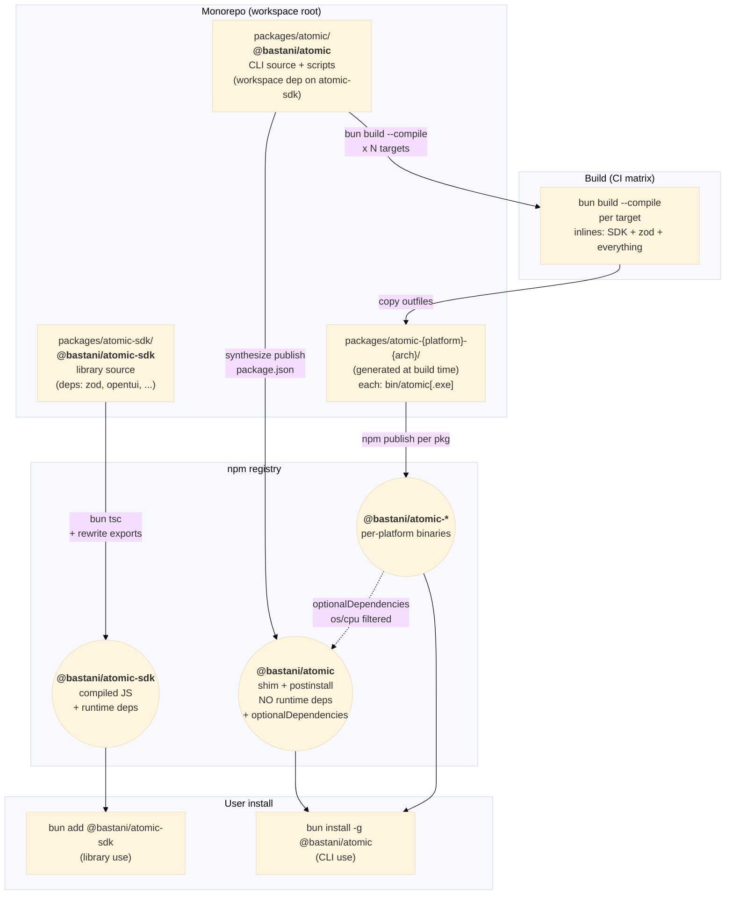

# Atomic Package Split — CLI Binary Wrapper + Standalone SDK

| Document Metadata      | Details                                                |
| ---------------------- | ------------------------------------------------------ |
| Author(s)              | Norin Lavaee                                           |
| Status                 | Draft (WIP)                                            |
| Team / Owner           | flora131/atomic                                        |
| Created / Last Updated | 2026-05-03                                             |

## 1. Executive Summary

Atomic currently ships as a single npm package, `@bastani/atomic`, which serves both as a global CLI and as a TypeScript SDK consumed via the `"bun"` export condition. This bundling forces every consumer install — including global CLI installs on Windows — to drag every runtime dependency (notably `zod`) into a deeply-nested `node_modules` tree. On Windows, those nested paths can exceed the 260-character `MAX_PATH` limit, causing silent file-extraction truncation. The observed symptom is `z.toJSONSchema is not a function` at runtime, because `node_modules/zod/v4/core/json-schema-processors.js` failed to extract.

This RFC proposes adopting OpenCode's two-package distribution model:

- **`@bastani/atomic`** — the CLI. Zero runtime `dependencies`; only `optionalDependencies` listing per-platform binary packages. The `bin` is a tiny Node shim that resolves the matching native binary.
- **`@bastani/atomic-sdk`** — the library, separate npm package. Ships compiled JS in `dist/`, declares zod and other runtime deps normally. Library consumers `bun add @bastani/atomic-sdk`.
- **`@bastani/atomic-{platform}-{arch}[-baseline]`** — one tiny package per build target containing a single `bun build --compile` binary with everything inlined.

This is a **breaking change** for SDK consumers, who must migrate from `@bastani/atomic` → `@bastani/atomic-sdk`. Per explicit user direction, no backwards-compatibility shims are added. The README will document the migration. Windows `MAX_PATH` failures are eliminated by construction because globally installed `@bastani/atomic` no longer ships any runtime dependencies and therefore cannot create nested `node_modules`.

## 2. Context and Motivation

### 2.1 Current State

**Distribution today** (`package.json`, lines 25-45):
- `bin: { atomic: "src/cli.ts" }` — bin entry is raw TypeScript, executed by Bun via the `"bun"` export condition.
- `exports."."."bun" = "./src/sdk/index.ts"` — SDK consumers also resolve to TS source.
- Build is `bunx tsc --project tsconfig.build.json` — emits **types only** to `dist/`. No JS bundling occurs.
- All runtime deps (zod, OpenCode SDK, Claude Agent SDK, Copilot SDK, OpenTUI, React peer dep) are declared in `dependencies`/`peerDependencies` and resolved at consumer-runtime.

**Install today** (`install.sh`, `install.ps1`):
- Bootstrap installer downloads bun (if missing), then runs `bun install -g @bastani/atomic@latest`.
- No native binaries are built or shipped today. The earlier binary-distribution effort ([`specs/2026-01-21-binary-distribution-installers.md`](2026-01-21-binary-distribution-installers.md), [`specs/2026-03-29-windows-arm64-ci-pipeline-corrections.md`](2026-03-29-windows-arm64-ci-pipeline-corrections.md)) was rolled back — the current `.github/workflows/publish.yml` has a single `publish` job that calls `npm publish --provenance` plus a `release` job that bundles configs, with no `bun build --compile` steps.

**Two known triggers for the Windows MAX_PATH bug** (`grep -rn "z\.toJSONSchema"`):
- `src/sdk/workflows/builtin/ralph/helpers/prompts.ts:162`
- `examples/structured-output-demo/helpers/schema.ts:49`

### 2.2 The Problem

When a Windows user runs `bun install -g @bastani/atomic` from a deep current working directory or with a long username, bun installs atomic and its full transitive dep tree into the global location. zod lands at `<global>\node_modules\@bastani\atomic\node_modules\zod\...`. Files like `node_modules/zod/v4/core/json-schema-processors.js` exceed Windows `MAX_PATH` (260 chars) and silently fail to extract. JavaScript's `export *` treats names from a missing or empty descendant module as `undefined` rather than throwing, so basic zod calls (`z.string()`, `z.object()`) keep working while `z.toJSONSchema` is silently `undefined` — the exact symptom reported.

- **User Impact:** Atomic's Ralph workflow and the structured-output demo crash on first invocation on Windows, with no clear actionable error.
- **Business Impact:** Windows is a first-class CI/dev target ([`specs/windows-arm64-support.md`](windows-arm64-support.md), [`specs/2026-03-29-windows-arm64-ci-pipeline-corrections.md`](2026-03-29-windows-arm64-ci-pipeline-corrections.md)). Today atomic does not work reliably on Windows for users who don't happen to install from a short path.
- **Technical Debt:** The `"bun"` export condition pointing at TS source ties consumers to a Bun runtime and forces them to install every transitive dep.

### 2.3 Reference Implementation

OpenCode (`sst/opencode`) sidesteps this problem entirely:

- **`packages/opencode/script/build.ts`** — runs `bun build --compile --target=bun-{platform}-{arch}` per build target, producing self-contained binaries with all deps inlined.
- **`packages/opencode/script/publish.ts:36-52`** — synthesizes the published `opencode-ai` package on the fly with `dependencies: {}` and `optionalDependencies` listing per-platform packages (`opencode-linux-x64`, `opencode-windows-x64`, etc.).
- **`packages/opencode/bin/opencode`** (~170 lines) — a Node shim that probes `os.platform()`/`os.arch()`, resolves the matching `optionalDependency`, and `spawnSync`s its bundled binary.
- **`packages/sdk/js/`** — `@opencode-ai/sdk` published separately as compiled JS in `dist/`. Only runtime dep is `cross-spawn`; the SDK shells out to whatever `opencode` binary is on `PATH`.

The result on Windows: globally installing `opencode-ai` yields exactly one wrapper directory plus exactly one matching binary directory at depth one — no nested `node_modules`, no MAX_PATH risk on any vector.

## 3. Goals and Non-Goals

### 3.1 Functional Goals

- [ ] `bun install -g @bastani/atomic` (or `npm i -g @bastani/atomic`) on Windows installs zero transitive `node_modules` for atomic — only the matching native binary package.
- [ ] `bun add @bastani/atomic-sdk` in a consumer project gives library users compiled JS with type definitions, runtime deps hoisted into the consumer's tree.
- [ ] `atomic` CLI works on Windows (x64 + ARM64-via-Prism), Linux (x64 + arm64), macOS (x64 + arm64) without requiring users to enable long paths or change install location.
- [ ] Builds, signs (out of scope for this RFC; see §3.2), and publishes per-platform binary packages atomically with each release.
- [ ] README documents the SDK rename and migration steps.
- [ ] Existing release flow (branch naming, `bump-version.ts`, automatic publish on merge) extends naturally to the new layout.

### 3.2 Non-Goals (Out of Scope)

- **Backwards-compatibility shims.** `@bastani/atomic` will no longer expose SDK exports; library consumers must migrate. No transitional re-export package is published. (Per explicit user direction.)
- **Windows code signing.** Azure Trusted Signing (the OpenCode approach) is desirable but deferred to a follow-up RFC. Initial release ships unsigned binaries; SmartScreen warnings are an accepted regression for one release cycle.
- **`curl | bash` / `irm | iex` distribution.** Not removed in this RFC, but also not extended. Current `install.sh`/`install.ps1` continue working because they invoke `bun install -g @bastani/atomic`, which after this change fetches the wrapper + the matching binary package — same outcome.
- **Self-update mechanism.** Atomic does not currently auto-update; this RFC does not introduce one. (Prior research at [`research/docs/2026-03-23-dual-binary-windows-approach.md`](../research/docs/2026-03-23-dual-binary-windows-approach.md) discusses a `download.ts` self-update path; that file no longer exists in the current tree and is not reintroduced.)
- **Removing the `"bun"` runtime requirement for the CLI.** The compiled binary embeds its own bun runtime via `bun build --compile`. End users do **not** need bun installed to run `atomic`. Library consumers of `@bastani/atomic-sdk`, however, may still need bun if their own project uses it; the SDK targets ESM JS so it works under Node ≥ 22 too.
- **Restructuring or revising the SDK's public API.** The split is a packaging change, not an API redesign. Existing exports (`./workflows`, `./workflows/components`, etc.) are preserved under the new package name.

## 4. Proposed Solution (High-Level Design)

### 4.1 System Architecture Diagram



### 4.2 Architectural Pattern

**Wrapper + `optionalDependencies` per-platform binary packages**, the same pattern used by esbuild, swc, parcel, turbo, rolldown, and OpenCode. The wrapper is a tiny zero-dep package that delegates execution to a sibling per-platform package selected at install time by npm's `os`/`cpu` filtering on `optionalDependencies`.

The SDK is a separate package with no relationship to the CLI's runtime layout.

### 4.3 Key Components

| Component                                | Responsibility                                                                              | Technology / Mechanism                                                                                |
| ---------------------------------------- | ------------------------------------------------------------------------------------------- | ----------------------------------------------------------------------------------------------------- |
| `@bastani/atomic` (wrapper)              | Receive the global install, resolve the matching binary package, exec the binary           | Node shim (`bin/atomic`), `optionalDependencies`, `postinstall.mjs` for friendly missing-binary error |
| `@bastani/atomic-{platform}-{arch}`      | Hold one platform-specific compiled binary                                                  | `bun build --compile --target=...`; each pkg has `os: ["..."], cpu: ["..."]` filters                 |
| `@bastani/atomic-sdk`                    | Library-facing exports: `defineWorkflow`, schemas, components                               | `bun tsc` to JS + `.d.ts`, exports field rewritten to point at `dist/`                                |
| `packages/atomic/script/build.ts`        | Build matrix: invoke `bun build --compile` per target, write outfiles into per-platform pkg | Node/bun script; mirrors `sst/opencode`'s `packages/opencode/script/build.ts`                         |
| `packages/atomic/script/publish.ts`      | Synthesize wrapper `package.json`, publish wrapper + each per-platform pkg + SDK pkg        | Node/bun script; mirrors `packages/opencode/script/publish.ts`                                        |
| `.github/workflows/publish.yml` (rework) | Run build matrix, run publish script, create GitHub release                                 | GitHub Actions, `oven-sh/setup-bun`, `npm publish --provenance`                                       |

## 5. Detailed Design

### 5.1 Target Monorepo Layout

```
atomic/                                # repo root, workspace root
├── package.json                       # workspace root — only devDependencies + workspaces field
├── bun.lock
├── tsconfig.json
├── .github/
│   └── workflows/
│       ├── publish.yml                # rewritten for matrix build + multi-package publish
│       └── ci.yml                     # adjusted for workspace
├── packages/
│   ├── atomic/                        # @bastani/atomic — CLI source + build/publish scripts
│   │   ├── package.json               # has zod etc. as workspace devDependencies for build
│   │   ├── bin/
│   │   │   └── atomic                 # Node shim (no extension; chmod +x; shebang #!/usr/bin/env node)
│   │   ├── src/
│   │   │   └── cli.ts                 # current root src/cli.ts moves here
│   │   ├── script/
│   │   │   ├── build.ts               # invokes bun build --compile per target
│   │   │   ├── publish.ts             # synthesizes wrapper pkg.json, publishes everything
│   │   │   └── postinstall.mjs        # friendly error if no matching binary package found
│   │   └── tsconfig.json
│   └── atomic-sdk/                    # @bastani/atomic-sdk — library source
│       ├── package.json               # zod, opentui, ai SDKs in dependencies
│       ├── src/
│       │   └── (everything currently under src/sdk/* and related modules)
│       ├── script/
│       │   ├── build.ts               # bun tsc → dist/, then rewrite exports
│       │   └── publish.ts             # publish step (synth or static)
│       └── tsconfig.json
├── examples/                          # stays at root, depends on atomic-sdk via workspace
├── tests/                             # stays at root or moves under packages/* — TBD
├── docs/
├── research/
└── specs/
```

**Key points:**
- `packages/atomic/package.json` is `private: true` — it is a workspace dev shell. It is **never published** under that name. The publish script writes a fresh `package.json` for the wrapper at publish time (just like OpenCode's approach).
- `packages/atomic-sdk/package.json` has `name: "@bastani/atomic-sdk"`, runtime `dependencies`, and a publish-time exports rewrite from `./src/*.ts` → `./dist/*.js` + `./dist/*.d.ts`.
- Per-platform binary packages **are not committed to source**; they are synthesized inside `packages/atomic/dist/` during the build step and published from there.

### 5.2 Per-Platform Binary Packages (Synthesized)

Build script writes one directory per target into `packages/atomic/dist/<platform-arch>/`:

```
packages/atomic/dist/linux-x64/
├── package.json
└── bin/
    └── atomic                  # bun build --compile output
```

`packages/atomic/dist/<platform-arch>/package.json` is generated by `script/build.ts`:

```json
{
  "name": "@bastani/atomic-linux-x64",
  "version": "X.Y.Z",
  "os": ["linux"],
  "cpu": ["x64"],
  "files": ["bin"],
  "license": "MIT"
}
```

For Windows the `bin/atomic.exe` filename has the `.exe` extension. For ARM64-via-Prism, see §5.6.

### 5.3 The Wrapper Package — Synthesized at Publish Time

Following OpenCode's pattern (`packages/opencode/script/publish.ts:36-52`), the `script/publish.ts` writes a fresh `package.json` for `@bastani/atomic` immediately before `npm publish`:

```js
// script/publish.ts (sketch — final form will be a typed bun script)
const version = process.env.VERSION;
const TARGETS = [
  { name: "linux-x64",          os: "linux",  cpu: "x64",   ext: ""    },
  { name: "linux-arm64",        os: "linux",  cpu: "arm64", ext: ""    },
  { name: "linux-x64-musl",     os: "linux",  cpu: "x64",   ext: ""    },
  { name: "linux-arm64-musl",   os: "linux",  cpu: "arm64", ext: ""    },
  { name: "darwin-x64",         os: "darwin", cpu: "x64",   ext: ""    },
  { name: "darwin-arm64",       os: "darwin", cpu: "arm64", ext: ""    },
  { name: "windows-x64",        os: "win32",  cpu: "x64",   ext: ".exe"},
  { name: "windows-arm64",      os: "win32",  cpu: "arm64", ext: ".exe"},
  // baseline variants — see §5.6
];

const wrapperPkg = {
  name: "@bastani/atomic",
  version,
  description: "Configuration management CLI for coding agents",
  bin: { atomic: "./bin/atomic" },
  files: ["bin", "postinstall.mjs", "LICENSE"],
  scripts: { postinstall: "node ./postinstall.mjs" },
  optionalDependencies: Object.fromEntries(
    TARGETS.map(t => [`@bastani/atomic-${t.name}`, version])
  ),
  // intentionally NO `dependencies` field
  engines: { node: ">=20" },
  license: "MIT",
};
```

The wrapper tarball ships only:
- `bin/atomic` (the Node shim, ~150 LOC)
- `postinstall.mjs` (friendly error if no binary package matched, e.g. unsupported platform)
- `package.json` (the synthesized one above)
- `LICENSE`

**No `src/`, no transitive deps, no node_modules.**

### 5.4 The Node Shim — `packages/atomic/bin/atomic`

```js
#!/usr/bin/env node
// Resolves the matching @bastani/atomic-{platform}-{arch} package and execs its binary.
import { spawnSync } from "node:child_process";
import { createRequire } from "node:module";
import { fileURLToPath } from "node:url";
import { dirname, join } from "node:path";
import process from "node:process";

const platform = process.platform;          // "linux" | "darwin" | "win32"
const arch     = process.arch;              // "x64" | "arm64"

// Map process.platform to package suffix
const PLATFORM_MAP = { linux: "linux", darwin: "darwin", win32: "windows" };
const platformSuffix = PLATFORM_MAP[platform];
if (!platformSuffix) {
  console.error(`atomic: unsupported platform "${platform}"`);
  process.exit(1);
}

// Resolve the per-platform package's bin via Node's resolver.
const here = dirname(fileURLToPath(import.meta.url));
const require_ = createRequire(import.meta.url);
const candidates = [
  `@bastani/atomic-${platformSuffix}-${arch}`,
  // baseline fallback for x64-on-ARM64 Prism: see §5.6
];

let binPath;
for (const pkg of candidates) {
  try {
    const pkgJsonPath = require_.resolve(`${pkg}/package.json`);
    const ext = platform === "win32" ? ".exe" : "";
    binPath = join(dirname(pkgJsonPath), "bin", `atomic${ext}`);
    break;
  } catch { /* try next */ }
}
if (!binPath) {
  console.error(
    `atomic: no matching binary package installed for ${platform}-${arch}.\n` +
    `Run \`npm install -g @bastani/atomic\` (or \`bun install -g @bastani/atomic\`) again.`
  );
  process.exit(1);
}

const { status, error } = spawnSync(binPath, process.argv.slice(2), { stdio: "inherit" });
if (error) { console.error(error); process.exit(1); }
process.exit(status ?? 1);
```

Total ~50 LOC; the 150-LOC budget includes baseline-detection fallback, stderr formatting, and Windows-specific chmod sanity (binaries downloaded as tarballs may not have +x on POSIX — addressed in `postinstall.mjs`).

### 5.5 Build Script — `packages/atomic/script/build.ts`

```ts
// build.ts (sketch)
import { mkdir, writeFile, copyFile, chmod } from "node:fs/promises";
import { spawnSync } from "node:child_process";

const TARGETS = [
  { name: "linux-x64",          bunTarget: "bun-linux-x64",            os: "linux",  cpu: "x64"   },
  { name: "linux-arm64",        bunTarget: "bun-linux-arm64",          os: "linux",  cpu: "arm64" },
  { name: "linux-x64-musl",     bunTarget: "bun-linux-x64-musl",       os: "linux",  cpu: "x64"   },
  { name: "linux-arm64-musl",   bunTarget: "bun-linux-arm64-musl",     os: "linux",  cpu: "arm64" },
  { name: "darwin-x64",         bunTarget: "bun-darwin-x64",           os: "darwin", cpu: "x64"   },
  { name: "darwin-arm64",       bunTarget: "bun-darwin-arm64",         os: "darwin", cpu: "arm64" },
  { name: "windows-x64",        bunTarget: "bun-windows-x64",          os: "win32",  cpu: "x64",   ext: ".exe" },
  { name: "windows-arm64",      bunTarget: "bun-windows-x64-baseline", os: "win32",  cpu: "arm64", ext: ".exe" }, // see §5.6
];

const version = process.env.VERSION!;
for (const t of TARGETS) {
  const outdir = `dist/${t.name}`;
  await mkdir(`${outdir}/bin`, { recursive: true });

  // bun build --compile inlines the entire dep graph (SDK + zod + ...)
  const r = spawnSync("bun", [
    "build", "--compile", "--minify",
    "--target", t.bunTarget,
    "--outfile", `${outdir}/bin/atomic${t.ext ?? ""}`,
    "src/cli.ts",
  ], { stdio: "inherit" });
  if (r.status !== 0) process.exit(r.status ?? 1);

  // synthesize per-platform package.json
  await writeFile(`${outdir}/package.json`, JSON.stringify({
    name: `@bastani/atomic-${t.name}`,
    version,
    os: [t.os],
    cpu: [t.cpu],
    files: ["bin"],
    license: "MIT",
  }, null, 2));
}
```

Cross-compilation works for all five Linux/macOS targets from a single `ubuntu-latest` runner (Bun supports cross-compile via `--target`). The Windows build can also cross-compile from Linux per current Bun support.

### 5.6 Windows ARM64 Handling — Dual-Binary Approach

Per [`research/docs/2026-03-23-dual-binary-windows-approach.md`](../research/docs/2026-03-23-dual-binary-windows-approach.md), Windows ARM64 has no native `bun:ffi`/TinyCC backend, so OpenTUI's native renderer crashes on a true Windows-arm64 binary. The accepted solution is to ship an **x64-baseline** binary (no AVX) for Windows ARM64 users, who run it under Windows 11's Prism x64 emulation.

Concretely:
- The `windows-arm64` per-platform package contains a binary built with `--target=bun-windows-x64-baseline`. Inside the binary, `process.arch` reads as `"x64"` under Prism, but the package's `cpu: ["arm64"]` ensures only ARM64 hosts install it.
- A separate `windows-x64` per-platform package contains a `--target=bun-windows-x64` binary (with AVX) for native x64 users.

The shim's resolution order (§5.4) needs no special Prism logic because `optionalDependencies` already handles dispatch via npm's `os`/`cpu` filtering.

### 5.7 SDK Package — `packages/atomic-sdk/`

**`packages/atomic-sdk/package.json`** (committed):

```json
{
  "name": "@bastani/atomic-sdk",
  "version": "X.Y.Z",
  "type": "module",
  "license": "MIT",
  "exports": {
    ".":                       "./src/index.ts",
    "./workflows":             "./src/workflows/index.ts",
    "./workflows/components":  "./src/components/workflow-picker-panel.tsx"
  },
  "files": ["dist"],
  "dependencies": {
    "zod": "^4.4.2",
    "@anthropic-ai/claude-agent-sdk": "...",
    "@github/copilot-sdk": "...",
    "@opencode-ai/sdk": "...",
    "@opentui/core": "...",
    "@opentui/react": "...",
    "@clack/prompts": "..."
  },
  "peerDependencies": {
    "react": "^19.2.5"
  }
}
```

**`packages/atomic-sdk/script/build.ts`** rewrites the `exports` field at publish time to point at `dist/*.js` / `dist/*.d.ts`, mirroring `sst/opencode`'s `packages/sdk/js/script/publish.ts`. Production tarball:

```
@bastani/atomic-sdk/
├── package.json   (exports rewritten to dist/)
├── dist/
│   ├── index.js
│   ├── index.d.ts
│   ├── workflows/...
│   └── components/...
└── LICENSE
```

### 5.8 Repo-Internal Migration of Imports

Every current `import "..." from "../../sdk/..."` (and friends) becomes `import "..." from "@bastani/atomic-sdk/..."` once the source moves. Within the workspace:
- `packages/atomic/src/cli.ts` imports the SDK via the workspace package name `@bastani/atomic-sdk` (resolved by bun workspace linking).
- `examples/` becomes a workspace package (or stays loose) that depends on `@bastani/atomic-sdk` via `workspace:*`.
- `tests/` — open question §9: do they live at root or move under `packages/*`?

A best-effort `bunx jscodeshift` (or hand-rolled bun script) rewrite will handle the moves; given atomic's size this is tractable but not trivial.

### 5.9 Versioning

All three package families version in **lockstep** (same as OpenCode):
- `@bastani/atomic@X.Y.Z`
- `@bastani/atomic-sdk@X.Y.Z`
- `@bastani/atomic-{platform}-{arch}@X.Y.Z`

The wrapper's `optionalDependencies` pin exact `X.Y.Z` of each per-platform pkg. The SDK is **not** a runtime dep of the wrapper, so its version is independent in npm's resolution graph; we still lockstep for human sanity.

`bump-version.ts` is updated to bump all `packages/*/package.json` plus the workspace root.

## 6. Alternatives Considered

| Option                                                            | Pros                                                                                   | Cons                                                                                              | Reason for Rejection                                                                                          |
| ----------------------------------------------------------------- | -------------------------------------------------------------------------------------- | ------------------------------------------------------------------------------------------------- | ------------------------------------------------------------------------------------------------------------- |
| **A: Single package + bundle CLI + zod**                          | One package, no workspace, one publish flow                                            | Doesn't fix MAX_PATH — global install still pulls runtime `dependencies` (zod et al)              | Doesn't actually solve the problem. Rejected.                                                                 |
| **B: Single package + zod as `peerDependency`**                   | One package; CLI binary can be self-contained                                          | Library consumers must install peer manually; peer-on-global-install behavior is unreliable; partial fix | Brittle. SDK consumers face a worse install UX. Rejected.                                                  |
| **C: Single package + `/sdk` subpath + bundle deps into sdk dist** | One package, simple consumer story                                                     | Bundling zod into SDK dist creates two zod copies in consumer projects → instanceof / `z.infer` mismatches; tree-shaking lost | Breaks SDK use-cases where consumers pass their own `z.object()` into atomic's workflow definers. Rejected. |
| **D: Document the problem; tell Windows users to set long paths** | Zero engineering work                                                                  | Requires registry edit + admin + reboot; SmartScreen/installer-tool variability                   | Unacceptable UX for a CLI that targets Windows as a first-class platform.                                     |
| **E: Two-package split (OpenCode model)** ✅ **(Selected)**       | Eliminates MAX_PATH by construction; mirrors a battle-tested reference implementation; clean SDK consumer story; preserves zod identity for library users | Workspace conversion; CI matrix; ~12 published packages per release; one-time breaking migration for SDK consumers | The structural cost is real, but every alternative either fails to fix the problem or imposes worse UX. |

## 7. Cross-Cutting Concerns

### 7.1 Security

- **npm provenance** continues via `npm publish --provenance`. Both `@bastani/atomic` and `@bastani/atomic-sdk` get provenance attestations; per-platform binary packages get them too.
- **Binary supply chain** — each `@bastani/atomic-{platform}-{arch}` is built in CI from source. SHA256 checksums of every binary are written to the GitHub Release alongside the npm publish, mirroring the (rolled-back) prior approach in [`specs/2026-01-21-binary-distribution-installers.md`](2026-01-21-binary-distribution-installers.md).
- **Windows code signing** — out of scope for this RFC (§3.2); follow-up RFC will integrate Azure Trusted Signing à la OpenCode.

### 7.2 Observability

No new observability surfaces. Existing telemetry in atomic continues working — the binary embeds the same telemetry code as TS source did.

### 7.3 Compatibility / Scalability

- **Node ≥ 20** runs the wrapper shim. CLI binary runs without any host runtime (bun is embedded by `--compile`).
- **Per-platform package count**: 8 targets × 1 package each + 1 wrapper + 1 SDK = **10 packages per release** (6 original + 2 musl variants). Well under npm's package count limits and OpenCode's 12+. CI matrix scales linearly.

## 8. Migration, Rollout, and Testing

### 8.1 Phased Rollout

- **Phase 1 — Workspace conversion (no behavior change)**
  - Convert root to a Bun workspace.
  - Move `src/sdk/*` → `packages/atomic-sdk/src/`.
  - Move `src/cli.ts` and CLI-specific source → `packages/atomic/src/`.
  - Adjust all internal imports to use `@bastani/atomic-sdk` workspace name.
  - Confirm `bun typecheck`, `bun test`, `bun run dev` all still pass.
  - Single internal commit; not yet published.

- **Phase 2 — Build/publish scripts and CI matrix**
  - Add `packages/atomic/script/build.ts`, `script/publish.ts`, `bin/atomic`, `script/postinstall.mjs`.
  - Add `packages/atomic-sdk/script/build.ts`, `script/publish.ts`.
  - Rewrite `.github/workflows/publish.yml` to invoke the matrix build then publish all packages.
  - Dry-run by publishing a `0.7.0-rc.0` prerelease to npm to verify the per-platform install works on every target OS.

- **Phase 3 — README + migration documentation**
  - README "Installation" section updated.
  - **New "Migration from 0.6.x" section** at the top with the deprecation notice for SDK consumers.
  - CHANGELOG entry highlighting the breaking change.

- **Phase 4 — Cut release**
  - Release as the next minor (likely `0.7.0`) — open question §9 on whether this warrants `1.0`.
  - Smoke-test from a deeply-nested directory on Windows to confirm MAX_PATH is solved end-to-end.

### 8.2 Test Plan

- **Unit / integration tests** continue to pass via `bun test` from the workspace root.
- **SDK consumer smoke test** — separate fixture project that does `bun add @bastani/atomic-sdk@<rc-version>` and imports `defineWorkflow`.
- **Type compatibility** — `bun typecheck` in a fixture project that imports `@bastani/atomic-sdk` types and constructs zod schemas, asserting `instanceof` works (same zod identity).

### 8.3 Cross-Platform / Cross-Arch CI Test Matrix

The release pipeline today never exercises a real install on Windows, which is precisely why the MAX_PATH bug shipped to users undetected. To prevent regressions of this class going forward, add a dedicated `install-smoke` job to the publish workflow that runs **after** the matrix build + npm publish (or against a local `npm pack` tarball for pre-publish validation), spanning all six supported targets.

**Matrix dimensions:**

| Job ID                  | OS runner                    | Architecture | Test scope                                                |
| ----------------------- | ---------------------------- | ------------ | --------------------------------------------------------- |
| `smoke-linux-x64`       | `ubuntu-latest`              | x64          | native                                                    |
| `smoke-linux-arm64`     | `ubuntu-24.04-arm` *         | arm64        | native (GitHub-hosted ARM Linux runner)                   |
| `smoke-darwin-x64`      | `macos-13`                   | x64          | native (Intel Mac runners deprecate over time — see §9)   |
| `smoke-darwin-arm64`    | `macos-14` or later          | arm64        | native (Apple Silicon)                                    |
| `smoke-windows-x64`     | `windows-latest`             | x64          | native + the deep-cwd MAX_PATH regression test            |
| `smoke-windows-arm64`   | `windows-11-arm` *           | arm64        | exercises the x64-baseline binary under Prism (§5.6)      |

\* GitHub-hosted ARM runners are GA as of 2025; if the project's plan tier doesn't expose them, fall back to QEMU emulation on `ubuntu-latest` (slow but functional) or self-hosted ARM runners. Open question §9 picks the strategy.

**Per-job test steps** (each runs in a clean working directory):

```yaml
- name: Install bun (host runtime for the wrapper shim)
  uses: oven-sh/setup-bun@v2

- name: Install atomic globally
  run: bun install -g @bastani/atomic@${{ env.RC_VERSION }}

- name: Smoke test — resolution + version
  run: atomic --version

- name: Smoke test — exercise zod.toJSONSchema codepath
  # The Ralph workflow's review schema generation hit the MAX_PATH bug.
  # `atomic workflow list` (or a dedicated `atomic doctor` subcommand) loads
  # the workflow registry, which in turn imports the prompts module that
  # calls z.toJSONSchema. Failure here is the canonical regression signal.
  run: atomic workflow list

- name: Windows-only — deep-cwd MAX_PATH stress test
  if: runner.os == 'Windows'
  shell: pwsh
  run: |
    # Reproduce the original failure mode: run from a deeply-nested cwd to
    # confirm the binary distribution is immune to MAX_PATH entirely.
    $deep = Join-Path $env:TEMP ('a' * 200)
    New-Item -ItemType Directory -Force -Path $deep | Out-Null
    Set-Location $deep
    atomic --version
    atomic workflow list

- name: SDK consumer smoke test
  working-directory: tests/fixtures/sdk-consumer
  run: |
    bun add @bastani/atomic-sdk@${{ env.RC_VERSION }}
    bun run smoke.ts   # constructs a zod schema, passes to defineWorkflow,
                       # asserts the returned schema is the same zod identity
```

**Trigger conditions:**

- **Pre-publish (every PR touching `packages/atomic/**` or `packages/atomic-sdk/**`):** run the matrix against tarballs produced by `npm pack` from the matrix build job (no real publish). Catches packaging regressions before they hit npm.
- **Post-publish (after `npm publish` on release):** run the matrix against the actually-published version. If any target fails, unpublish that single per-platform package within the 72-hour window (§8.3 Rollback) and ship a follow-up patch. The wrapper survives because `optionalDependencies` failures are non-fatal.
- **Nightly:** run the matrix against the latest published version to catch environmental drift (Bun runtime updates, OS image updates, etc.).

**Failure-mode tests** (negative coverage, single job each, not part of the per-target matrix):

| Test                          | Description                                                                                                                          | Expected outcome                                  |
| ----------------------------- | ------------------------------------------------------------------------------------------------------------------------------------ | ------------------------------------------------- |
| Unsupported platform          | On a FreeBSD or alpine-musl runner without a matching `optionalDependency`, run `bun install -g @bastani/atomic` then `atomic`.      | Postinstall + shim print a clear error, exit 1.   |
| Tampered binary               | Replace the binary in the per-platform package's `bin/` with garbage; run `atomic`.                                                  | Process fails with a non-zero exit; no silent succeed. |
| Missing per-platform package  | Force `--no-optional` install of the wrapper; run `atomic`.                                                                          | Shim prints reinstall instruction, exit 1.        |
| Long-cwd Windows regression   | Already covered above; explicitly track as a named, never-skipped test.                                                              | `atomic --version` succeeds with a 200+ char cwd. |

**Cost / runtime envelope.** Six matrix jobs, each ~2–3 minutes of install + smoke. Total ~15–20 minutes added to the publish pipeline (parallel). Acceptable given the historical cost of the regression we're preventing.

### 8.4 Rollback

If Phase 4 reveals a blocker on a single platform, that platform's `@bastani/atomic-{platform}-{arch}` package can be unpublished (per npm 72-hour window) without rolling back the wrapper. The wrapper's `optionalDependencies` will simply skip it on install — users on the broken platform get the postinstall error, but other platforms keep working.

## 9. Open Questions / Unresolved Issues

- [x] **SDK package surface**: ~~mirror full set vs trim~~ — **resolved: trim to documented public surface.** `@bastani/atomic-sdk` exports only `.`, `./workflows`, and `./workflows/components`. The `./*` catchall is dropped — internals stay private.
- [x] **Per-platform package naming**: ~~scoped vs unscoped~~ — **resolved: `@bastani/atomic-{platform}-{arch}`.** Stays inside the `@bastani` scope.
- [x] **Version after split**: ~~minor vs major~~ — **resolved: minor bump to `0.7.0`.** Pre-1.0 semver allows breaking minor bumps; documents the SDK rename in the README and CHANGELOG.
- [x] **`tests/` location**: ~~root vs per-package~~ — **resolved: stay at workspace root.** Tests cross-cut both packages; `bun test` runs from root.
- [x] **`examples/` location**: ~~loose vs workspace package~~ — **resolved: workspace package depending on `@bastani/atomic-sdk` via `workspace:*`.** Examples build against the published SDK shape, not raw `src/`.
- [ ] **Native deps in transitive packages**: `@anthropic-ai/claude-agent-sdk` ships its own platform-specific optional native deps (e.g. `@anthropic-ai/claude-agent-sdk-linux-x64`). Does `bun build --compile` correctly inline them, or do they need to surface as runtime deps of the wrapper too? Empirical verification needed in Phase 2.
- [x] **`install.sh` / `install.ps1`**: ~~drop, keep, or simplify~~ — **resolved: keep and simplify.** They continue to install bun (if missing) and then run `bun install -g @bastani/atomic`. The bootstrap helps users who don't have bun yet; the underlying install path is unchanged but now operates on the new wrapper-only layout.
- [x] **Bundled skills location**: ~~wrapper vs SDK vs binary~~ — **resolved: embed into the CLI binary via `Bun.embeddedFiles`.** The build script runs `bunx skills add` against a staging dir, then `bun build --compile` inlines the resulting tree into the binary. The CLI extracts skills to `~/.agents/skills/` (existing location) on first run, cache-keyed by atomic version.
- [x] **CLI binary discovery of bundled configs**: ~~embed-and-extract vs inline-read vs ship-as-files~~ — **resolved: `Bun.embeddedFiles` + extract-on-first-run.** All of `assets/`, `.claude/`, `.opencode/`, `.github/` are embedded into the binary via `bun build --compile` import attributes. On first run (or when version mismatches the cached version), atomic extracts them to a platform-appropriate cache (XDG cache dir on Linux, `~/Library/Caches/atomic/` on macOS, `%LOCALAPPDATA%\atomic\Cache\` on Windows) and reads from there. Auto-init flows that copy configs into a project's `.claude/` etc. read from the cache, not from a relative filesystem path.
- [ ] **Implementation note (action item, not a user decision)**: audit every existing filesystem read against `assets/`, `.claude/`, `.opencode/`, `.github/` and route them through a new `getEmbeddedAsset(path)` accessor that reads from `Bun.embeddedFiles` + cache. Failing to do this is the single most likely regression source for Phase 2.
- [ ] **macOS code signing / notarization** — same status as Windows signing (out of scope for this RFC, follow-up).
- [ ] **Telemetry endpoint** continues working from inside the compiled binary?
- [x] **ARM CI runner strategy**: ~~GitHub-hosted vs QEMU vs self-hosted~~ — **resolved: GitHub-hosted ARM runners** (`ubuntu-24.04-arm`, `windows-11-arm`). If the project's plan tier doesn't expose them at implementation time, fall back to QEMU emulation on x64 with a tracked follow-up to migrate.
- [x] **Cross-platform smoke test cadence**: ~~pre-only vs post-only vs both~~ — **resolved: pre-publish (npm pack tarballs) + post-publish + nightly drift.** Pre-publish gates the release; post-publish validates the real artifacts; nightly catches Bun/OS image drift.
