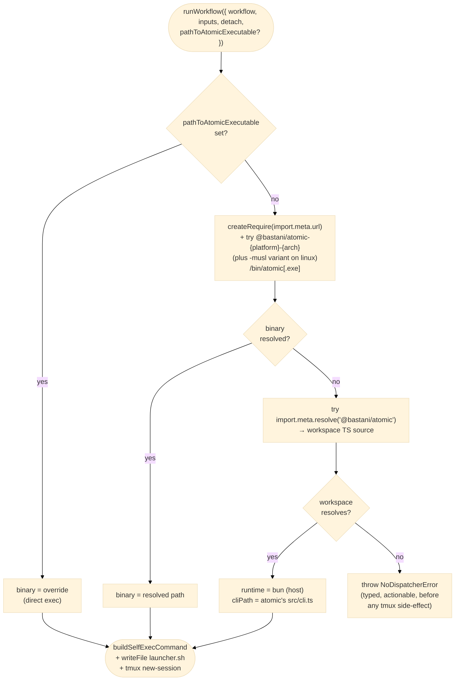

# Self-Contained `runWorkflow()` — SDK Reuses Atomic's Per-Platform Binaries via `optionalDependencies`

| Document Metadata      | Details         |
| ---------------------- | --------------- |
| Author(s)              | Alex Lavaee     |
| Status                 | Superseded by §11 — implementation diverges from §1–§9 |
| Team / Owner           | flora131/atomic |
| Created / Last Updated | 2026-05-06      |

> **Note (2026-05-06 evening):** Sections 1–9 below describe the original
> "reuse atomic's per-platform binaries" approach. During implementation
> the atomic binary was found to be unable to dynamic-import third-party
> workflow files — it has no module-resolution context for
> `@bastani/atomic-sdk/workflows` outside its own bunfs bundle. The
> shipped resolver therefore differs from §4–§5; see **§11 Implementation
> Notes** for the actual design.
>
> **Update (2026-05-06 later):** §11 originally introduced an explicit
> `handleSelfDispatch` helper that compiled third-party hosts had to call
> as the first statement of their CLI entry. That was replaced before
> shipping with two automatic mechanisms — see **§11.7** for the final
> design that eliminates the consumer boilerplate entirely.

## 1. Executive Summary

`@bastani/atomic-sdk` exposes `runWorkflow({ workflow, inputs, detach, pathToAtomicExecutable? })` as the only entry point a third-party SDK consumer should need. In practice today the SDK still leaks its internal dispatcher contract: when no override is given and the consumer's process happens to be a `bun build --compile` binary, `executor.ts:584` and `tmux.ts:219` fall through to `process.execPath`. That assumes the running binary registers `_orchestrator-entry` and `_cc-debounce` Commander commands — which is true for `@bastani/atomic`'s own CLI, but **not** for any third-party CLI that imports `runWorkflow` and ships its own compiled binary.

This RFC adopts the encapsulation shape the **Claude Agent SDK** landed in v0.2.113 ("spawn a native Claude Code binary (via a per-platform optional dependency) instead of bundled JavaScript") — but with a critical twist: **the SDK reuses `@bastani/atomic`'s existing per-platform binary packages** rather than publishing its own duplicate set. Atomic's CLI binary is already the dispatcher — it registers `_orchestrator-entry` and `_cc-debounce` (`packages/atomic/src/cli.ts:272`), and the [package-split RFC](2026-05-03-atomic-package-split.md) already publishes it as `@bastani/atomic-{platform}-{arch}`. Shipping a parallel `@bastani/atomic-sdk-{platform}-{arch}` set would be a 200 MB-per-release duplicate of the same code.

Resolution collapses to two branches:

1. `pathToAtomicExecutable` override → use it verbatim.
2. Default → `require.resolve("@bastani/atomic-{platform}-{arch}/bin/atomic[.exe]")` and spawn it.

A typed `NoDispatcherError` covers the unreachable case. Atomic's own CLI passes `pathToAtomicExecutable: process.execPath` so the SDK doesn't fork a sibling copy when it's already running inside atomic. The duplicate dispatcher in `packages/atomic-sdk/src/cli.ts` is **deleted** — atomic's CLI is the single source of truth for the dispatcher commands.

**This is a clean rewrite. No backwards-compatibility shims.** The old `resolveSdkCliPath()` helper, the `process.execPath` fallback ternaries in `executor.ts` and `tmux.ts`, the SDK's duplicate `cli.ts` dispatcher, and the `"./cli"` entry in `package.json#exports` are all **deleted outright** — not aliased, not deprecated, not wrapped in a "still works for one release" guard. Consumers on the previous SDK either upgrade end-to-end or stay on the old version. The package-split RFC already established that pre-1.0 minor bumps may carry breaking changes; this RFC rides that envelope.

**Net effect on published artifacts: zero new binary packages.** The 6–8 atomic CLI binaries already published do double duty.

## 2. Context and Motivation

### 2.1 Current State

Two places duplicate the dispatcher today:

- `packages/atomic/src/cli.ts:272` registers `_orchestrator-entry` and `_cc-debounce` for atomic's own CLI.
- `packages/atomic-sdk/src/cli.ts:32` registers the **same** commands for SDK-only consumers.

The SDK's `lib/self-exec.ts:100` (`resolveSdkCliPath()`) decides which dispatcher to spawn:
- Override → verbatim.
- Compiled-binary runtime → `process.execPath`.
- Else → `import.meta.resolve("@bastani/atomic-sdk/cli")`.

`executor.ts:580-584` and `tmux.ts:216-219` then build the launcher with `runtime = pathToAtomicExecutable ? cliPath : process.execPath`. This works for atomic's binary (whose Commander program speaks the protocol) and for dev mode (where `bun` is the host). It silently breaks for any third-party `bun build --compile`d CLI.

### 2.2 The Problem

When a third-party SDK consumer compiles their own CLI with `bun build --compile`:

- `process.execPath` is **their** binary.
- Their Commander program does not register `_orchestrator-entry` or `_cc-debounce`.
- The launcher emits `<their-binary> _orchestrator-entry <name> <agent> <inputsB64> <source>`. Their dispatcher prints "unknown command" and exits 1.
- The launcher script captures stderr to `orchestrator.log`; the user-facing tmux pane closes immediately. `executeWorkflow()` reports a green path because the tmux session was created successfully.
- The `@atomic-cc-debounce` user-option installed on the shared atomic tmux server points at the same broken command, breaking Ctrl+C debounce in every atomic-managed pane.

### 2.3 References

- **Claude Agent SDK v0.2.113 changelog**: "Changed the SDK to spawn a native Claude Code binary (via a per-platform optional dependency) instead of bundled JavaScript."
- **Claude Agent SDK v0.2.63 changelog**: "Fixed `pathToClaudeCodeExecutable` failing when set to a bare command name (e.g., `\"claude\"`) that should resolve via PATH" — confirms the override is binary-or-bare-name, PATH-resolves at exec time.
- **Claude Agent SDK v0.2.51 changelog**: "Fixed SDK crashing with `ReferenceError` when used inside compiled Bun binaries (`bun build --compile`)" — confirms the SDK targets compiled-Bun consumers.

The Claude Agent SDK's resolver, decompiled from the installed `@anthropic-ai/claude-agent-sdk@0.2.131/sdk.mjs`:

```js
function findBinary(resolver, platform, arch) {
  const ext = platform === "win32" ? ".exe" : "";
  const candidates = (platform === "linux"
    ? [`@anthropic-ai/claude-agent-sdk-linux-${arch}-musl`,
       `@anthropic-ai/claude-agent-sdk-linux-${arch}`]
    : [`@anthropic-ai/claude-agent-sdk-${platform}-${arch}`]
  ).map(pkg => `${pkg}/claude${ext}`);
  for (const cand of candidates) try { return resolver(cand); } catch {}
  return null;
}

let cli = options.pathToClaudeCodeExecutable;
if (!cli) {
  const require_ = createRequire(import.meta.url);
  cli = findBinary(require_.resolve.bind(require_));
  if (!cli) try { cli = require_.resolve("./cli.js"); } catch { throw }
}
```

That's the entire encapsulation — override or per-platform `optionalDependency`. We adopt the same shape, but resolve to `@bastani/atomic-{platform}-{arch}` instead of inventing a parallel `@bastani/atomic-sdk-{platform}-{arch}` family.

- **OpenCode SDK** (referenced in [`specs/2026-05-03-atomic-package-split.md`](2026-05-03-atomic-package-split.md) §2.3) takes a related shape: `@opencode-ai/sdk` shells out to whatever `opencode` binary is on PATH. Atomic's improvement is wiring the binary discovery via `optionalDependencies` so the user doesn't have to `PATH` it themselves.

## 3. Goals and Non-Goals

### 3.1 Functional Goals

- [ ] `runWorkflow({ workflow, inputs, detach })` works in a third-party `bun build --compile` binary without the consumer registering `_orchestrator-entry` or `_cc-debounce`.
- [ ] `runWorkflow({ ..., pathToAtomicExecutable: "/path/to/atomic" })` works as the explicit escape hatch. Bare command names PATH-resolve at exec time.
- [ ] `@bastani/atomic`'s own CLI passes `pathToAtomicExecutable: process.execPath` so the SDK doesn't double-resolve.
- [ ] Dev / monorepo mode (`bun packages/atomic-sdk/src/...` with no built atomic binary) keeps working via a workspace-resolution fallback that spawns `bun packages/atomic/src/cli.ts _orchestrator-entry ...`.
- [ ] **Zero new published packages.** The SDK's `optionalDependencies` reuse atomic's existing `@bastani/atomic-{platform}-{arch}` set.
- [ ] The duplicate dispatcher at `packages/atomic-sdk/src/cli.ts` is deleted in this RFC.
- [ ] When the SDK can't construct any dispatcher, `runWorkflow` throws a typed `NoDispatcherError` **before** creating the tmux session.

### 3.2 Non-Goals (Out of Scope)

- **Backwards compatibility with the previous SDK shape.** No alias, no deprecation, no transitional re-export.
  - `resolveSdkCliPath()` is removed, not soft-deprecated.
  - The `process.execPath` fallback in `executor.ts:584` and `tmux.ts:219` is removed, not gated behind an env-var or feature flag.
  - `packages/atomic-sdk/src/cli.ts` is deleted; `package.json#exports."./cli"` is dropped — no compat re-export to a shim, no "still works if you import it" branch.
  - `isCompiledBinaryRuntime()`'s "compiled binary → `process.execPath`" branch is deleted (the function itself stays for `runtime-assets.ts`'s bunfs-detection use, which is unrelated).
  - SDK consumers on the previous version stay on it or upgrade everything at once. Pre-1.0 minor bump is the version envelope.
- **Publishing a separate `@bastani/atomic-sdk-{platform}-{arch}` family.** Avoided by construction.
- **Inline JS-dispatcher materialization**, env-var atomic-host markers, host-bun probing as an end-user fallback. All obviated by the optional-binary approach.
- **Removing `pathToAtomicExecutable`.** Stays as the documented escape hatch.
- **Wire-format changes.** Launcher script shape, env-var contract (`ATOMIC_WF_*`), inputs base64 — all unchanged.
- **Code signing of atomic's binary.** Inherited from the package-split spec; not relitigated here.

## 4. Proposed Solution (High-Level Design)

### 4.1 Resolution Order Diagram



### 4.2 Architectural Pattern

**Wrapper SDK + sibling-package binary discovery via `optionalDependencies`** — the Claude Agent SDK shape, with the per-platform binary packages reused from `@bastani/atomic`'s split spec instead of duplicated. Three resolver branches:

1. **Override binary** — direct exec.
2. **Sibling-package binary** — resolved via `require.resolve("@bastani/atomic-{platform}-{arch}/bin/atomic[.exe]")`. The `optionalDependencies` declared on `@bastani/atomic-sdk` ensure npm/bun installs the matching one.
3. **Workspace dev fallback** — resolves `@bastani/atomic` (workspace-linked TS source) and spawns it via the host bun. Only reachable in monorepo dev / `bun link`.

### 4.3 Key Components

| Component                                                                             | Responsibility                                                                                                           | Notes                                                                                             |
| ------------------------------------------------------------------------------------- | ------------------------------------------------------------------------------------------------------------------------ | ------------------------------------------------------------------------------------------------- |
| `lib/self-exec.ts → resolveDispatcher()` (rewrite)                                    | Override → verbatim; else `findBinary` over `@bastani/atomic-*` optional deps; else workspace TS fallback; else throw.   | Direct port of Claude's `findBinary` shape.                                                       |
| `packages/atomic-sdk/package.json` (extend)                                           | Adds `optionalDependencies` block listing every `@bastani/atomic-{platform}-{arch}` published by the package-split spec. | Lockstep version pin with `@bastani/atomic`.                                                      |
| `packages/atomic-sdk/src/cli.ts` (delete)                                             | The SDK's duplicate dispatcher. Deleted.                                                                                 | Atomic's CLI is the single source of truth for `_orchestrator-entry` / `_cc-debounce`.            |
| `packages/atomic-sdk/package.json#exports` (edit)                                     | Drop `"./cli"` entrypoint.                                                                                               | The export pointed at the deleted `cli.ts`.                                                       |
| `errors.ts → NoDispatcherError` (new)                                                 | Typed error thrown when no resolver branch fits.                                                                         | Carries `searchedFor: ReadonlyArray<string>`.                                                     |
| `runtime/executor.ts`, `runtime/tmux.ts`                                              | Drop `pathToAtomicExecutable ? cliPath : process.execPath` ternaries. Consume the resolver's `Dispatcher`.               | Thin call-site change.                                                                            |
| `packages/atomic/src/lib/run-workflow-with-self.ts` (new)                             | Atomic-side helper: `runWorkflow({...args, pathToAtomicExecutable: process.execPath})`.                                  | Centralizes the "host knows the protocol itself" pattern across atomic's call sites.              |
| Package-split spec (`2026-05-03-atomic-package-split.md`) — extend with musl variants | Add `@bastani/atomic-linux-{x64,arm64}-musl` to atomic's binary matrix.                                                  | Required so SDK consumers on alpine/musl have a working binary; matches Claude Agent SDK's shape. |

## 5. Detailed Design

### 5.1 Resolver API

```ts
// packages/atomic-sdk/src/lib/self-exec.ts (rewrite)

export interface ResolveDispatcherOptions {
  override?: string;
  /** Test seam for `require.resolve`. */
  resolver?: (specifier: string) => string;
  platform?: NodeJS.Platform;
  arch?: string;
}

export type Dispatcher =
  | { kind: "override-binary";    binary: string }
  | { kind: "atomic-binary";      binary: string }
  | { kind: "workspace-dev";      runtime: string; cliPath: string };

export function resolveDispatcher(opts?: ResolveDispatcherOptions): Dispatcher;
// throws NoDispatcherError if none of the three fit
```

### 5.2 Resolution Algorithm

```ts
function resolveDispatcher(opts) {
  const override = opts?.override;
  if (override && override.length > 0) {
    return { kind: "override-binary", binary: override };
  }

  const platform = opts?.platform ?? process.platform;
  const arch = opts?.arch ?? process.arch;
  const ext = platform === "win32" ? ".exe" : "";

  const pkgCandidates = platform === "linux"
    ? [`@bastani/atomic-linux-${arch}-musl`,
       `@bastani/atomic-linux-${arch}`]
    : [`@bastani/atomic-${platform}-${arch}`];

  const require_ = opts?.resolver
    ? { resolve: opts.resolver }
    : createRequire(import.meta.url);

  for (const pkg of pkgCandidates) {
    try {
      const binary = require_.resolve(`${pkg}/bin/atomic${ext}`);
      return { kind: "atomic-binary", binary };
    } catch { /* try next */ }
  }

  // Workspace dev fallback: resolve the atomic package's TS source and spawn
  // via host bun. Reachable only in monorepo dev or `bun link` workflows
  // where no @bastani/atomic-{platform}-{arch} optional dep is installed.
  // Production installs always have the binary.
  try {
    const cliPath = fileURLToPath(import.meta.resolve("@bastani/atomic"));
    return { kind: "workspace-dev", runtime: process.execPath, cliPath };
  } catch { /* no workspace either */ }

  throw new NoDispatcherError({
    searchedFor: [...pkgCandidates, "@bastani/atomic (workspace)"],
  });
}
```

### 5.3 SDK `package.json` Additions

```json
{
  "name": "@bastani/atomic-sdk",
  "version": "X.Y.Z",
  "optionalDependencies": {
    "@bastani/atomic-linux-x64":          "X.Y.Z",
    "@bastani/atomic-linux-x64-musl":     "X.Y.Z",
    "@bastani/atomic-linux-arm64":        "X.Y.Z",
    "@bastani/atomic-linux-arm64-musl":   "X.Y.Z",
    "@bastani/atomic-darwin-x64":         "X.Y.Z",
    "@bastani/atomic-darwin-arm64":       "X.Y.Z",
    "@bastani/atomic-win32-x64":          "X.Y.Z",
    "@bastani/atomic-win32-arm64":        "X.Y.Z"
  }
}
```

(Same eight entries `@bastani/atomic` — the wrapper CLI package — declares in its own `optionalDependencies`. Both packages depend on the same binaries; npm de-duplicates so the user installs each once.)

The `./cli` entrypoint is **removed** from `exports` (not aliased to anything), and `src/cli.ts` is **deleted** (not stubbed, not re-exported from another module). The only published JS surface is the SDK's `defineWorkflow`, `runWorkflow`, registry, components, etc. — exactly what consumers actually import. Any external code that was importing `@bastani/atomic-sdk/cli` will fail at install/resolve time with a clear "no such export" error — that's the desired surface for a clean rewrite.

### 5.4 Atomic CLI Integration

`packages/atomic/src/cli.ts` already registers `_orchestrator-entry` and `_cc-debounce`. To avoid the SDK's resolver spawning a sibling copy when atomic is already the host, atomic wraps every `runWorkflow` call site:

```ts
// packages/atomic/src/lib/run-workflow-with-self.ts
import { runWorkflow, type RunWorkflowOptions } from "@bastani/atomic-sdk/workflows";

export function runWorkflowWithSelf(
  opts: Omit<RunWorkflowOptions, "pathToAtomicExecutable">,
) {
  // The compiled atomic binary IS the dispatcher; reuse it instead of
  // letting the SDK resolve a sibling @bastani/atomic-{platform}-{arch}.
  return runWorkflow({ ...opts, pathToAtomicExecutable: process.execPath });
}
```

All atomic-side `runWorkflow` callers (`packages/atomic/src/commands/.../*.ts`) migrate from `runWorkflow(opts)` to `runWorkflowWithSelf(opts)`. Roughly five call sites today.

### 5.5 Migrating Existing Call Sites

In `@bastani/atomic-sdk`:

- `runtime/executor.ts:580-590` — replace runtime/cliPath dance with `const dispatcher = resolveDispatcher({ override: pathToAtomicExecutable })`. Pass to `buildSelfExecCommand`. The pre-existing `pathToAtomicExecutable ? cliPath : process.execPath` ternary is **deleted**, not preserved as a fallback.
- `runtime/tmux.ts:216-226` — same shape; same deletion.
- `lib/self-exec.ts` — `resolveSdkCliPath()` is **removed** (not re-exported as a thin wrapper around the new resolver, not kept as `@deprecated`). `resolveDispatcher` replaces it.
- `src/cli.ts` — **deleted.** Not stubbed, not re-exported from another module.
- `package.json#exports` — `"./cli"` entry **removed.** No alias to the new resolver, no JSON-redirect to a stub.
- `runtime/orchestrator-entry.ts` — already a non-CLI module; no change.
- `lib/self-exec.test.ts` — rewritten against `resolveDispatcher`. Old tests for `resolveSdkCliPath` are deleted alongside the production code, not "ported" into compat tests.

In `@bastani/atomic`:

- New `lib/run-workflow-with-self.ts`.
- All `runWorkflow(...)` call sites migrate to `runWorkflowWithSelf(...)`. Direct `runWorkflow` is no longer called from atomic-side code (the SDK still exports it for third-party consumers).

### 5.6 `buildSelfExecCommand` Adjustments

The existing helper takes `runtime` + `cliPath` + `subcommand` + `args`. The `Dispatcher` discriminated union maps cleanly:

- `{ kind: "override-binary", binary }` → `runtime = cliPath = binary`.
- `{ kind: "atomic-binary", binary }` → same shape.
- `{ kind: "workspace-dev", runtime, cliPath }` → `runtime !== cliPath`; helper emits `<bun> <atomic/src/cli.ts> <subcommand>`.

A thin adapter inside `buildSelfExecCommand` (or inline at the call site) handles the union destructuring. No quoting / escaping changes.

### 5.7 Error Surface

```ts
// packages/atomic-sdk/src/errors.ts (additions)

export class NoDispatcherError extends Error {
  readonly name = "NoDispatcherError";
  readonly searchedFor: ReadonlyArray<string>;
  constructor(opts: { searchedFor: ReadonlyArray<string> }) {
    super(
      `runWorkflow() could not locate the atomic CLI binary.\n` +
      `Searched: ${opts.searchedFor.join(", ")}.\n` +
      `Reinstall @bastani/atomic-sdk so the matching ` +
      `@bastani/atomic-${process.platform}-${process.arch} optional ` +
      `dependency is present, or pass \`pathToAtomicExecutable\` to ` +
      `runWorkflow() pointing at an atomic binary.`,
    );
    this.searchedFor = opts.searchedFor;
  }
}
```

`runWorkflow` is async; the error rejects the returned promise. `executeWorkflow()` calls `resolveDispatcher()` **before** creating the tmux session — failure mode is "throw before side-effect."

### 5.8 Test Plan

- `self-exec.test.ts` — rewrite against `resolveDispatcher`:
  - Override (absolute path, bare command name, empty string).
  - `atomic-binary` resolution on every `{platform, arch}`. Synthetic `resolver` mock returns a path for the matching package; throws otherwise. Linux probes musl-first.
  - `workspace-dev` fallback when no binary package matches but `import.meta.resolve("@bastani/atomic")` succeeds.
  - `NoDispatcherError` when nothing matches; `searchedFor` array populated.
- `executor.test.ts` (extend) — integration: with the resolver mocked to throw, `runWorkflow` rejects **before** any tmux command runs.
- `orchestrator-entry.test.ts` (existing, kept) — still validates atomic's compiled binary handles `_orchestrator-entry` end-to-end.
- **`tests/fixtures/sdk-compiled-consumer/` (new, Phase 3)** — see §8.2.

## 6. Alternatives Considered

| Option                                                                                                                    | Pros                                                                                                                                                                                                                                                                                                                             | Cons                                                                                                                                                                                                                                                                                                                                                                                                                     | Reason for Selection / Rejection                                                                                                |
| ------------------------------------------------------------------------------------------------------------------------- | -------------------------------------------------------------------------------------------------------------------------------------------------------------------------------------------------------------------------------------------------------------------------------------------------------------------------------- | ------------------------------------------------------------------------------------------------------------------------------------------------------------------------------------------------------------------------------------------------------------------------------------------------------------------------------------------------------------------------------------------------------------------------ | ------------------------------------------------------------------------------------------------------------------------------- |
| **A: Drop `process.execPath` fallback; require `pathToAtomicExecutable` for compiled third-party CLIs**                   | Smallest change.                                                                                                                                                                                                                                                                                                                 | Breaks the functional interface promise.                                                                                                                                                                                                                                                                                                                                                                                 | **Rejected.**                                                                                                                   |
| **B: Materialize SDK's `cli.js` from bunfs, spawn via host bun** (previous selected)                                      | No new publish matrix.                                                                                                                                                                                                                                                                                                           | Requires bun on every host or atomic-on-PATH; introduces an env-var atomic-host marker; bunfs materialization adds ≈ 100 LOC and a new failure mode. The Claude Agent SDK explicitly switched away from this in v0.2.113.                                                                                                                                                                                                | **Rejected.**                                                                                                                   |
| **C: Ship a parallel `@bastani/atomic-sdk-{platform}-{arch}` binary family** (previous selected, after Claude SDK review) | Mirrors Claude Agent SDK's package layout exactly.                                                                                                                                                                                                                                                                               | Duplicate of `@bastani/atomic-{platform}-{arch}` content. Doubles the binary publish matrix (8 SDK + 6–8 atomic = 14–16 binary packages). Atomic's CLI binary already contains the dispatcher; shipping a parallel SDK-only binary is redundant.                                                                                                                                                                         | **Rejected.**                                                                                                                   |
| **D: SDK reuses atomic's binaries via `optionalDependencies` (Selected — §4–§5)**                                         | Zero new binary packages. Single dispatcher binary across the whole product. Single source of truth for `_orchestrator-entry` / `_cc-debounce`. Atomic's CLI keeps working unchanged; the SDK now matches its dispatch model exactly. Mirrors the "binary discovery via `optionalDependencies`" idea Claude Agent SDK validated. | The SDK now has a hard runtime dependency on the atomic CLI binary being installed — but that's exactly what `optionalDependencies` makes automatic, so SDK consumers don't notice. SDK consumers' `node_modules` will contain atomic's full binary (≈ 100 MB) even though they only invoke the dispatcher subset; bandwidth cost is real but not unique to atomic (Claude Agent SDK ships binaries of comparable size). | **Selected.** Cleanest contract, fewest moving parts, and avoids the duplicate-publish overhead Option C would have introduced. |
| **E: Inline the dispatcher into the SDK module so there's no separate process**                                           | No subprocesses, no shell quoting.                                                                                                                                                                                                                                                                                               | Violates the existing process-isolation invariant: the orchestrator pane is its own process inside tmux.                                                                                                                                                                                                                                                                                                                 | **Rejected.**                                                                                                                   |

## 7. Cross-Cutting Concerns

### 7.1 Security and Privacy

- **npm provenance** — atomic's `@bastani/atomic-{platform}-{arch}` packages already publish with provenance per the package-split spec. Adding them as `optionalDependencies` of `@bastani/atomic-sdk` does not change the security posture.
- **PATH-resolution risk on overrides** — bare command names in `pathToAtomicExecutable` PATH-resolve at exec time. Existing risk; no new attack surface.
- **No env-var marker, no materialization-cache integrity surface** — both removed by going binary-direct.

### 7.2 Observability

- **Resolver decision logging.** When `ATOMIC_DEBUG=1`, `resolveDispatcher` logs which `Dispatcher` kind it returned and what was searched.
- **Telemetry tag** — emit `dispatcher.kind` per `runWorkflow` call. Three values now (`override-binary`, `atomic-binary`, `workspace-dev`); we expect `workspace-dev` to round to 0% in production telemetry.
- **`NoDispatcherError`** carries `searchedFor: ReadonlyArray<string>`.

### 7.3 Compatibility / Scalability

- **Atomic's own CLI**: identical behavior after the `runWorkflowWithSelf` wrapper lands. Atomic's binary keeps registering `_orchestrator-entry` and `_cc-debounce` itself.
- **Dev / monorepo mode**: `workspace-dev` branch resolves atomic's TS source via workspace linking (`@bastani/atomic` is a workspace package). Spawns `bun packages/atomic/src/cli.ts _orchestrator-entry ...`. Works without any binary build.
- **Third-party SDK consumers running under bun (not compiled)**: optional binary auto-installed; SDK spawns it.
- **Third-party SDK consumers compiled with `bun build --compile`**: their dev machine had `node_modules/@bastani/atomic-{platform}-{arch}/bin/atomic` installed. The compiled binary's `require.resolve` walks the host filesystem at runtime to find the same package — so the consumer's distribution must include the atomic binary alongside their own. Two patterns:
  1. **Co-distribute**: include the matching `@bastani/atomic-{platform}-{arch}` directory next to the consumer's binary. Documented in the SDK README. Same constraint Claude Agent SDK consumers face.
  2. **Postinstall download**: a release script that fetches the atomic binary from GitHub Releases and bundles it.
  Phase 3's fixture validates pattern (1) explicitly.
- **Per-platform package count**: 8 atomic binaries + 1 atomic wrapper + 1 SDK wrapper = **10 packages per release** (vs 16 if the SDK shipped its own binaries — Option C). Adding musl variants is the net delta vs the package-split spec's current 6.

## 8. Migration, Rollout, and Testing

### 8.1 Phased Rollout

**Sequencing note:** the phases below are implementation order, not "ramp the new path while leaving the old path live." Each phase ends with the old code physically removed, not deprecated. There is no compat dual-path inside the SDK at any point.

- **Phase 1 — Resolver rewrite + atomic CLI integration. Old path deleted at the end of this phase.**
  - Add `resolveDispatcher()` and `errors.ts → NoDispatcherError`.
  - Migrate `executor.ts` and `tmux.ts` to consume the resolver. **Delete** the `pathToAtomicExecutable ? cliPath : process.execPath` ternaries at the same time — no fallback retained.
  - Add `runWorkflowWithSelf()` in atomic; migrate atomic's `runWorkflow` callers in lockstep.
  - **Delete** `lib/self-exec.ts → resolveSdkCliPath` and rewrite its tests against `resolveDispatcher`. The PR that adds `resolveDispatcher` is the same PR that removes `resolveSdkCliPath` — they do not coexist on `main`.
  - Verify atomic's compiled binary still self-execs via the override path (the only way it should now).
  - Verify dev mode works via `workspace-dev` fallback.

- **Phase 2 — SDK `optionalDependencies` + delete duplicate dispatcher.**
  - Add `optionalDependencies` block to `packages/atomic-sdk/package.json`. Lockstep version with atomic.
  - **Delete** `packages/atomic-sdk/src/cli.ts` and remove `"./cli"` from `exports` in the same PR. No alias, no re-export, no compat shim. Any external import of `@bastani/atomic-sdk/cli` will fail at resolve time post-merge — that's the intended surface.
  - Add musl variants to atomic's binary publish matrix in the package-split spec's CI workflow. Two new build targets: `bun-linux-x64-musl`, `bun-linux-arm64-musl`.
  - Dry-run via a `0.7.0-rc.0` prerelease.

- **Phase 3 — Third-party-compiled validation via real fixture.**
  - Create `tests/fixtures/sdk-compiled-consumer/` — a minimal SDK consumer (`my-app.ts`) that imports `runWorkflow` from `@bastani/atomic-sdk/workflows`, registers a trivial workflow, exposes a `greet` Commander subcommand. Pinned to the prerelease SDK version.
  - Build script: `bun build --compile --outfile dist/my-app src/cli.ts`. Produces a self-contained binary.
  - **Smoke matrix per target** (Linux x64/arm64 ± musl, Darwin x64/arm64, Win32 x64/arm64):
    1. `bun install` the fixture (pulls SDK + matching atomic binary via `optionalDependencies`).
    2. Compile the fixture.
    3. Copy the matching `node_modules/@bastani/atomic-{platform}-{arch}` directory next to the compiled fixture binary (the co-distribute pattern).
    4. Run the fixture binary in a clean PWD. Assert `runWorkflow` succeeds, the orchestrator pane comes up, and the workflow runs to completion.
    5. Repeat with `pathToAtomicExecutable` set to a known-good atomic binary path; assert `dispatcher.kind === "override-binary"`.
    6. Force-remove the colocated atomic binary; assert `runWorkflow` rejects with `NoDispatcherError` carrying the expected `searchedFor` array. Tmux session must NOT be created.
  - **`require.resolve` empirical verification**: this matrix directly answers the open question about how `createRequire(import.meta.url).resolve("@bastani/atomic-{platform}-{arch}/bin/atomic")` behaves inside a `/$bunfs/...`-rooted compiled binary. Pattern (1) above proves it walks to the host filesystem; if a target fails this assertion, we either ship a `BUN_BUNFS_DOWNLINK`-style workaround or document the requirement to colocate via a different mechanism.

- **Phase 4 — Documentation + cleanup.**
  - SDK README "Distribution" section: how to co-distribute the atomic binary with a `bun build --compile`d third-party CLI.
  - `examples/commander-embed/README.md`: same note.
  - Delete dead code from `packages/atomic-sdk/src/cli.ts` (already done in Phase 2; this is a cleanup-of-cleanup pass for any references in tests).

### 8.2 Cross-Platform CI Test Matrix

Phase 3's fixture is the new test harness. It runs:
- **Pre-publish** (every PR touching `packages/atomic-sdk/**` or `packages/atomic/**`) against `npm pack` tarballs.
- **Post-publish** against the actually-published prerelease.
- **Nightly** to catch Bun runtime drift.

### 8.3 Rollback

If a single per-platform atomic binary proves broken on a target (e.g., a musl variant), unpublish that one within npm's 72-hour window. The SDK wrapper's `optionalDependencies` failures are non-fatal — users on the broken platform get `NoDispatcherError`; other platforms keep working.

## 9. Open Questions / Unresolved Issues

- [x] **Encapsulation strategy** — **resolved: SDK reuses atomic's binaries via `optionalDependencies` (Option D).** Zero new binary packages. Atomic's CLI is the single dispatcher source of truth.
- [x] **Override semantics** — **resolved: binary-only.** Bare command names PATH-resolve at exec time.
- [x] **Atomic CLI integration** — **resolved: `runWorkflowWithSelf()` wrapper inside atomic.** Centralizes the `pathToAtomicExecutable: process.execPath` injection across atomic's call sites.
- [x] **Linux musl** — **resolved: extend atomic's binary matrix with musl variants** (`@bastani/atomic-linux-{x64,arm64}-musl`). Probe musl-first in the resolver. Mirrors Claude Agent SDK's exact suffix shape.
- [x] **Windows ARM64** — **resolved: x64-baseline binary under Prism**, identical to the package-split spec §5.6.
- [x] **Dev / monorepo fallback** — **resolved: `workspace-dev` branch.** Resolves `@bastani/atomic` workspace package, spawns its TS source via host bun. Production installs always have the binary; this branch is a safety net for contributors.
- [x] **Duplicate dispatcher in `packages/atomic-sdk/src/cli.ts`** — **resolved: delete in this RFC, no compat shim.** Atomic's CLI is the single source of truth; the SDK's copy is dead code once the resolver points at atomic's binary. The `@bastani/atomic-sdk/cli` export is removed alongside, not aliased.
- [x] **Backwards compatibility with the v0.7.x SDK shape** — **resolved: none.** Clean rewrite. No `@deprecated` markers, no transitional aliases, no env-var or feature-flag gating of the new resolver, no compat tests for the old `resolveSdkCliPath`. Pre-1.0 minor bump (likely `0.8.0`) is the version envelope; consumers on v0.7.x stay there or upgrade end-to-end.
- [x] **Telemetry on resolver-kind** — **resolved: emit `dispatcher.kind`** with three values (`override-binary`, `atomic-binary`, `workspace-dev`).
- [x] **`require.resolve` in compiled third-party binaries** — **resolved: empirically verified by the Phase 3 fixture matrix.** Assertion (3) of Phase 3 directly tests it on every supported target. Failure on any target gates the release.
- [ ] **Code signing for atomic's binaries** — inherited from package-split spec; not relitigated here.
- [ ] **Should `@bastani/atomic` (the wrapper) and `@bastani/atomic-sdk` declare the same `optionalDependencies` independently, or should `@bastani/atomic-sdk` *depend on* `@bastani/atomic` (the wrapper) and inherit them transitively?** Independent declarations keep the install graph simple (the SDK doesn't pull the user-facing `bin: { atomic }` shim into a library consumer's tree). Transitive inheritance dedupes the version-pin list. **Recommendation: independent declarations** — the wrapper's `bin` shim and postinstall would be unwanted on SDK-only consumers.

## 11. Implementation Notes (corrects §4–§5)

The "reuse atomic's per-platform binaries" approach in §4–§5 had a fatal
flaw discovered in `bun run` testing: the atomic CLI binary cannot
dynamic-import third-party workflow files because the workflow's
`import { defineWorkflow } from "@bastani/atomic-sdk/workflows"` is
unresolvable from outside the binary's bunfs context. Spawning the
atomic binary against a third-party workflow source path therefore
fails with `Cannot find module '@bastani/atomic-sdk/workflows'`.

### 11.1 Shipped Resolver

The shipped resolver has only two branches:

```ts
type Dispatcher =
  | { kind: "override-binary"; binary: string }
  | { kind: "host-bun";        runtime: string; cliPath: string };

function resolveDispatcher(opts) {
  if (opts?.override) return { kind: "override-binary", binary: opts.override };

  const url = import.meta.resolve("@bastani/atomic-sdk/cli");
  const cliPath = fileURLToPath(url);
  if (!isCompiledBinaryRuntime(cliPath)) {
    return { kind: "host-bun", runtime: process.execPath, cliPath };
  }
  throw new NoDispatcherError({ searchedFor: ["@bastani/atomic-sdk/cli (host-bun)"] });
}
```

This means:

- **`bun run`** consumers (third-party or atomic dev) get the SDK's own
  prebundled `cli.ts` spawned via host bun. Module resolution from the
  workflow's project tree resolves `@bastani/atomic-sdk` normally —
  the third-party `bun run` crash is fixed.
- **Compiled `@bastani/atomic` binary** passes
  `pathToAtomicExecutable: process.execPath` via `runWorkflowWithSelf`
  and self-dispatches through its own Commander program.
- **Compiled third-party CLIs** opt into the same self-dispatch by
  importing `handleSelfDispatch` from `@bastani/atomic-sdk/dispatcher`
  (see §11.3) and passing `pathToAtomicExecutable: process.execPath`.

The `atomic-binary` and `workspace-dev` Dispatcher kinds are deleted.
The SDK's `optionalDependencies` on `@bastani/atomic-{platform}-{arch}`
are also removed — the SDK no longer reaches into atomic's binary
distribution.

### 11.2 `runWorkflowWithSelf` Detects Compiled Mode

`packages/atomic/src/lib/run-workflow-with-self.ts` only sets the
override when `import.meta.dir` is bunfs-rooted (compiled mode). In
atomic dev mode (`bun packages/atomic/src/cli.ts …`) it leaves the
override undefined so the SDK's host-bun resolution kicks in.

### 11.3 Self-Dispatch Helper for Compiled Third-Party Hosts

`packages/atomic-sdk/src/dispatcher.ts` exports `handleSelfDispatch()` —
a function the consumer calls as the very first statement of their
compiled CLI's entry point:

```ts
import { handleSelfDispatch } from "@bastani/atomic-sdk/dispatcher";
await handleSelfDispatch();   // intercepts argv[2] === "_orchestrator-entry"

import { Command } from "commander";
import { runWorkflow } from "@bastani/atomic-sdk/workflows";
// ... rest of CLI
```

When `runWorkflow` spawns `<my-app> _orchestrator-entry <args>`, the
helper catches argv before Commander parses it, runs the SDK's
`runOrchestratorEntry`, and exits.

### 11.4 Why Not Auto-Dispatch via Side-Effect Import?

A side-effect import in the SDK barrel that auto-installs an argv
handler was considered but rejected: the side-effect runs at SDK barrel
import time, BEFORE the consumer's `import workflow from "./workflow.ts"`
line in their cli.ts (ESM evaluates in dependency-topological order, and
workflow.ts depends on the SDK barrel). The auto-dispatcher therefore
can't read a registry populated by `defineWorkflow` calls. Explicit
`handleSelfDispatch()` lets the consumer order the import correctly.

### 11.5 Why Not Materialize the SDK's cli.js to Disk?

In compiled mode the SDK's cli.js lives in bunfs. Materializing it to a
real on-disk path would let host bun read it — but compiled binaries
don't expose a host bun, and we can't assume host bun is on `PATH` for
end-user installs of a third-party compiled CLI. The override pattern
with `handleSelfDispatch` is the only mechanism that works without
shipping additional binaries.

### 11.6 Fixture and CI

`tests/fixtures/sdk-compiled-consumer/` exercises both branches:

| Step | Mode | Asserts |
|---|---|---|
| 2 | host-bun (`bun src/cli.ts greet`) | `kind=host-bun` resolution, `workflow:launched` |
| 4 | compiled (`dist/my-app greet`) | `kind=override-binary` (via auto-defaulted `process.execPath`), `workflow:launched` |
| 5 | compiled, `ATOMIC_DISABLE_DEFAULT_EXEC=1` | `NoDispatcherError` before tmux side-effect |

`.github/workflows/sdk-fixture-smoke.yml` runs the full six-step matrix
on every PR touching `packages/atomic-sdk/**`, `packages/atomic/**`, or
the fixture, across linux-x64 (glibc + musl), linux-arm64 glibc,
darwin-arm64, darwin-x64, and windows-x64.

### 11.7 Final Design — Zero-Boilerplate Compiled Hosts (corrects §11.1, §11.3, §11.4)

§11.1 originally required compiled third-party hosts to (a) call
`handleSelfDispatch()` at the top of their entry file and (b) pass
`pathToAtomicExecutable: process.execPath` to every `runWorkflow` call.
That two-line ceremony pushed an SDK-internal argv contract into the
consumer's CLI and was rejected as a poor developer experience.

The shipped design replaces it with two automatic mechanisms. Compiled
third-party hosts now look identical to `bun run` hosts — no SDK
boilerplate at all:

```ts
// my-app/src/cli.ts — all of it
import { Command } from "commander";
import { runWorkflow } from "@bastani/atomic-sdk/workflows";
import workflow from "./workflow.ts";

const program = new Command("my-app");
program.command("greet").action(async () => {
  await runWorkflow({ workflow, inputs: {} });
});
await program.parseAsync();
```

#### 11.7.1 Mechanism 1 — auto-default `pathToAtomicExecutable`

`runWorkflow` (in `packages/atomic-sdk/src/primitives/run.ts`) defaults
the option when the caller leaves it unset:

```ts
const pathToAtomicExecutable =
  options.pathToAtomicExecutable
  ?? (isCompiledBinaryRuntime(import.meta.dir) ? process.execPath : undefined);
```

`import.meta.dir` of `run.ts` is bunfs-rooted in any compiled host
(atomic's own binary or a third-party `bun build --compile` host) and a
real on-disk path otherwise. The auto-default lights up the
`override-binary` branch in compiled hosts and leaves the host-bun
branch as the default in `bun run` mode. The user-facing
`pathToAtomicExecutable` option remains as the documented escape hatch.

#### 11.7.2 Mechanism 2 — argv side-effect at SDK barrel load

`primitives/run.ts` installs a top-level argv handler that fires when
the module is evaluated:

```ts
{
  const sub = process.argv[2];
  if (sub === "_orchestrator-entry") {
    try {
      const { runOrchestratorEntry } = await import("../runtime/orchestrator-entry.ts");
      await runOrchestratorEntry(source, agent, inputsB64);
      process.exit(0);
    } catch (err) {
      if (err instanceof InvalidWorkflowError) {
        // Source path didn't resolve to a workflow module — defer to
        // the host's argv parser (atomic's compiled CLI, which has its
        // own hidden Commander handler that resolves builtin workflows
        // by name+agent against `createBuiltinRegistry()`).
      } else {
        process.stderr.write(...);
        process.exit(1);
      }
    }
  } else if (sub === "_cc-debounce") {
    process.exit(runCcDebounce(process.argv[3] ?? ""));
  }
}
```

The side-effect runs whenever a host imports `runWorkflow` (directly or
via the `@bastani/atomic-sdk/workflows` barrel), which any host calling
`runWorkflow` necessarily does. Non-matching argv is a single string
compare — no async cost. Matching argv top-level-awaits the dispatch
and exits before the consumer's Commander parser sees argv.

#### 11.7.3 Atomic's compiled binary fallback

Atomic's `_orchestrator-entry` Commander handler stays in
`packages/atomic/src/cli.ts` because the SDK's source-path dynamic-
import can't resolve atomic's builtin workflows (Bun collapses every
bundled module's `import.meta.path` to the binary entry, which
re-imports atomic's own cli.ts and fails with no default export). The
side-effect catches `InvalidWorkflowError` and falls through silently;
atomic's Commander then runs the registry-aware fallback
(`createBuiltinRegistry().resolve(name, agent)` →
`runOrchestratorWithDefinition`). Both paths converge.

Third-party compiled hosts whose workflow modules retain individual
bunfs paths (the typical case — workflow.ts statically-imported from
the consumer's entry) get auto-dispatched by the SDK side-effect with
no fallback needed.

#### 11.7.4 Deletions made for this redesign

- `packages/atomic-sdk/src/dispatcher.ts` — `handleSelfDispatch` removed.
- `package.json#exports['./dispatcher']` — corresponding export entry.
- `packages/atomic/src/lib/run-workflow-with-self.ts` — the auto-default
  in the SDK primitive replaces this wrapper.
- All documentation references to `handleSelfDispatch` across
  `packages/atomic-sdk/README.md`, `examples/commander-embed/README.md`,
  `tests/fixtures/sdk-compiled-consumer/README.md` and `…/src/cli.ts`,
  the smoke script, and the SDK `script/build.test.ts` /
  `script/verify-bundled-cli.ts` packaging assertions.
