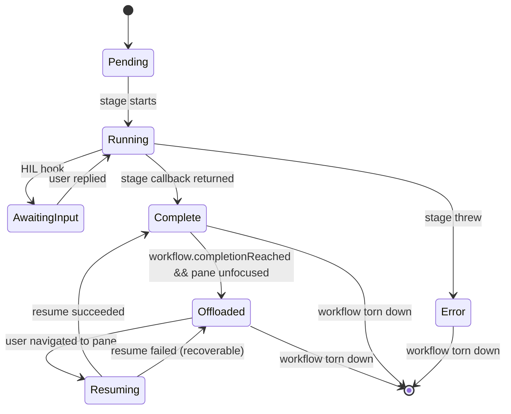

# Workflow Pane Offload & Resume (Chrome-Tab-Style)

| Document Metadata      | Details      |
| ---------------------- | ------------ |
| Author(s)              | Norin Lavaee |
| Status                 | Draft (WIP)  |
| Team / Owner           | Atomic CLI   |
| Created / Last Updated | 2026-05-08   |

## 1. Executive Summary

Long-running Atomic workflows hold a tmux pane + a live agent CLI process (Claude Code, OpenCode, Copilot) for every non-headless stage, even after the stage's callback returns. These idle CLIs each consume hundreds of MB of RAM. This RFC proposes a Chrome-tab-style offload mechanism: when a non-headless workflow stage finishes (or is left unfocused), kill the underlying agent process and free its tmux pane resources, persisting only the agent-native session ID. When the user navigates back to that pane, transparently re-spawn the agent with `--resume <sessionId>` so the user sees the original transcript and can continue the conversation.

The feature does **not** apply to headless stages (those are already torn down at completion) and does **not** apply to actively running stages (the user expects work to continue when they switch away). The result: large, multi-stage workflow runs stop accumulating ghost agent processes, and a dormant workflow only costs disk space.

## 2. Context and Motivation

### 2.1 Current State

- Each non-headless stage runs `tmux.createWindow(...)` (`packages/atomic-sdk/src/runtime/executor.ts:1717`) and spawns a real `claude` / `opencode` / `copilot` CLI in that window.
- After `s.send(prompt)` returns, the stage callback typically completes — `activeRegistry.delete(name)` runs and the entry moves to `completedRegistry` (`executor.ts:1986`) — but the **agent CLI keeps running** in tmux, holding its own context window, model HTTP keep-alive, MCP servers, and any preloaded skills/tools.
- A workflow with N stages keeps N idle agent CLIs alive until `runOrchestrator`'s `shutdown` (`executor.ts:2093`) calls `tmux.killSession(...)`, which only fires when the entire tmux session is being torn down.
- Atomic already persists per-stage state to `~/.atomic/sessions/<runId>/<name>-<sessionId>/` (status.json, metadata.json, messages.json, inbox.md), so on-disk recoverability is already partially in place. See [`2026-02-25-workflow-sdk-design.md`](../research/docs/2026-02-25-workflow-sdk-design.md).

### 2.2 The Problem

- **User Impact:** Multi-stage workflows (e.g., Ralph DAG runs with 6+ stages) are unusable on lower-RAM machines because every Claude/Copilot/OpenCode pane holds its full context.
- **Resource Impact:** A 5-stage non-headless workflow easily holds 1–2 GB of resident agent memory after the workflow run completes, even when the user is no longer interacting with any pane.
- **Technical Debt:** There is no notion of "this pane is dormant" — the panel store models only `running | awaiting_input | complete | error` (`packages/atomic-sdk/src/components/orchestrator-panel-store.ts:85-107`). Every completed stage looks the same regardless of whether its CLI is still in memory.
- **Cross-doc:** Related interrupt/destroy bugs are documented in [`2026-03-25-workflow-interrupt-resume-bugs.md`](../research/docs/2026-03-25-workflow-interrupt-resume-bugs.md), which calls out that the conductor's `finally` block destroys session state unconditionally — the same teardown discipline we want to invert here.

## 3. Goals and Non-Goals

### 3.1 Functional Goals

- [ ] When a non-headless workflow run reaches `completionReached`, idle/unfocused panes have their underlying agent CLI killed and their tmux window reaped.
- [ ] When the user navigates to a previously-offloaded pane (via the session graph, `Enter` on a node, or a tmux switch-client), the agent CLI is re-spawned with the agent's native `--resume` flag against the persisted session ID, transparently to the user.
- [ ] The agent's transcript (history, tool calls, prior messages) is preserved across the offload/resume cycle by relying on the agent CLI's own resume mechanism — Atomic does not re-implement transcript replay.
- [ ] Per-provider `--resume` wiring exists for Claude (`claude --resume <id>`), OpenCode (`opencode --session <id>` or equivalent), and Copilot (`copilot --resume <id>` or equivalent — see Section 9).
- [ ] The pane lifecycle states grow a new value `offloaded` (visible in `SessionData.status`), distinct from `complete`.
- [ ] Active (still-streaming) stages are exempt from offload, even if the user has navigated to a different pane.
- [ ] Offload is unconditional for non-headless workflows once the workflow run reaches `completionReached`. There is no opt-out flag at any level — the goal is to make offload a system-wide invariant of completed runs.

### 3.2 Non-Goals (Out of Scope)

- [ ] We will NOT offload headless stages — they already terminate cleanly at the end of `createSessionRunner` (`executor.ts:1986`) and have no tmux pane.
- [ ] We will NOT offload mid-run stages just because the user navigated away. Active workflows continue regardless of pane focus, per the user's requirement "active workflows will run regardless if we are detached".
- [ ] We will NOT introduce a memory-pressure-driven eviction policy in v1 (e.g., LRU eviction at N panes). This may come later (Section 9, Q5).
- [ ] We will NOT preserve sub-agent (Task tool) sessions for offload. Sub-agents are short-lived and tied to their parent stage's run.
- [ ] We will NOT change the existing `~/.atomic/sessions/<runId>/` on-disk schema in a backwards-incompatible way; new fields are additive only.
- [ ] We will NOT support cross-machine resume (you cannot offload on machine A and resume on machine B). The agent CLI's own transcript file (e.g., `~/.claude/projects/<hash>/<UUID>.jsonl`) is local-only.

## 4. Proposed Solution (High-Level Design)

### 4.1 System Architecture Diagram

```mermaid
%%{init: {'theme':'base'}}%%
flowchart TB
    subgraph User["User Interaction"]
        U(("◉ User"))
    end

    subgraph TUI["Atomic TUI (orchestrator-panel)"]
        SG["SessionGraphPanel<br/>(focus poller)"]
        Store["PanelStore<br/>+ status: 'offloaded'<br/>+ offloadResumeMeta"]
    end

    subgraph Runtime["packages/atomic-sdk/src/runtime"]
        Exec["executor.ts<br/>activeRegistry/<br/>completedRegistry"]
        Off["offload-manager.ts<br/>(NEW)"]
        Tmux["tmux.ts<br/>+ killWindow()"]
    end

    subgraph Provider["Providers"]
        Claude["claude.ts<br/>spawn(--resume id)"]
        OC["opencode.ts<br/>session.create({sessionId})"]
        Cop["copilot.ts<br/>spawn(--resume id)"]
    end

    Disk[("◆ ~/.atomic/sessions/&lt;runId&gt;/<br/>&lt;name&gt;-&lt;stageId&gt;/<br/>+ resume.json (NEW)")]

    U -->|navigate to pane| SG
    SG -->|focus event| Store
    Store -->|requestResume(name)| Off
    Exec -->|onCompletion| Off
    Off -->|spawn agent --resume id| Provider
    Off -->|killWindow| Tmux
    Off <-->|read/write| Disk
    Provider -->|writes transcript| Disk
```

### 4.2 Architectural Pattern

- **State machine + lazy materialization.** Each non-headless stage's pane has a lifecycle: `running → complete → offloaded → resuming → complete (re-attached)`. Offload is an idempotent transition that releases process resources while preserving the disk-side resume token.
- **Single-source-of-truth on disk.** The agent's own session-id file (Claude's UUID JSONL, OpenCode's session row, Copilot's session record) is the *authoritative* transcript store. Atomic only persists the *pointer* to it (resume metadata). This avoids reimplementing transcript replay.
- **Reactive resume trigger via existing focus poller.** `SessionGraphPanel` already polls tmux every 500ms (`session-graph-panel.tsx:342-367`) for `display-message` to detect window focus changes. We extend this poller to fire `offloadManager.requestResume(name)` when the user enters an offloaded pane.

### 4.3 Key Components

| Component                          | Responsibility                                                                    | Location (existing or NEW)                                                                               |
| ---------------------------------- | --------------------------------------------------------------------------------- | -------------------------------------------------------------------------------------------------------- |
| `OffloadManager`                   | Tracks offloadable panes, performs kill, executes resume spawns, idempotent guard | NEW: `packages/atomic-sdk/src/runtime/offload-manager.ts`                                                |
| `OffloadMetadata` (disk format)    | Records agent-native session ID, last-known prompt, tmux window name, agent kind  | EXTEND: `~/.atomic/sessions/<runId>/<name>-<stageId>/metadata.json` — new `resume` sub-object            |
| `tmux.killWindow(session, name)`   | Kill a single window without tearing down the whole tmux session                  | EXTEND: `packages/atomic-sdk/src/runtime/tmux.ts` (currently only has `killSession`)                     |
| Provider `spawnWithResume` adapter | Per-provider mapping from `(sessionId, prompt?) → spawn args`                     | EXTEND: each of `providers/{claude,opencode,copilot}.ts`                                                 |
| `SessionData.status = 'offloaded'` | New panel-store status, distinct from `complete`                                  | EXTEND: `packages/atomic-sdk/src/components/orchestrator-panel-types.ts` + `orchestrator-panel-store.ts` |
| Focus poller hook                  | Detects "user just entered a pane that is offloaded"                              | EXTEND: `packages/atomic-sdk/src/components/session-graph-panel.tsx` (existing 500ms `setInterval`)      |

## 5. Detailed Design

### 5.1 Disk Format: Extended `metadata.json`

The existing `metadata.json` (currently write-once at stage start, `executor.ts:1932`) is extended to be mutable for offload-related fields only. The original immutable fields (`name`, `description`, `agent`, `paneId`, `serverUrl`, `port`, `startedAt`) keep their write-once contract; new mutable fields are added under a `resume` sub-object so the immutability boundary stays clear.

```json
{
  "name": "review",
  "description": "Review code changes",
  "agent": "claude",
  "paneId": "%7",
  "serverUrl": "",
  "port": null,
  "startedAt": 1717804800000,
  "resume": {
    "schemaVersion": 1,
    "agentSessionId": "9f3a8f1d-1c0e-4b1f-9a2f-5e7d8b0e1a23",
    "tmuxSessionName": "atomic-7f3a2c1d",
    "tmuxWindowName": "review",
    "spawnEnv": { "CLAUDECODE": "1" },
    "spawnCwd": "/home/user/projects/foo",
    "lastPrompt": "Look at the diff and propose fixes",
    "lastSeenAt": 1717804900000,
    "offloadedAt": null
  }
}
```

- **`resume.agentSessionId`** is the value Atomic feeds back into the agent's resume flag. For Claude it's the UUID currently held in `PaneState.claudeSessionId` (`providers/claude.ts:391`). For OpenCode it's the `session.id` returned by `oc.client.session.create(...)` (`executor.ts:1499`). For Copilot it's `session.sessionId` from `client.createSession(...)` (`executor.ts:1493`).
- **`resume.offloadedAt`** is `null` while the agent is alive, set to a timestamp the moment the agent process is killed.
- **Mutation discipline:** writes to the `resume` object go through a single `OffloadManager.persistResume(stageDir, patch)` helper that does read-modify-write under a per-stage in-process mutex. The top-level immutable fields are never touched after stage start, preserving the write-once contract for everything outside `resume`.
- **Forward compatibility:** older readers (e.g., `atomic workflow read`) ignore unknown top-level keys; the `resume` block is invisible to them. Newer code that reads `metadata.json` checks for `resume.schemaVersion` before consuming.

### 5.2 `OffloadManager` API

```ts
// packages/atomic-sdk/src/runtime/offload-manager.ts
export interface OffloadManager {
  /** Called when a stage's session is fully initialized; persists resume metadata. */
  registerSession(input: {
    name: string;
    runId: string;
    stageDir: string;
    agent: AgentKind;
    agentSessionId: string;
    tmuxSession: string;
    tmuxWindow: string;
    spawnEnv: Record<string, string>;
    spawnCwd: string;
  }): void;

  /** Called when the workflow's `completionReached` flips true. Schedules eligible panes for offload. */
  onWorkflowCompletion(): Promise<void>;

  /** Idempotent: if `name` is offloaded, re-spawn the agent and reattach. If alive, no-op. */
  requestResume(name: string): Promise<void>;

  /** Inspect current state for the panel store. */
  getStatus(name: string): "alive" | "offloaded" | "resuming";
}
```

#### 5.2.1 Offload procedure (`onWorkflowCompletion → killOnePane`)

1. Read `activeRegistry` + `completedRegistry`. Skip any name that is still in `activeRegistry` — that pane is still running. Skip any name whose stage was `headless` (no tmux window). Skip the pane the user is currently focused on (`PanelStore.activeAgentId`).
2. For each eligible pane:
   a. Persist `metadata.json#resume` with `offloadedAt = Date.now()`.
   b. Call `tmux.killWindow(tmuxSession, tmuxWindow)` (new helper, see 5.3) — this terminates the agent CLI gracefully via SIGHUP from tmux.
   c. Update `PanelStore`: `setSessionStatus(name, "offloaded")`.
3. Concurrency: serialize per-pane via a `Map<string, Promise<void>>` to avoid double-kill races between the completion handler and the focus poller.

#### 5.2.2 Resume procedure (`requestResume`)

1. If `getStatus(name) === "alive"` → return. (Idempotent: focus poller fires on every focus change.)
2. If `getStatus(name) === "resuming"` → await the existing in-flight promise.
3. Otherwise:
   a. Load `metadata.json#resume`. Reject with a user-visible error if the file is missing or schema-incompatible.
   b. Re-create the tmux window: `tmux.createWindow(session, windowName, cwd)`.
   c. Per-agent: build resume command via the provider adapter (Section 5.4) and spawn into the pane via `tmux send-keys`.
   d. Wait for the readiness signal. For Claude this is the `claude-ready/<id>` marker file written by the SessionStart hook (`providers/claude.ts:249`). For OpenCode/Copilot, wait for the SDK to register the session via `client.session.get(id)` returning successfully (port discovery via `waitForServer`, mirroring `executor.ts:1432-1497`).
   e. Update `PanelStore`: `setSessionStatus(name, "complete")` (re-attached and ready for input).
   f. **Auto-switch (resume UX):** the focus event is *not* allowed to flip tmux to an offloaded pane immediately. Instead, the graph node renders a "Resuming…" indicator in place; only once readiness in step (d) confirms does `OffloadManager` call `tmux select-window -t <session>:<name>` to bring the user into the live pane. The user stays on the graph view until the agent CLI is ready to accept input — they never see an empty pane.
4. On any error: write `metadata.json#resume.error = <stack>`, set status back to `offloaded`, surface a toast in the TUI ("Failed to resume <name>; try again?"). The user remains on the graph view.

#### 5.2.3 Why a separate manager rather than inlining into `executor.ts`?

`executor.ts` is already 2k+ lines and conflates three concerns (orchestration, per-stage runner, registry bookkeeping). A separate `OffloadManager` lets us unit-test the offload state machine in isolation and gives Ralph (which currently bypasses parts of `WorkflowSDK`, see [`2026-02-25-workflow-sdk-design.md`](../research/docs/2026-02-25-workflow-sdk-design.md)) a single integration point.

### 5.3 `tmux.killWindow` Helper

Today `packages/atomic-sdk/src/runtime/tmux.ts:445` exposes only `killSession(name)` (kills the whole tmux session). We add:

```ts
export function killWindow(sessionName: string, windowName: string): Promise<void> {
  return tmuxRun(["kill-window", "-t", `${sessionName}:${windowName}`]).then(() => {});
}
```

Behavior:
- tmux kills the pane; the agent CLI receives SIGHUP. Claude's Stop hook may or may not fire (best-effort) — we do not depend on it.
- The orchestrator pane (window 0) is never targeted; offload runs only against stage windows.

### 5.4 Per-Provider Resume Adapter

Each provider gets a new exported helper:

```ts
// providers/claude.ts
export function buildClaudeResumeArgs(meta: OffloadMetadata): string[] {
  // claude --resume <UUID> [...standard chat flags] --settings <hooks>
  return ["--resume", meta.agentSessionId, ...standardClaudeFlags(), "--settings", hooksPath];
}
```

| Provider | Resume command                   | Notes                                                                                                           |
| -------- | -------------------------------- | --------------------------------------------------------------------------------------------------------------- |
| Claude   | `claude --resume <UUID>`         | Confirmed: standard Claude Code behavior. Replays JSONL transcript at `~/.claude/projects/<hash>/<UUID>.jsonl`. |
| OpenCode | `opencode --session <sessionId>` | Confirmed: native session-rehydration flag in the OpenCode CLI.                                                 |
| Copilot  | `copilot --resume=<session-id>`  | Confirmed: Copilot CLI's resume flag (note `=` syntax).                                                         |

For OpenCode: the existing per-run shared server pattern (`executor.ts:1499` calls `oc.client.session.create()` against a single `oc` server per workflow run) means offload kills the whole `opencode` process. Resume re-spawns the CLI with `--session <id>`, which boots a fresh server, rehydrates the named session, and re-attaches the SDK client. This is a per-provider implementation nuance, not a feature gap — all three providers reach the same end state.

### 5.5 Pane Focus Detection (and Resume Trigger)

Existing code (`packages/atomic-sdk/src/components/session-graph-panel.tsx:342-367`) already polls tmux every 500ms via `display-message` and stores the focused window in `PanelStore.activeAgentId`. The focus poll alone is *not* sufficient for offload-aware resume because by the time the poll detects the change, tmux has already switched the user to an empty pane. Instead, we move the resume trigger upstream into the `doAttach` keypress handler (`session-graph-panel.tsx:105-123`):

```ts
// pseudocode for doAttach
const status = offloadManager.getStatus(name);
if (status === "offloaded" || status === "resuming") {
  store.setViewMode("resuming", name);
  await offloadManager.requestResume(name);  // includes auto-switch on success
} else {
  store.setViewMode("attached", name);
  void tmuxRun(["switch-client", "-t", `${session}:${name}`]);
}
```

The 500ms tmux focus poll remains as a fallback for cases where the user changed windows by tmux keybinding rather than the graph UI (e.g., `prefix + n`). When the poll detects a transition into an offloaded window, it calls `requestResume(name)` and adds a `setSessionStatus(name, "resuming")` for visibility. (Edge case: the user is briefly inside an empty tmux window while the resume runs — that's the rare path; the primary flow goes through `doAttach`.)

### 5.6 Lifecycle State Machine



**Important:** the existing `resumeSession(name)` method in `orchestrator-panel-store.ts:101` is a HIL helper (status `awaiting_input → running`). It does NOT reflect process-level resume. We will keep that method unchanged and add a separate `setSessionStatus(name, status)` for offload transitions to avoid name collision.

### 5.7 No Opt-Out

Offload is unconditional for non-headless workflows. There is intentionally no `defineWorkflow({ offload: false })` flag, no per-stage knob, and no global config setting. The rationale: offload is correctness-preserving (the agent's own `--resume` machinery owns transcript fidelity), and adding opt-outs would split the codebase into two paths that have to stay in sync forever. If real-world friction emerges later, an opt-out can be added — but the v1 surface stays minimal.

### 5.8 API Interfaces

No new public CLI commands. Internal SDK additions only:

- `SessionData.status` gains `"offloaded" | "resuming"`
- `tmux.killWindow(session, window): Promise<void>`
- `OffloadManager` (Section 5.2)
- `metadata.json` gains a mutable `resume` sub-object (Section 5.1)

### 5.9 Data Model / Schema

`metadata.json#resume` schema as in 5.1. Existing files (`metadata.json`, `status.json`, `messages.json`, `inbox.md`) remain unchanged. `status.json` may be extended to include a per-session `offloadedAt` field for easier debugging via `atomic workflow read`, but this is additive.

### 5.10 Algorithms and State Management

- **Offload eligibility check** — runs at workflow `completionReached` time:
  ```
  for each (name, session) in panel.sessions:
    if session.headless: skip
    if name == panel.activeAgentId: skip   // user is on this pane
    if session.status not in {"complete"}: skip  // running/error stays
    schedule offload
  ```
- **Resume idempotency** — guarded via `Map<string, Promise<void>>` in `OffloadManager`. The 500ms focus poller may fire multiple `requestResume(name)` calls for the same pane; only the first triggers a real spawn.
- **Concurrency model** — offload and resume are async but per-pane serialized. Multiple panes can offload concurrently. Multiple panes can resume concurrently (rare; user can only focus one at a time, but a "resume all" admin action could exist later — Section 9, Q7).

## 6. Alternatives Considered

| Option                                                    | Pros                                                                                  | Cons                                                                                        | Reason for Rejection                                                               |
| --------------------------------------------------------- | ------------------------------------------------------------------------------------- | ------------------------------------------------------------------------------------------- | ---------------------------------------------------------------------------------- |
| **A. Keep all panes alive** (status quo)                  | Zero implementation cost, instant resume                                              | Massive memory footprint                                                                    | This is the problem we're solving.                                                 |
| **B. Pause via SIGSTOP instead of kill**                  | Resume is instantaneous (SIGCONT)                                                     | RAM is still resident; tmux pane still allocated; HTTP keep-alives expire; not portable     | Doesn't actually free memory — the goal is RAM reduction, not just CPU.            |
| **C. Replay transcript ourselves on resume**              | Fully provider-agnostic; no need to wire `--resume` per provider                      | Reimplements every agent's history loader; loses tool-call IDs; provider may reject replays | Brittle and duplicative — agent CLIs already have `--resume` built in.             |
| **D. Single global "offload after N minutes idle" timer** | Simple, no per-pane focus tracking                                                    | Aggressive: offloads panes the user is reading                                              | Conflicts with "as long as the user is in a workflow pane it stays alive."         |
| **E. Offload manager (selected)**                         | Surgical, opt-out, leverages agent-native resume, integrates with existing focus poll | More moving parts; per-provider resume wiring needed                                        | **Selected:** matches the user's stated semantics exactly and the cost is bounded. |

## 7. Cross-Cutting Concerns

### 7.1 Security and Privacy

- `metadata.json#resume` contains the agent session ID, last prompt, and cwd. The session ID is not authentication material in any of the three providers (the local transcript file is the authoritative store and only the local user can read it), but `lastPrompt` may include user-typed sensitive content.
- File permissions: write `metadata.json#resume` with `0o600`, matching how Claude's existing transcript files are stored.
- No new network exposure. The OpenCode HTTP server is bound to `127.0.0.1` and a random port (`executor.ts:322`), unchanged.

### 7.2 Observability Strategy

- Telemetry events (already routed via `packages/atomic/src/lib/telemetry/`):
  - `workflow.offload.scheduled` (count of panes scheduled per workflow)
  - `workflow.offload.completed` (per-pane, with agent kind)
  - `workflow.offload.resume.attempted` / `.succeeded` / `.failed` (with error code)
  - `workflow.offload.resume.latency_ms` (time from focus event → pane ready)
- Logs land in `~/.atomic/sessions/<runId>/orchestrator.log` (existing destination).
- A new entry in the panel store is rendered next to the pane name in the session graph TUI (`offloaded` icon).

### 7.3 Scalability and Capacity Planning

- Memory: a 6-stage workflow goes from ~1.5 GB resident to ~250 MB resident (only the focused pane + orchestrator).
- Disk: each `metadata.json#resume` is < 4 KB; even 1000 historical workflow runs = 4 MB. Existing `~/.atomic/sessions/` cleanup logic (if any — Section 9, Q8) governs lifetime.
- Resume latency budget:
  - Claude: ~1.5s (process spawn + JSONL replay + hook readiness marker)
  - OpenCode: ~2s (server respawn + session re-fetch)
  - Copilot: ~1.5s (process spawn + transcript load)
- Bottleneck: tmux `send-keys` for re-pasting the resume command — negligible (< 50ms).

## 8. Migration, Rollout, and Testing

### 8.1 Deployment Strategy

- **Phase 1 — Plumbing.** Land `OffloadMetadata`, `tmux.killWindow`, per-provider `buildResumeArgs`. No behavior change yet (offload disabled by default via feature flag).
- **Phase 2 — Manual offload.** Add a `Ctrl+O` keybinding in the session graph panel that manually offloads the focused pane. Validate Claude's `--resume` round-trip end-to-end with real workflows.
- **Phase 3 — Auto offload.** Flip the default for Claude only. OpenCode and Copilot remain manual until their resume semantics are validated (Section 9, Q1).
- **Phase 4 — All providers.** Roll out to OpenCode + Copilot. Per-workflow opt-out documented.

### 8.2 Data Migration Plan

- No backfill: pre-existing workflow runs (without `metadata.json#resume`) are non-resumable. They render as `complete` with a tooltip "(legacy run, cannot resume)".
- Schema versioning: `resume.json.schemaVersion` starts at 1; bumps trigger graceful skip of incompatible files.

### 8.3 Test Plan

- **Unit tests** (`bun test`):
  - `OffloadManager` state transitions (offload / resume / idempotent / error path)
  - `buildClaudeResumeArgs` / `buildOpencodeResumeArgs` / `buildCopilotResumeArgs` snapshots
  - `tmux.killWindow` against a fixture tmux server
  - `metadata.json#resume` schema serialization round-trip
- **Integration tests** (gated on `CLAUDECODE=1` env, real binaries):
  - Run a 2-stage non-headless Claude workflow, navigate away from stage 1, verify pane is killed and `metadata.json#resume` exists.
  - Navigate back to stage 1, verify pane re-spawns and message history is intact.
  - Repeat for OpenCode (after Q1 resolved) and Copilot.
- **End-to-end (UI smoke)**:
  - Launch a real workflow, exercise offload via Ctrl+O (Phase 2), verify the panel store status change renders correctly.
  - Verify focused pane is never offloaded (race condition with completion event).
- **Regression**:
  - Existing interrupt/resume flows ([`2026-03-25-workflow-interrupt-resume-bugs.md`](../research/docs/2026-03-25-workflow-interrupt-resume-bugs.md)) — confirm offload doesn't tangle with HIL `awaiting_input → running` transitions.
  - Headless workflows: assert no `metadata.json#resume` is ever written.

## 9. Open Questions / Unresolved Issues

- [x] **Q1 — OpenCode resume semantics.** RESOLVED: OpenCode supports `opencode --session <sessionId>` natively. Offload kills the per-run `opencode` server; resume re-spawns it with the session flag, which rehydrates the named session before the SDK client reconnects.
- [x] **Q2 — Copilot resume flag.** RESOLVED: `copilot --resume=<session-id>` (note the `=` syntax). Per-provider adapter uses this exact form.
- [x] **Q3 — Disk format.** RESOLVED: extend `metadata.json` with a `resume` sub-object. Mutation is funneled through `OffloadManager.persistResume(stageDir, patch)` with a per-stage in-process mutex; the original immutable top-level fields stay write-once.
- [x] **Q4 — Resume UX during the spawn gap.** RESOLVED: stay on the graph view with a "Resuming…" indicator on the node; auto-`tmux select-window` only after readiness confirmed. User never sees an empty tmux pane on the primary flow (graph-driven attach).
- [x] **Q5 — Eviction policy.** RESOLVED: completion-only offload for v1. Mid-run idle offload and LRU eviction are explicitly out of scope; revisit only if real-world memory complaints persist after Phase 4.
- [x] **Q6 — Opt-out.** RESOLVED: no opt-out at any level. Offload is unconditional for non-headless workflows on `completionReached`. The `WorkflowDefinition.offload` flag and global config are explicitly NOT introduced.
- [x] **Q7 — Bulk resume.** RESOLVED: skipped for v1. User-driven resume only.
- [x] **Q8 — On-disk lifetime.** RESOLVED: out of scope. Pre-existing problem unrelated to offload; tracked separately.
- [x] **Q9 — Claude signal-file cleanup.** RESOLVED: offload proactively writes `claude-release/<id>` and unlinks stale `claude-stop/<id>`, `claude-pid/<id>`, `claude-inflight/<id>/` markers (`providers/claude.ts:843` reads these). Resume re-creates the marker structure via the SessionStart hook the same way fresh spawns do.
- [x] **Q10 — `metadata.json#resume.lastPrompt` privacy.** RESOLVED: kept. Already lives in `messages.json` adjacent to it; both files written with mode `0o600`. No incremental privacy surface.
