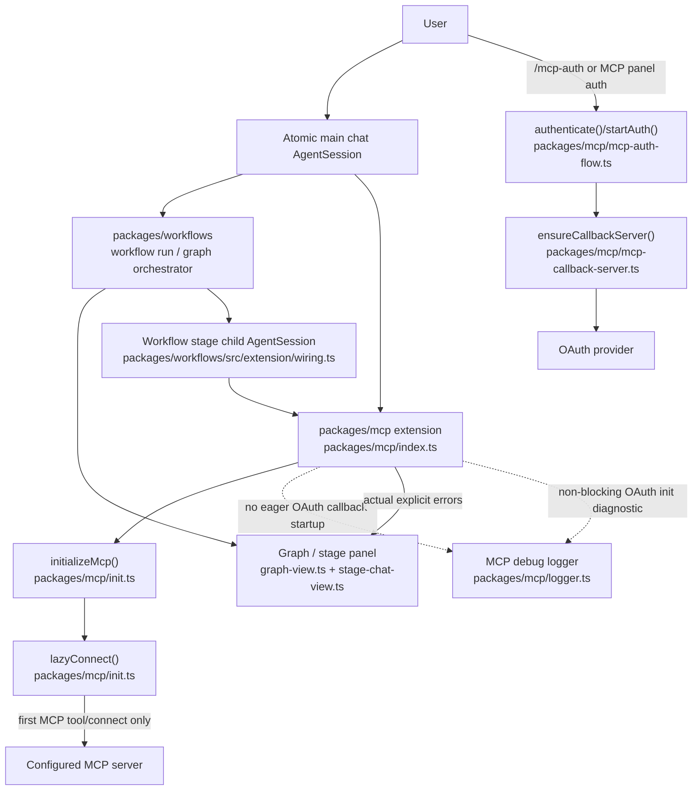

# Atomic Issue #1045 Technical Design Document / RFC

| Document Metadata      | Details                            |
| ---------------------- | ---------------------------------- |
| Author(s)              | Norin Lavaee                       |
| Status                 | Draft (WIP)                        |
| Team / Owner           | Atomic MCP + Workflows maintainers |
| Created / Last Updated | 2026-05-25                         |

## 1. Executive Summary

GitHub issue [#1045](https://github.com/bastani-inc/atomic/issues/1045) reports that the workflow graph/orchestrator panel displays repeated `MCP OAuth initialization failed` messages when a configured MCP server requires OAuth and the user is not authenticated. This failure is non-blocking: workflows and subagent orchestration can continue, but the panel makes it look like the workflow itself failed.

Repository inspection shows the root noise source is the MCP extension startup path in `packages/mcp/index.ts:107-109`, which catches OAuth callback-server initialization failures and writes the exact user-visible string to `console.error`. Workflow stages create child `AgentSession`s through `packages/workflows/src/extension/wiring.ts:178-183`; those stage sessions keep bundled MCP enabled while excluding only workflows (`packages/workflows/src/extension/wiring.ts:169-175`). Therefore each workflow/stage session can repeat MCP startup and emit the same stderr line.

The proposed first-iteration fix is to make MCP OAuth callback initialization lazy and quiet:

1. Stop treating OAuth callback-server startup as a session-start requirement.
2. Keep server/tool connections lazy as documented in `packages/mcp/README.md`.
3. Start OAuth callback handling only from explicit auth flows (`/mcp-auth`, MCP panel auth shortcut, or `settings.autoAuth` tool/connect paths), where `packages/mcp/mcp-auth-flow.ts:101` already calls `ensureCallbackServer`.
4. Replace the current `console.error("MCP OAuth initialization failed")` path with debug-level diagnostics via `packages/mcp/logger.ts`.
5. Add a defensive workflow-visible-error sanitizer for the exact non-blocking line so already-mixed stderr/error text does not appear as a stage/orchestrator error.

## 2. Context and Motivation

### 2.1 Current State

Issue evidence from `gh issue view 1045 --repo bastani-inc/atomic`:

- Problem: the graph orchestrator panel surfaces repeated inline `MCP OAuth initialization failed` entries.
- Expected behavior:
    - MCP servers should remain lazy-loaded like the main chat MCP extension.
    - Suppress this specific non-blocking OAuth initialization failure.
    - Preserve actual blocking MCP errors.
    - Keep observability in debug logs or lower-noise diagnostics.

Relevant current architecture:

- MCP extension entrypoint: `packages/mcp/index.ts`.
    - On every `session_start`, it calls `initializeOAuth()` and catches failures with `console.error("MCP OAuth initialization failed")` (`packages/mcp/index.ts:107-109`).
    - It then starts `initializeMcp(pi, ctx)` asynchronously (`packages/mcp/index.ts:111-135`).
- MCP server lifecycle is documented as lazy by default in `packages/mcp/README.md`: servers connect on first tool call, with metadata cache support.
- OAuth auth flow already starts callback handling on demand:
    - `startAuth()` calls `ensureCallbackServer({ strictPort: Boolean(config.clientId) })` before browser auth (`packages/mcp/mcp-auth-flow.ts:101`).
    - `authenticate()` wraps `startAuth()` (`packages/mcp/mcp-auth-flow.ts:163`).
- Workflow stages create separate Atomic SDK sessions:
    - `createPiSdkAgentSession()` imports `@bastani/atomic` and calls `createAgentSession()` (`packages/workflows/src/extension/wiring.ts:178-183`).
    - Workflow child sessions exclude only the workflows package, leaving MCP, subagents, web-access, and intercom enabled (`packages/workflows/src/extension/wiring.ts:169-175`).
    - Stage extension UI is bound to the workflow/stage broker (`packages/workflows/src/extension/wiring.ts:331-334`).
- Workflow graph and stage UI surfaces:
    - Graph overlay: `packages/workflows/src/tui/graph-view.ts`.
    - Stage chat pane: `packages/workflows/src/tui/stage-chat-view.ts`.
    - Stage/run error rendering: `packages/workflows/src/tui/run-detail.ts:184-260`.
    - Stage error classification: `packages/workflows/src/shared/workflow-failures.ts`.

Test and prior-art evidence:

- `test/unit/mcp-init-statusbar.test.ts` covers MCP status bar behavior, including `needs-auth`.
- `test/unit/mcp-stage-scoping.test.ts` covers workflow MCP stage scope set/clear ordering.
- `test/unit/stage-chat-view.test.ts` covers stage panel behavior.
- `packages/mcp/CHANGELOG.md` documents lazy startup, OAuth callback lifecycle, and debug-level init context changes.
- `packages/mcp/OAUTH.md` documents OAuth 2.1 flow, callback server, `/mcp-auth`, and `settings.autoAuth`.

This investigation also reproduced the same visible noise in a background subagent result: fallback output included `MCP OAuth initialization failed` before the actual model/API-key failure, confirming that startup stderr can be mixed into user-facing orchestration output.

### 2.2 The Problem

`MCP OAuth initialization failed` is currently emitted as a raw console error even though the failure is non-blocking. In orchestration contexts, raw stderr/console output can be captured or rendered alongside stage/subagent execution state, making it appear as a graph or task failure.

This violates the issue’s success criteria:

- The message is not actionable in the graph panel.
- It repeats because workflow stages/subagents create child sessions.
- It is not scoped to an explicit user action like `/mcp-auth`.
- It conflates non-blocking auth/callback availability with actual workflow execution errors.

## 3. Goals and Non-Goals

### 3.1 Functional Goals

1. Suppress the exact non-blocking `MCP OAuth initialization failed` line from workflow graph/orchestrator user-visible surfaces.
2. Preserve actual blocking MCP errors:
    - explicit `/mcp` initialization failures,
    - explicit `/mcp-auth` failures,
    - `mcp({ connect })` failures,
    - direct/proxy MCP tool auth-required results,
    - eager/keep-alive server connection failures.
3. Preserve observability by logging OAuth callback startup failures at debug level with the underlying error message.
4. Keep MCP server initialization lazy in workflow child sessions, matching `packages/mcp/README.md`.
5. Add regression coverage for:
    - no console/error output on non-blocking OAuth startup failure,
    - explicit auth still surfaces failures,
    - workflow visible errors strip only the exact benign line.
6. Avoid changes to public workflow authoring APIs or MCP config schema.

### 3.2 Non-Goals (Out of Scope)

1. Do not implement a new MCP authentication UX.
2. Do not suppress all OAuth errors; only the known non-blocking initialization line is suppressible.
3. Do not hide `needs-auth` states in `/mcp`, MCP panel, direct tools, or proxy tool results.
4. Do not remove MCP from workflow stage sessions entirely.
5. Do not change `.mcp.json` precedence or MCP server discovery.
6. Do not introduce a new build step or generated output for `packages/workflows`.

## 4. Proposed Solution (High-Level Design)

### 4.1 System Architecture Diagram



### 4.2 Architectural Pattern

Use a **source suppression + defensive display sanitization** pattern:

- **Source suppression** in `packages/mcp/index.ts`: do not emit raw console errors for non-blocking OAuth callback initialization.
- **Lazy initialization** in `packages/mcp/mcp-auth-flow.ts`: rely on existing `startAuth()` / `authenticate()` callback setup instead of starting OAuth callback infrastructure on every `session_start`.
- **Defensive display sanitization** in `packages/workflows/src/shared/workflow-failures.ts`: strip only the exact `MCP OAuth initialization failed` prefix if it has already been mixed into an unrelated stage error.
- **Diagnostics preservation** through `packages/mcp/logger.ts` debug logs.

This keeps responsibilities separated: MCP owns MCP lifecycle/logging; workflows own graph/stage rendering hygiene.

### 4.3 Key Components

| Component                                                         | Responsibility                                                                   | Technology Stack                                    | Justification                                                                                          |
| ----------------------------------------------------------------- | -------------------------------------------------------------------------------- | --------------------------------------------------- | ------------------------------------------------------------------------------------------------------ |
| `packages/mcp/index.ts`                                           | MCP extension lifecycle; remove/silence non-blocking OAuth startup console error | TypeScript extension API                            | Current source of exact noisy string at `session_start`                                                |
| `packages/mcp/mcp-auth-flow.ts`                                   | Start OAuth callback server only during explicit auth flows                      | TypeScript, MCP SDK OAuth                           | `startAuth()` already calls `ensureCallbackServer`, so eager startup is not required for explicit auth |
| `packages/mcp/logger.ts`                                          | Preserve low-noise diagnostics                                                   | TypeScript logger with debug/info/warn/error levels | Existing logger supports debug logging and avoids user-visible panel output by default                 |
| `packages/workflows/src/shared/workflow-failures.ts`              | Sanitize workflow-visible error summaries defensively                            | TypeScript pure classification helpers              | Existing central point for stage/run error user messages                                               |
| `packages/workflows/src/tui/run-detail.ts`                        | Renders run/stage errors in graph detail panels                                  | TypeScript TUI renderer                             | Should receive sanitized `stage.error`; no direct MCP-specific rendering logic needed                  |
| `packages/workflows/src/extension/wiring.ts`                      | Creates stage child sessions                                                     | TypeScript Atomic SDK integration                   | Confirms child stages load MCP; should not need MCP-specific suppression if MCP source is fixed        |
| `test/unit/mcp-init-statusbar.test.ts` and new MCP/workflow tests | Regression coverage                                                              | `bun:test`, `node:assert/strict`                    | Existing test style and relevant MCP/workflow surface area                                             |

## 5. Detailed Design

### 5.1 API Interfaces

No public user-facing API changes are proposed.

Internal helper additions:

```ts
// packages/mcp/oauth-startup-diagnostics.ts
export const NON_BLOCKING_MCP_OAUTH_INIT_MESSAGE =
    "MCP OAuth initialization failed";

export function isNonBlockingMcpOAuthInitMessage(message: string): boolean;

export function formatMcpOAuthInitDebugMessage(error: unknown): {
    readonly message: string;
    readonly errorMessage?: string;
};
```

MCP lifecycle change:

```ts
// packages/mcp/index.ts
pi.on("session_start", async (_event, ctx) => {
    // Existing shutdown behavior stays.
    // Do not eagerly call initializeOAuth() as a required startup step.
    // initializeMcp(pi, ctx) remains async and lazy-server-aware.
});
```

Explicit auth flow remains:

```ts
// packages/mcp/mcp-auth-flow.ts
export async function startAuth(...) {
  await ensureCallbackServer({ strictPort: Boolean(config.clientId) });
  ...
}
```

Defensive workflow sanitizer:

```ts
// packages/workflows/src/shared/workflow-failures.ts
export function sanitizeWorkflowVisibleError(message: string): string {
    // Remove only a leading exact non-blocking MCP OAuth line.
    // Preserve all other MCP/auth/provider errors.
}
```

### 5.2 Data Model / Schema

No persisted schema migration is required.

Existing affected data fields:

- `StageSnapshot.error` in `packages/workflows/src/shared/store-types.ts` should contain sanitized user-visible text.
- `StageSnapshot.failureMessage` should continue preserving original unsanitized diagnostic text when different.
- `RunSnapshot.error` and `RunSnapshot.failureMessage` follow the same pattern.

No MCP config changes are required. Existing `.mcp.json` remains valid.

### 5.3 Algorithms and State Management

#### MCP lifecycle algorithm

Current:

1. On every `session_start`, shut down previous MCP/OAuth state.
2. Call `initializeOAuth()`.
3. If it fails, write `MCP OAuth initialization failed` to stderr.
4. Start `initializeMcp()`.

Proposed:

1. On every `session_start`, shut down previous MCP/OAuth state.
2. Do **not** eagerly start OAuth callback infrastructure.
3. Start `initializeMcp()` as today.
4. For configured lazy servers, do not connect until tool/connect usage.
5. When explicit auth is requested, `authenticate()` calls `startAuth()`, and `startAuth()` calls `ensureCallbackServer()`.
6. If callback-server setup fails during explicit auth, surface that error through existing `/mcp-auth` / MCP panel pathways.

#### Defensive workflow error sanitization

When `classifyWorkflowFailure(error)` builds `userMessage`:

1. Convert structured/raw error to a string as today.
2. If the string starts with exactly:
    - `MCP OAuth initialization failed\n`, or
    - `MCP OAuth initialization failed\r\n`,
      remove that first line.
3. Trim only the removed prefix boundary.
4. If the remaining message is empty, return a neutral non-error diagnostic only for debug contexts; do not create a stage failure from this line alone.
5. Preserve the original value in `failureMessage` when different from `error`.

This ensures actual messages like `MCP initialization failed: <real error>`, `OAuth authentication failed for "<server>"`, and `Server "<server>" requires OAuth authentication` still surface.

## 6. Alternatives Considered

| Option                                                                                      | Pros                                                                                                                            | Cons                                                                                                                              | Reason for Rejection                                                                                                                 |
| ------------------------------------------------------------------------------------------- | ------------------------------------------------------------------------------------------------------------------------------- | --------------------------------------------------------------------------------------------------------------------------------- | ------------------------------------------------------------------------------------------------------------------------------------ |
| A. Filter `MCP OAuth initialization failed` only in `GraphView` / `StageChatView` renderers | Very localized to the reported panel; low implementation cost                                                                   | Leaves noisy stderr in logs, subagent outputs, persisted session entries, and other workflow renderers; treats symptom not source | Rejected because issue appears from session startup noise before rendering, and the same line appeared in background subagent output |
| B. Remove bundled MCP from workflow stage sessions                                          | Eliminates MCP startup noise in orchestrator stages                                                                             | Breaks documented workflows/MCP integration; stage options include MCP scoping; users expect stages to inherit MCP tools          | Rejected as too broad and functionally regressive                                                                                    |
| C. Keep eager OAuth startup but change `console.error` to `logger.debug`                    | Minimal change; suppresses visible stderr while preserving diagnostics                                                          | Still starts callback server for every child session, causing avoidable port binding work and repeated hidden failures            | Acceptable fallback if lazy removal is risky, but not the preferred design                                                           |
| D. Make OAuth callback setup lazy and add exact-message defensive sanitizer                 | Fixes source, preserves explicit auth errors, reduces child-session startup work, protects graph panel from mixed legacy stderr | Requires touching MCP lifecycle and workflow failure classification                                                               | Recommended                                                                                                                          |

## 7. Cross-Cutting Concerns

### 7.1 Security and Privacy

- OAuth tokens remain stored through existing `packages/mcp/mcp-auth.ts` helpers.
- The proposal does not change token storage, callback URL validation, state validation, PKCE, or dynamic client registration.
- Debug logs must not include tokens, authorization codes, bearer headers, or callback query strings.
- If logging the underlying error, log only `error.message` and safe error metadata.

### 7.2 Observability Strategy

- Non-blocking OAuth callback startup failures move to debug diagnostics through `packages/mcp/logger.ts`.
- Explicit user actions still surface visible messages:
    - `/mcp-auth <server>` failures,
    - MCP panel auth failures,
    - `mcp({ connect })` auth-required results,
    - direct/proxy tool `auth_required` details.
- Tests should assert that the exact non-blocking startup line is not emitted to console during session startup.
- Optionally include this in `/mcp` diagnostics later, but that is out of scope for iteration 1.

### 7.3 Scalability and Capacity Planning

- Lazy OAuth callback setup reduces work in workflow-heavy runs because each stage child session no longer tries to bind callback infrastructure.
- Server connections remain governed by existing lazy/eager/keep-alive lifecycle logic in `packages/mcp/init.ts`.
- No new long-running processes, queues, or persistent stores are introduced.
- This should reduce duplicate stderr volume in parallel graph/subagent runs.

## 8. Migration, Rollout, and Testing

### 8.1 Deployment Strategy

1. Implement behind normal code paths; no feature flag required.
2. Add changelog entries under:
    - `packages/mcp/CHANGELOG.md` → `## [Unreleased] / ### Fixed`.
    - `packages/workflows/CHANGELOG.md` if defensive sanitizer lands there.
3. Release as a patch-level bug fix.
4. No user migration required.

### 8.2 Data Migration Plan

No data migration is needed.

Existing persisted sessions that already contain the noisy line may still show it if rendered directly from historical transcript text. The defensive workflow sanitizer should prevent future stage/run error summaries from treating that line as the visible error.

### 8.3 Test Plan

Focused tests with Bun:

1. MCP lifecycle suppression:
    - New unit test around MCP adapter startup with mocked failing `initializeOAuth()` or extracted helper.
    - Assert `console.error` is not called with `MCP OAuth initialization failed`.
    - Assert debug logger receives safe diagnostic context if debug logging is enabled/test-injected.
2. Explicit auth remains visible:
    - Test `authenticate()` / `/mcp-auth` path still surfaces callback-server failures when explicitly invoked.
3. Workflow error sanitizer:
    - Add tests in `test/unit/workflow-failures.test.ts`.
    - Input: `MCP OAuth initialization failed\nNo API key found for openai.`
    - Expected visible message: `No API key found for openai.`
    - Input: `MCP initialization failed: connection refused`
    - Expected: unchanged.
    - Input: `OAuth authentication failed for "github": ...`
    - Expected: unchanged.
4. Graph/stage rendering:
    - Extend `test/unit/stage-chat-view.test.ts` or `test/unit/overlay-graph.test.ts` to ensure sanitized `StageSnapshot.error` does not render the suppressed line.
5. Regression command:
    - `bun test test/unit/mcp-init-statusbar.test.ts test/unit/workflow-failures.test.ts test/unit/stage-chat-view.test.ts`
    - Run broader checks before merge: `bun run typecheck` and relevant unit suite.

## 9. Open Questions / Unresolved Issues

1. Should `initializeOAuth()` be removed from `session_start` entirely, or retained only for top-level interactive sessions as debug-only best effort? `[OWNER: MCP maintainers]`
2. Do workflow child sessions expose a reliable session-start marker that distinguishes graph/stage sessions from main chat sessions? If not, source suppression in MCP is safer than context-specific filtering. `[OWNER: workflows maintainers]`
3. Should debug diagnostics use the existing `packages/mcp/logger.ts` only, or should MCP add a user-accessible `/mcp diagnostics` surface in a later iteration? `[OWNER: MCP maintainers]`
4. How should historical persisted sessions containing the raw line be handled? Iteration 1 proposes no migration. `[OWNER: product/UX]`
5. The repository `.mcp.json` contains a GitHub Copilot MCP URL with bearer header interpolation but no explicit `auth: false`; should documentation recommend `auth: "bearer"` or `oauth: false` for bearer-only HTTP servers to avoid auto-OAuth assumptions? `[OWNER: MCP maintainers]`
