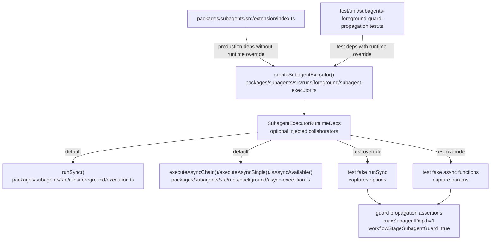

# Atomic Subagents Technical Design Document / RFC

| Document Metadata      | Details                                             |
| ---------------------- | --------------------------------------------------- |
| Author(s)              | Norin Lavaee                                        |
| Status                 | Draft (WIP)                                         |
| Team / Owner           | Atomic Subagents maintainers / `@bastani/subagents` |
| Created / Last Updated | 2026-05-28 / 2026-05-28                             |

## 1. Executive Summary

Implement GitHub issue [#1088](https://github.com/bastani/atomic/issues/1088) by refactoring `test/unit/subagents-foreground-guard-propagation.test.ts` away from `spyOn` against ESM namespace imports. The issue is a follow-up from PR #1081 review: Bun currently allows this pattern, but it is fragile if imported ESM module bindings become read-only or if module-load ordering changes.

The proposed fix is to add a narrow, internal dependency-injection seam to `createSubagentExecutor()` in `packages/subagents/src/runs/foreground/subagent-executor.ts`. Production callers continue using the real foreground/background execution functions by default, while tests can inject typed fakes for `runSync`, `executeAsyncChain`, `executeAsyncSingle`, and async availability checks. The existing guard-propagation tests will then assert behavior through injected collaborators instead of monkey-patching module exports.

## 2. Context and Motivation

### 2.1 Current State

Issue #1088 states that `test/unit/subagents-foreground-guard-propagation.test.ts` uses `spyOn` against ESM namespace imports and recommends DI seams in `createSubagentExecutor`.

Current evidence:

- `test/unit/subagents-foreground-guard-propagation.test.ts:1` imports `spyOn` from `bun:test`.
- The test imports real modules:
    - `../../packages/subagents/src/runs/background/async-execution.ts`
    - `../../packages/subagents/src/runs/foreground/execution.ts`
- The test patches module exports with `spyOn(...).mockImplementation(...)` for:
    - `foregroundExecution.runSync`
    - `asyncExecution.executeAsyncChain`
    - `asyncExecution.executeAsyncSingle`
    - `asyncExecution.formatAsyncStartedMessage`
    - `asyncExecution.isAsyncAvailable`
- The test dynamically imports `subagent-executor.ts` only after spies are installed, creating a module-load-order dependency.
- `packages/subagents/src/runs/foreground/subagent-executor.ts` directly imports these collaborators at module scope:
    - `runSync` from `./execution.ts`
    - `executeAsyncChain`, `executeAsyncSingle`, `formatAsyncStartedMessage`, and `isAsyncAvailable` from `../background/async-execution.ts`
- Direct call sites include:
    - `executeAsyncSingle(...)` in async resume and single async paths.
    - `executeAsyncChain(...)` in async chain/parallel and clarify-to-background paths.
    - `isAsyncAvailable()` before async launches.
    - `runSync(...)` in foreground parallel and single paths.

The current `createSubagentExecutor(deps)` entry point is defined in `packages/subagents/src/runs/foreground/subagent-executor.ts`, and its `ExecutorDeps` already centralizes runtime dependencies such as `pi`, `state`, config, cwd expansion, and agent discovery.

Prior-art DI exists elsewhere in this package, for example `packages/subagents/src/runs/shared/pi-spawn.ts`, where `getPiSpawnCommand(args, deps = {})` accepts optional collaborators for filesystem/platform/package resolution.

### 2.2 The Problem

The guard-propagation test verifies important behavior: workflow-stage subagent calls must pass `maxSubagentDepth: 1` and `workflowStageSubagentGuard: true` through foreground and async execution paths. However, the current test achieves this by mutating ESM namespace imports.

Risks:

- If Bun or another runner treats ESM namespace exports as read-only, the test can fail even though production behavior is correct.
- Dynamic import ordering makes the test harder to reason about.
- Module-level spies are broader than the behavior under test.
- Future tests cannot easily create multiple executor instances with different fake execution collaborators in the same file.

## 3. Goals and Non-Goals

### 3.1 Functional Goals

1. Add an internal DI seam to `createSubagentExecutor()` for execution collaborators currently patched by the test.
2. Keep production behavior unchanged when no collaborators are injected.
3. Refactor `test/unit/subagents-foreground-guard-propagation.test.ts` to use injected fakes instead of `spyOn`/dynamic import ordering.
4. Preserve all existing assertions for workflow-stage guard propagation through:
    - sequential/parallel chain children,
    - foreground parallel children,
    - parallel clarify-to-background async handoff,
    - single clarify-to-background async handoff.
5. Use Bun-first TDD and validation commands.
6. Add a concise `packages/subagents/CHANGELOG.md` entry if maintainers consider the test hardening/change noteworthy.

### 3.2 Non-Goals (Out of Scope)

- No change to the public `subagent` tool schema or CLI behavior.
- No change to workflow-stage recursion policy.
- No change to background runner semantics.
- No broad refactor of `chain-execution.ts`, `async-execution.ts`, or `execution.ts`.
- No cleanup of unrelated duplicate `[Unreleased]` changelog sections unless explicitly requested.
- No new public SDK for third-party executor customization.

## 4. Proposed Solution (High-Level Design)

Add a typed optional runtime-collaborator object to `ExecutorDeps` in `packages/subagents/src/runs/foreground/subagent-executor.ts`. `createSubagentExecutor()` resolves real defaults and uses injected replacements only when supplied by tests.

### 4.1 System Architecture Diagram



### 4.2 Architectural Pattern

Use dependency injection through a small internal Facade/Strategy object:

- Facade: `SubagentExecutorRuntimeDeps` groups execution-side effects behind one object.
- Strategy: tests provide alternate implementations for selected collaborators.
- Default strategy: production uses the existing imported functions.

This keeps the seam explicit and local to `createSubagentExecutor()` instead of spreading module mocks across tests.

### 4.3 Key Components

| Component                                                     | Responsibility                                                                                                                                | Technology Stack                       | Justification                                                                                    |
| ------------------------------------------------------------- | --------------------------------------------------------------------------------------------------------------------------------------------- | -------------------------------------- | ------------------------------------------------------------------------------------------------ |
| `packages/subagents/src/runs/foreground/subagent-executor.ts` | Owns `createSubagentExecutor()`, validates params, selects single/parallel/chain/async paths, and forwards guard policy into child execution. | TypeScript, Bun runtime                | Primary component under issue #1088; direct imports are what force current test monkey-patching. |
| `SubagentExecutorRuntimeDeps`                                 | Typed internal seam for `runSync`, `executeAsyncChain`, `executeAsyncSingle`, `isAsyncAvailable`, and optionally `formatAsyncStartedMessage`. | TypeScript structural typing           | Allows tests to inject fakes without changing user-facing behavior.                              |
| `test/unit/subagents-foreground-guard-propagation.test.ts`    | Regression test for workflow-stage subagent guard propagation.                                                                                | `bun:test`, `node:assert/strict`       | The exact test called out by the GitHub issue.                                                   |
| `packages/subagents/src/runs/foreground/execution.ts`         | Real foreground child process execution via `runSync`.                                                                                        | TypeScript, child process spawn        | Production default collaborator; should remain behaviorally unchanged.                           |
| `packages/subagents/src/runs/background/async-execution.ts`   | Real async launch/status formatting helpers.                                                                                                  | TypeScript, filesystem async run state | Production default collaborator; current test fakes async launch behavior.                       |
| `packages/subagents/CHANGELOG.md`                             | Records user/developer-visible package changes under `[Unreleased]`.                                                                          | Markdown                               | Project instructions require changelog updates when appropriate.                                 |

## 5. Detailed Design

### 5.1 API Interfaces

No user-facing API changes.

Internal interface to add in `packages/subagents/src/runs/foreground/subagent-executor.ts`:

```ts
export interface SubagentExecutorRuntimeDeps {
    runSync: typeof runSync;
    executeAsyncChain: typeof executeAsyncChain;
    executeAsyncSingle: typeof executeAsyncSingle;
    isAsyncAvailable: typeof isAsyncAvailable;
    formatAsyncStartedMessage: typeof formatAsyncStartedMessage;
}

const defaultSubagentExecutorRuntimeDeps: SubagentExecutorRuntimeDeps = {
    runSync,
    executeAsyncChain,
    executeAsyncSingle,
    isAsyncAvailable,
    formatAsyncStartedMessage,
};
```

Extend existing `ExecutorDeps` with:

```ts
runtime?: Partial<SubagentExecutorRuntimeDeps>;
```

Resolve defaults once per executor or via a helper:

```ts
function resolveSubagentExecutorRuntimeDeps(
    overrides?: Partial<SubagentExecutorRuntimeDeps>,
): SubagentExecutorRuntimeDeps {
    return { ...defaultSubagentExecutorRuntimeDeps, ...overrides };
}
```

Recommended call-site changes:

- Replace direct `runSync(...)` calls with `runtime.runSync(...)`.
- Replace direct `executeAsyncChain(...)` calls with `runtime.executeAsyncChain(...)`.
- Replace direct `executeAsyncSingle(...)` calls with `runtime.executeAsyncSingle(...)`.
- Replace direct `isAsyncAvailable()` calls with `runtime.isAsyncAvailable()`.
- Replace direct `formatAsyncStartedMessage(...)` in async resume formatting with `runtime.formatAsyncStartedMessage(...)`.

`runForegroundParallelTasks()` currently does not receive `deps`; add a narrow field to its input object, e.g.:

```ts
runtime: Pick<SubagentExecutorRuntimeDeps, "runSync">;
```

### 5.2 Data Model / Schema

No persistent data model changes.

No changes to:

- `SubagentParamsLike`
- `Details`
- `RunSyncOptions`
- async run status files
- workflow-stage orchestration context
- environment variable names such as `ATOMIC_WORKFLOW_STAGE_SUBAGENT_GUARD`

The only new structure is an in-memory TypeScript dependency object used at executor construction time.

### 5.3 Algorithms and State Management

Runtime resolution algorithm:

1. `createSubagentExecutor(deps)` is called by production extension code or tests.
2. Resolve:
    - real default collaborators from imported modules,
    - test overrides from `deps.runtime`.
3. Execution path functions use the resolved runtime object instead of module-level functions.
4. Guard propagation logic remains unchanged:
    - `resolveSubagentDepthPolicy(ctx, deps.config.maxSubagentDepth)` still determines `maxSubagentDepth` and `workflowStageSubagentGuard`.
    - Child launch params/options continue to receive those values.
5. Tests capture collaborator call arguments through injected fake functions.

Test refactor algorithm:

1. Remove ESM namespace imports for `foregroundExecution` and `asyncExecution`.
2. Remove all `spyOn(...)` setup and `mockRestore()` teardown.
3. Statically import `createSubagentExecutor` using repo convention `.js` specifier.
4. Pass `runtime` fakes from `makeExecutor()`.
5. Keep captured arrays:
    - `runSyncCalls`
    - `asyncChainCalls`
    - `asyncSingleCalls`
6. Assert captured params/options as before.

## 6. Alternatives Considered

| Option                                                             | Pros                                                                                          | Cons                                                                                                                                    | Reason for Rejection                                                          |
| ------------------------------------------------------------------ | --------------------------------------------------------------------------------------------- | --------------------------------------------------------------------------------------------------------------------------------------- | ----------------------------------------------------------------------------- |
| Keep current `spyOn` pattern                                       | Minimal code change; tests pass today in Bun.                                                 | Fragile under read-only ESM bindings; depends on dynamic import ordering; called out directly by issue #1088.                           | Rejected because the issue explicitly requests moving away from this pattern. |
| Use `mock.module()` for execution modules                          | Avoids `spyOn` on namespace exports.                                                          | PR #1081 history showed broad module mocks can leak or omit exports such as `writeAsyncRunnerConfig`; higher cross-test pollution risk. | Rejected due prior failure mode and broader blast radius.                     |
| Add optional runtime collaborators to `createSubagentExecutor()`   | Narrow seam; type-safe; production defaults unchanged; tests become direct and deterministic. | Requires mechanical replacements at several call sites; small internal API expansion.                                                   | Selected because it addresses the issue with minimal production impact.       |
| Extract all subagent execution orchestration into separate classes | Could improve long-term modularity.                                                           | Much larger refactor; unrelated to issue #1088; increases risk.                                                                         | Rejected as over-scoped for a test-hardening issue.                           |
| Inject collaborators through process globals/env vars              | No signature changes.                                                                         | Hidden coupling; unsafe in concurrent tests; not type-safe.                                                                             | Rejected because it worsens test isolation.                                   |

## 7. Cross-Cutting Concerns

### 7.1 Security and Privacy

No new user input, network access, credentials, or persisted data are introduced.

The DI seam must remain internal and should not be wired to user configuration. Test fakes should only be passed by in-repo tests. Production behavior continues to call the real child process execution functions.

### 7.2 Observability Strategy

No runtime observability changes are required.

Testing observability improves because the test captures exact call arguments through injected fakes instead of relying on patched module exports. Existing assertions on `maxSubagentDepth` and `workflowStageSubagentGuard` remain the primary observability mechanism for this regression.

### 7.3 Scalability and Capacity Planning

No capacity impact.

Runtime overhead is negligible: resolving a small dependency object once per executor or reading from it at call sites is constant-time and not on a hot path compared to spawning foreground/background subagents.

## 8. Migration, Rollout, and Testing

### 8.1 Deployment Strategy

This is an internal code/test refactor in `@bastani/subagents`.

Recommended rollout steps:

1. Add failing/red test refactor first: remove spies and inject fakes via `createSubagentExecutor()` deps.
2. Implement `SubagentExecutorRuntimeDeps` and use it at call sites.
3. Confirm the refactored test passes.
4. Add one `packages/subagents/CHANGELOG.md` `[Unreleased]` entry if maintainers want developer-facing test hardening recorded.

### 8.2 Data Migration Plan

No data migration is required.

No files under async run directories, session directories, artifacts, config, or package manifests need migration.

### 8.3 Test Plan

TDD sequence:

1. Red:
    - Refactor `test/unit/subagents-foreground-guard-propagation.test.ts` to inject fakes through `runtime`.
    - Before implementation, the fake call arrays should remain empty or real execution should be attempted, causing the test to fail.
2. Green:
    - Implement the DI seam and route all relevant calls through it.
3. Refactor:
    - Remove unused `spyOn`, namespace imports, dynamic import machinery, and `afterAll` mock restoration.
    - Prefer `.js` import specifiers in the test.

Targeted validation:

```sh
AGENT=1 bun test test/unit/subagents-foreground-guard-propagation.test.ts
AGENT=1 bun test test/unit/subagents-depth-guard.test.ts test/unit/subagents-async-config.test.ts
bun run typecheck
git diff --check
```

Broader validation if time permits:

```sh
AGENT=1 bun run test:unit
```

## 9. Open Questions / Unresolved Issues

1. `[OWNER: subagents maintainers]` Should `formatAsyncStartedMessage` be part of the seam even though the current foreground guard propagation tests do not directly need it? Recommendation: include it because the current test patches it today and async resume uses it in the same executor module.
2. `[OWNER: subagents maintainers]` Should `SubagentExecutorRuntimeDeps` be exported from `subagent-executor.ts` for test typing, or kept module-private with structural test objects? Recommendation: export the type from the source file only; do not re-export it from the package root.
3. `[OWNER: release maintainer]` Should this test-hardening/internal-seam change receive a changelog entry? Recommendation: add a single concise `Fixed` entry under the topmost `packages/subagents/CHANGELOG.md` `[Unreleased]` section if issue #1088 is expected to be tracked in release notes.
4. `[OWNER: subagents maintainers]` Should `executeChain` also be injectable? Recommendation: not in iteration 1; current issue only requires replacing collaborators patched by the foreground guard propagation test.
