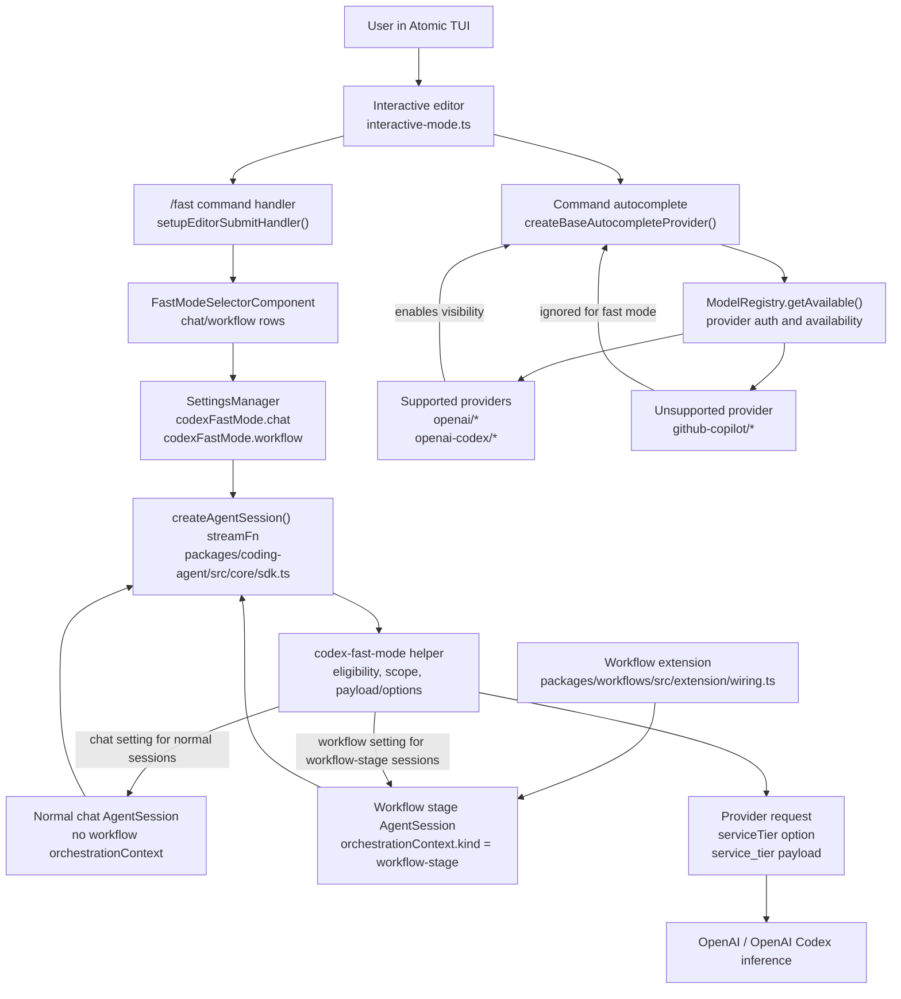

# Atomic Codex Fast Mode Technical Design Document / RFC

| Document Metadata      | Details                                     |
| ---------------------- | ------------------------------------------- |
| Author(s)              | Alex Lavaee                                 |
| Status                 | Draft (WIP)                                 |
| Team / Owner           | Atomic Coding Agent Core / Workflow Runtime |
| Created / Last Updated | 2026-05-30 / 2026-05-30                     |

## 1. Executive Summary

GitHub issue [bastani-inc/atomic#1134](https://github.com/bastani-inc/atomic/issues/1134) requests a user-facing Codex fast mode in Atomic. Users should be able to run `/fast` in the TUI, toggle fast mode separately for normal chat sessions and workflow stage sessions, and have Atomic invoke supported OpenAI inference providers with the correct priority-service setting. The command must only be visible when the current session has supported OpenAI-backed models available: `openai/*` or `openai-codex/*`, explicitly excluding GitHub Copilot/OpenAI models such as `github-copilot/*`.

This RFC proposes implementing Codex fast mode as a first-party coding-agent core feature, not as an external extension. The implementation will add:

- A persisted `codexFastMode` settings object in `packages/coding-agent/src/core/settings-manager.ts`.
- A small reusable fast-mode helper module for provider eligibility and request-option/payload mutation.
- A conditional built-in `/fast` command in `packages/coding-agent/src/core/slash-commands.ts` and `packages/coding-agent/src/modes/interactive/interactive-mode.ts`.
- A two-row TUI selector component with `chat: enabled/disabled` and `workflow: enabled/disabled`.
- Stream-option and provider-payload wiring in `packages/coding-agent/src/core/sdk.ts`, using `serviceTier: "priority"` where provider options support it and ensuring serialized payloads contain `service_tier: "priority"` for supported OpenAI providers.
- Documentation in `packages/coding-agent/docs/usage.md`, `packages/coding-agent/docs/settings.md`, and `packages/coding-agent/docs/providers.md`.
- Tests for visibility, settings persistence, provider eligibility, payload mutation, and workflow-stage selection.

No prior review findings exist for this first iteration.

## 2. Context and Motivation

### 2.1 Current State

Atomic already supports OpenAI and OpenAI Codex providers through the model registry and `@earendil-works/pi-ai` provider layer:

- `packages/coding-agent/src/core/model-resolver.ts` maps `openai-codex` to a default model (`gpt-5.5`).
- `packages/coding-agent/src/core/model-registry.ts` loads built-in providers, custom `models.json` providers, and configured auth. `getAvailable()` returns models whose provider has configured credentials.
- `packages/coding-agent/docs/providers.md` documents OpenAI API-key usage and OpenAI Codex subscription usage through `/login`.
- `packages/coding-agent/docs/custom-provider.md` documents `openai-responses` and `openai-codex-responses` API types.

Slash command visibility is currently centralized in two places:

- `packages/coding-agent/src/core/slash-commands.ts` defines `BUILTIN_SLASH_COMMANDS`, including `/settings`, `/model`, `/scoped-models`, `/login`, `/logout`, and other built-ins.
- `packages/coding-agent/src/modes/interactive/interactive-mode.ts` converts `BUILTIN_SLASH_COMMANDS` into autocomplete entries in `createBaseAutocompleteProvider()` and handles built-in command submission in `setupEditorSubmitHandler()`.

Settings are persisted through `SettingsManager`:

- `packages/coding-agent/src/core/settings-manager.ts` defines the `Settings` interface and typed getters/setters for fields such as `transport`, `steeringMode`, `followUpMode`, `warnings`, and `enabledModels`.
- Global settings live at `~/.atomic/agent/settings.json`; project settings live at `.atomic/settings.json`, as documented in `packages/coding-agent/docs/settings.md`.
- Settings writes are queued and can be awaited with `settingsManager.flush()`.

Provider requests flow through the SDK stream function:

- `packages/coding-agent/src/core/sdk.ts` constructs an `Agent` with `streamFn`, resolves auth via `modelRegistry.getApiKeyAndHeaders()`, and calls `streamSimple(model, context, options)`.
- The same file wires `onPayload` to `ExtensionRunner.emitBeforeProviderRequest()`, enabling provider-payload rewrites before the request is sent.
- `packages/coding-agent/docs/extensions.md` documents `before_provider_request` as a hook that can inspect or replace the provider payload.

Workflow stages create child `AgentSession`s through the workflows extension:

- `packages/workflows/src/extension/wiring.ts` calls Atomic’s `createAgentSession()` for workflow stages.
- `withWorkflowStageSessionOptions()` attaches `orchestrationContext.kind === "workflow-stage"` to child sessions.
- `packages/coding-agent/src/core/extensions/runner.ts` exposes `ctx.orchestrationContext` to extension handlers.

The issue includes a reference implementation: [calesennett/pi-codex-fast](https://github.com/calesennett/pi-codex-fast). Its `extensions/codex-fast.ts` toggles an extension setting and injects `service_tier: "priority"` in `before_provider_request` when `ctx.model?.provider` is `openai` or `openai-codex`. That validates the basic request-level mechanism, but Atomic needs a built-in `/fast` UI with separate chat/workflow controls and conditional command visibility.

### 2.2 The Problem

Users currently have to wire Codex fast mode themselves, typically by installing an extension or manually patching provider request payloads. This creates several problems:

1. **No built-in discovery path**: `/fast` does not exist in `BUILTIN_SLASH_COMMANDS`, so users do not discover fast mode through command completion.
2. **No conditional visibility**: a naïve built-in command would appear for users whose configured models cannot use it, contrary to issue #1134.
3. **No chat/workflow split**: workflows run separate child sessions. Users need to enable fast mode for chat, workflow stages, or both.
4. **Provider specificity is easy to get wrong**: fast mode must apply only to `openai` and `openai-codex` providers, not GitHub Copilot models that may expose OpenAI-family model IDs under `github-copilot`.
5. **Payload-only injection may miss accounting details**: upstream `openai-responses` and `openai-codex-responses` provider code accepts `serviceTier` options and serializes them as `service_tier`; using only `onPayload` can set the request field but may not preserve service-tier-aware usage accounting in provider processing.

## 3. Goals and Non-Goals

### 3.1 Functional Goals

1. Add a user-facing `/fast` slash command in interactive mode.
2. Show `/fast` in autocomplete only when the current session’s selectable or available model set includes at least one supported provider:
    - supported: `openai/*`, `openai-codex/*`
    - unsupported: `github-copilot/*`, Azure, OpenRouter, OpenCode, and all other providers
3. When `/fast` runs, replace the editor with a focused two-row configuration UI:
    - `chat: enabled/disabled`
    - `workflow: enabled/disabled`
4. Let users move between `chat` and `workflow` rows with Tab and Shift+Tab.
5. Let users change enabled/disabled values with left/right arrow keys.
6. Persist fast-mode state in Atomic settings, defaulting both rows to disabled.
7. Apply chat fast mode to normal, non-workflow `AgentSession` provider requests.
8. Apply workflow fast mode to child workflow-stage sessions identified by `orchestrationContext.kind === "workflow-stage"`.
9. Invoke supported OpenAI providers with priority service tier:
    - add `serviceTier: "priority"` to stream options when supported by the provider layer
    - ensure the provider payload includes `service_tier: "priority"` unless already set
10. Leave all existing non-fast behavior unchanged when fast mode is disabled.
11. Add tests or regression coverage for settings, command visibility, UI state changes, provider eligibility, payload mutation, and workflow-stage selection.
12. Update user docs under `packages/coding-agent/docs`.

### 3.2 Non-Goals (Out of Scope)

1. Do not publish, release, or tag any package as part of this issue.
2. Do not add a CLI flag such as `atomic --fast` in this iteration. The issue requests the `/fast` slash command.
3. Do not support GitHub Copilot fast mode, even when the model ID looks OpenAI-like.
4. Do not change the default model, default thinking level, or transport behavior.
5. Do not force workflows to use OpenAI models. Fast mode only affects workflow stages that already choose `openai` or `openai-codex`.
6. Do not add fast mode to third-party OpenAI-compatible providers such as OpenRouter, Vercel AI Gateway, Cloudflare AI Gateway, or custom `models.json` providers in this iteration.
7. Do not redesign `/settings`; `/fast` should be a focused command-specific selector.
8. Do not remove or replace the existing extension `before_provider_request` hook.
9. Do not migrate existing settings files. Missing `codexFastMode` means disabled.
10. Do not implement code changes in this RFC stage.

## 4. Proposed Solution (High-Level Design)

Implement first-party Codex fast mode in `packages/coding-agent`.

At a high level:

1. Add `codexFastMode?: { chat?: boolean; workflow?: boolean }` to `Settings`.
2. Add `getCodexFastModeSettings()` and `setCodexFastModeSettings()` to `SettingsManager`.
3. Add a helper module, for example `packages/coding-agent/src/core/codex-fast-mode.ts`, containing:
    - `isCodexFastModeSupportedModel(model)`
    - `hasSupportedCodexFastModeModel(models)`
    - `isWorkflowStageSession(orchestrationContext)`
    - `isCodexFastModeEnabledForSession(settings, orchestrationContext)`
    - `withCodexFastModeStreamOptions(...)`
    - `withCodexFastModePayload(...)`
4. Extend `interactive-mode.ts` so `/fast` is included in autocomplete only when supported models are available.
5. Add `FastModeSelectorComponent` under `packages/coding-agent/src/modes/interactive/components/`.
6. Wire `/fast` submission to `showFastModeSelector()`.
7. Apply fast mode in `sdk.ts` before calling `streamSimple()` and before extension payload hooks run.
8. Update docs and tests.

### 4.1 System Architecture Diagram



### 4.2 Architectural Pattern

The proposed pattern is **core feature with centralized policy helper**.

- Slash command registration stays with built-in command infrastructure in `slash-commands.ts` and `interactive-mode.ts`.
- UI state is local to a dedicated TUI component, matching existing selector components such as `SettingsSelectorComponent` in `packages/coding-agent/src/modes/interactive/components/settings-selector.ts`.
- Persistence stays in `SettingsManager`, matching existing settings such as `transport`, `warnings`, and `enabledModels`.
- Provider-specific behavior is centralized in a helper rather than scattered across `interactive-mode.ts`, `sdk.ts`, and workflow code.
- Workflow detection uses existing `orchestrationContext.kind === "workflow-stage"`, already set by `packages/workflows/src/extension/wiring.ts`.

This avoids making fast mode an extension while still reusing the same provider-payload seam that extensions use.

### 4.3 Key Components

| Component                                                                              | Responsibility                                                                                                     | Technology Stack                                      | Justification                                                                                              |
| -------------------------------------------------------------------------------------- | ------------------------------------------------------------------------------------------------------------------ | ----------------------------------------------------- | ---------------------------------------------------------------------------------------------------------- |
| `packages/coding-agent/src/core/codex-fast-mode.ts`                                    | Central predicate and mutation helpers for supported providers, chat/workflow scope, stream options, and payloads. | TypeScript ESM                                        | Keeps provider policy testable and prevents duplicated `openai` / `openai-codex` checks.                   |
| `SettingsManager` in `packages/coding-agent/src/core/settings-manager.ts`              | Persist `codexFastMode.chat` and `codexFastMode.workflow` with defaults false.                                     | TypeScript, JSON settings                             | Existing settings layer already handles global/project merge and async writes.                             |
| `BUILTIN_SLASH_COMMANDS` in `packages/coding-agent/src/core/slash-commands.ts`         | Add metadata for `/fast`.                                                                                          | TypeScript                                            | Built-in command list drives interactive autocomplete and conflict diagnostics.                            |
| `InteractiveMode` in `packages/coding-agent/src/modes/interactive/interactive-mode.ts` | Conditionally expose `/fast`, handle `/fast`, and mount the fast-mode selector.                                    | TypeScript, `@earendil-works/pi-tui`                  | Current built-in slash-command submit and autocomplete logic live here.                                    |
| `FastModeSelectorComponent`                                                            | Two-row command UI with Tab row navigation and arrow-key value changes.                                            | `@earendil-works/pi-tui` components and theme helpers | Satisfies the issue’s explicit TUI behavior while matching Atomic’s selector style.                        |
| `createAgentSession()` stream function in `packages/coding-agent/src/core/sdk.ts`      | Add `serviceTier: "priority"` and ensure `service_tier` payload for eligible requests.                             | TypeScript, `@earendil-works/pi-ai` `streamSimple`    | All chat and workflow stage LLM requests pass through this SDK stream path.                                |
| `packages/workflows/src/extension/wiring.ts`                                           | Existing workflow-stage `orchestrationContext` source.                                                             | TypeScript                                            | No workflow code change should be needed beyond tests, because stage sessions already identify themselves. |
| Docs in `packages/coding-agent/docs`                                                   | Explain `/fast`, supported providers, settings keys, and when to use it.                                           | Markdown                                              | Required by issue acceptance criteria.                                                                     |
| Tests under `packages/coding-agent/test`                                               | Validate settings, predicates, command visibility, UI, and provider request mutation.                              | Bun commands running existing test stack              | Prevents regressions in the configuration path.                                                            |

## 5. Detailed Design

### 5.1 API Interfaces

Add settings types in `packages/coding-agent/src/core/settings-manager.ts`:

```ts
export interface CodexFastModeSettings {
    chat?: boolean;
    workflow?: boolean;
}

export interface Settings {
    codexFastMode?: CodexFastModeSettings;
}
```

Add typed accessors:

```ts
getCodexFastModeSettings(): { chat: boolean; workflow: boolean };

setCodexFastModeSettings(settings: {
  chat: boolean;
  workflow: boolean;
}): void;
```

Add a helper API in `packages/coding-agent/src/core/codex-fast-mode.ts`:

```ts
export function isCodexFastModeSupportedProvider(provider: string): boolean;
// true only for "openai" and "openai-codex"

export function isCodexFastModeSupportedModel(
    model: Pick<Model<Api>, "provider">,
): boolean;

export function hasSupportedCodexFastModeModel(
    models: readonly Pick<Model<Api>, "provider">[],
): boolean;

export function isWorkflowStageOrchestrationContext(
    context: OrchestrationContext | undefined,
): boolean;

export function getCodexFastModeScope(
    context: OrchestrationContext | undefined,
): "chat" | "workflow";

export function isCodexFastModeEnabled(
    settings: { chat: boolean; workflow: boolean },
    context: OrchestrationContext | undefined,
): boolean;

export function withCodexFastModePayload(payload: unknown): unknown;
// If payload is an object and lacks service_tier, return { ...payload, service_tier: "priority" }.
// Otherwise return payload unchanged.
```

In `sdk.ts`, compute fast mode once per stream call:

```ts
const fastModeEnabled =
    isCodexFastModeSupportedModel(model) &&
    isCodexFastModeEnabled(
        settingsManager.getCodexFastModeSettings(),
        options.orchestrationContext,
    );
```

When enabled:

- Add `serviceTier: "priority"` to the provider options object passed to `streamSimple()` for providers that read it.
- Wrap `onPayload` so Atomic first ensures `service_tier: "priority"` on supported provider payloads, then existing extension `before_provider_request` handlers can inspect or override the resulting payload.

The ordering should be:

1. Provider builds params from stream options.
2. Atomic core fast-mode payload guard runs.
3. Extension `before_provider_request` handlers run in existing load order.
4. Provider sends final payload.

This keeps the built-in behavior deterministic while preserving extension override power.

### 5.2 Data Model / Schema

Persist fast mode in settings:

```json
{
    "codexFastMode": {
        "chat": true,
        "workflow": false
    }
}
```

Semantics:

| Field                    | Type    | Default | Meaning                                                                                         |
| ------------------------ | ------- | ------- | ----------------------------------------------------------------------------------------------- |
| `codexFastMode.chat`     | boolean | `false` | Apply priority service tier to supported OpenAI provider requests from normal chat sessions.    |
| `codexFastMode.workflow` | boolean | `false` | Apply priority service tier to supported OpenAI provider requests from workflow stage sessions. |

Merge behavior follows existing settings behavior:

- Global settings provide defaults.
- Project settings override global settings.
- Missing nested fields default to `false`.
- Setter writes to global settings, matching current `/settings` behavior for most user preferences.

No session-file schema migration is required. If a session is resumed, fast mode is read from current settings, not from historical transcript entries.

### 5.3 Algorithms and State Management

#### Command visibility

`InteractiveMode.createBaseAutocompleteProvider()` should build candidate models using the same source as `/model`:

1. If `session.scopedModels.length > 0`, inspect scoped models.
2. Otherwise call `session.modelRegistry.getAvailable()`.
3. Include `/fast` only if any candidate has `provider === "openai"` or `provider === "openai-codex"`.

This makes `/fast` visible only when the current session has supported OpenAI models available. A user with only `github-copilot/*` should not see `/fast`.

#### Command execution

When the editor submits `/fast`:

1. Re-check supported model availability.
2. If no supported model is available, clear the editor and show an informational warning.
3. If supported, mount `FastModeSelectorComponent`.
4. The component initializes from `settingsManager.getCodexFastModeSettings()`.
5. Left/right changes update component-local state and call `setCodexFastModeSettings()`.
6. On cancel/escape, restore the editor.
7. Prefer awaiting `settingsManager.flush()` before final close if the component has pending changes, so a workflow launched immediately afterward sees the updated workflow setting.

#### TUI behavior

`FastModeSelectorComponent` should be intentionally small:

- Header: `Codex fast mode`
- Description: `Uses OpenAI priority service tier for supported openai/* and openai-codex/* models.`
- Row 1: `chat      [enabled] [disabled]`
- Row 2: `workflow  [enabled] [disabled]`
- Tab and Shift+Tab move focus between rows.
- Left/right select `enabled` or `disabled`.
- Escape returns to chat.
- Muted footer hint: `tab row · ←/→ change · esc close`

The selected row should use the existing theme accent from `packages/coding-agent/src/modes/interactive/theme/theme.ts`. Avoid decorative UI; match existing settings selector density.

#### Provider request mutation

For each stream call in `sdk.ts`:

1. Determine if the model provider is supported.
2. Determine scope from `orchestrationContext`:
    - `"workflow"` when `kind === "workflow-stage"`
    - `"chat"` otherwise
3. Check the corresponding settings boolean.
4. If false, preserve existing stream options and payload behavior.
5. If true:
    - pass a provider options object that includes `serviceTier: "priority"` where possible
    - ensure object payloads contain `service_tier: "priority"` if absent
    - do not overwrite an existing `service_tier` field set earlier by provider options or another source

This should work for:

- `openai-codex` models using `openai-codex-responses`
- `openai` models using `openai-responses`
- `openai` models using `openai-completions`, via payload mutation

It intentionally excludes:

- `github-copilot`, even when the model ID is `gpt-*`
- `azure-openai-responses`
- custom OpenAI-compatible providers whose provider ID is not exactly `openai` or `openai-codex`

## 6. Alternatives Considered

| Option                                                              | Pros                                                                            | Cons                                                                                                                                                                                                           | Reason for Rejection                                                                                       |
| ------------------------------------------------------------------- | ------------------------------------------------------------------------------- | -------------------------------------------------------------------------------------------------------------------------------------------------------------------------------------------------------------- | ---------------------------------------------------------------------------------------------------------- |
| Ship or vendor the external `pi-codex-fast` extension               | Proven reference; small implementation; already uses `before_provider_request`. | Command would be extension-owned, named `/codex-fast`, not `/fast`; no built-in conditional visibility; no chat/workflow split; relies on private `SettingsManager` internals in the reference implementation. | Does not meet issue #1134 UI and command requirements.                                                     |
| Implement only a payload rewrite in `before_provider_request` style | Minimal code; works for serialized request body; easy to test.                  | May bypass provider-level `serviceTier` option handling and usage/cost accounting in `openai-responses` and `openai-codex-responses`; scatters first-party behavior through extension-like hooks.              | Use payload mutation as a safety layer, but primary core wiring should set stream options where supported. |
| Add one global `fastMode: boolean` setting                          | Simpler UI and data model.                                                      | Does not satisfy the required two rows for `chat` and `workflow`; users may want fast workflows but normal chat, or vice versa.                                                                                | Rejected because the issue explicitly requires separate chat/workflow configuration.                       |
| Always show `/fast` and show an error for unsupported providers     | Simple command list; less async autocomplete work.                              | Violates “ONLY exists when the user has a supported fast mode model”; creates confusing UI for GitHub Copilot-only users.                                                                                      | Rejected because conditional visibility is an acceptance requirement.                                      |
| Add `--fast` CLI flag instead of slash command                      | Useful for automation; mirrors the reference extension.                         | Issue asks for a user-facing slash command and TUI selector; CLI semantics for chat/workflow split are ambiguous.                                                                                              | Defer CLI support to a future issue if requested.                                                          |

## 7. Cross-Cutting Concerns

### 7.1 Security and Privacy

Fast mode changes provider service tier, not credential handling or data routing. It must not:

- expose API keys in logs or docs
- alter auth lookup in `ModelRegistry`
- send requests to a different provider
- apply to GitHub Copilot or other subscription providers without explicit support

Because priority service tier may affect billing or subscription consumption, docs and UI copy should clearly state that fast mode uses OpenAI priority service tier for supported OpenAI providers.

### 7.2 Observability Strategy

The feature should be observable through existing mechanisms:

- Add focused unit tests proving payloads receive `service_tier: "priority"` only when enabled and supported.
- Optionally show a TUI status or notification when `/fast` changes state. This is useful but not required by the issue.
- Avoid logging provider payloads by default, since payloads can include user prompts.

If a status indicator is added, use a compact label such as `fast` only when the current active model is supported and the current scope setting is enabled.

### 7.3 Scalability and Capacity Planning

The runtime overhead is negligible:

- Command visibility checks inspect the existing available model list.
- Per-request fast-mode checks are simple boolean and provider comparisons.
- Payload mutation is a shallow object copy only when enabled, supported, and the payload is object-like.

The primary capacity risk is user cost or quota consumption from `service_tier: "priority"`, especially for workflow stages that can fan out. The split `workflow` toggle mitigates this by letting users keep workflows on default tier while enabling fast chat.

## 8. Migration, Rollout, and Testing

### 8.1 Deployment Strategy

This is a normal package change in `packages/coding-agent`.

Implementation rollout should:

1. Create or reuse the separate worktree at `../atomic-issue-1134`.
2. Implement the settings, helper, TUI, SDK, docs, and tests.
3. Add a changelog entry under `packages/coding-agent/CHANGELOG.md` `## [Unreleased]`, likely `### Added`.
4. Run focused tests and typecheck with Bun commands only.
5. Commit changes on an issue branch.
6. Push and create or update a PR if appropriate.
7. Do not publish, release, or tag.

### 8.2 Data Migration Plan

No migration is required.

Existing users have no `codexFastMode` setting, so both toggles default to disabled:

```json
{
    "codexFastMode": {
        "chat": false,
        "workflow": false
    }
}
```

If a user manually adds only one nested value, missing values default to false:

```json
{
    "codexFastMode": {
        "workflow": true
    }
}
```

This means workflow fast mode is enabled and chat fast mode remains disabled.

### 8.3 Test Plan

Add or update tests in these areas:

1. **Helper tests**
    - `isCodexFastModeSupportedProvider("openai") === true`
    - `isCodexFastModeSupportedProvider("openai-codex") === true`
    - `isCodexFastModeSupportedProvider("github-copilot") === false`
    - payload helper adds `service_tier: "priority"` only to object payloads without an existing `service_tier`

2. **Settings tests**
    - `SettingsManager.inMemory()` defaults both fast-mode values to false
    - setter persists both booleans
    - project settings override global settings for nested values if applicable

3. **Interactive command visibility tests**
    - `/fast` appears in autocomplete when available models include `openai/*`
    - `/fast` appears when available models include `openai-codex/*`
    - `/fast` does not appear with only `github-copilot/*`
    - `/fast` does not appear when no supported models have configured auth

4. **TUI component tests**
    - initial render shows exactly `chat` and `workflow` rows
    - Tab moves between rows
    - left/right changes enabled/disabled
    - callbacks receive updated settings

5. **SDK/provider request tests**
    - chat scope enabled adds `service_tier: "priority"` for `openai`
    - workflow scope disabled does not add `service_tier`
    - workflow scope enabled with `orchestrationContext.kind === "workflow-stage"` adds `service_tier`
    - `github-copilot` never receives `service_tier`
    - existing `service_tier` is not overwritten

6. **Workflow integration tests**
    - A workflow stage session created through `packages/workflows/src/extension/wiring.ts` carries `orchestrationContext.kind === "workflow-stage"` and uses the workflow setting rather than the chat setting.

Recommended validation commands, using Bun only:

```sh
bun run typecheck
bun --cwd packages/coding-agent run test -- test/settings-manager.test.ts
bun --cwd packages/coding-agent run test -- test/interactive-mode-status.test.ts
bun --cwd packages/coding-agent run test -- test/extensions-runner.test.ts
bun --cwd packages/coding-agent run docs:check
```

If new tests are placed under root `test/unit`, also run:

```sh
bun run test:unit
```

## 9. Open Questions / Unresolved Issues

1. **Should `/fast` visibility respect `--models` scoped model lists or all configured available models?**
   Proposed answer: respect the current session’s model candidates, matching `/model` behavior.
   Owner: [OWNER: coding-agent maintainers]

2. **Should fast mode also support `azure-openai-responses` if Azure exposes a compatible priority tier?**
   Proposed answer: no for this issue, because #1134 explicitly says OpenAI inference only and excludes non-OpenAI providers.
   Owner: [OWNER: provider integrations]

3. **Should a future `--fast` CLI flag be added for non-interactive mode?**
   Proposed answer: defer. The current issue requests `/fast`; adding CLI semantics for separate chat/workflow toggles needs a separate design.
   Owner: [OWNER: CLI maintainers]

4. **Should Atomic display a persistent footer status when fast mode is enabled?**
   Proposed answer: optional. The issue requires a selector, not a status indicator. If implemented, it should be compact and only active for supported current providers.
   Owner: [OWNER: TUI maintainers]

5. **Should settings writes from `/fast` always await `settingsManager.flush()` before returning to chat?**
   Proposed answer: yes if practical, to avoid a race where a workflow starts immediately after toggling workflow fast mode.
   Owner: [OWNER: coding-agent maintainers]
