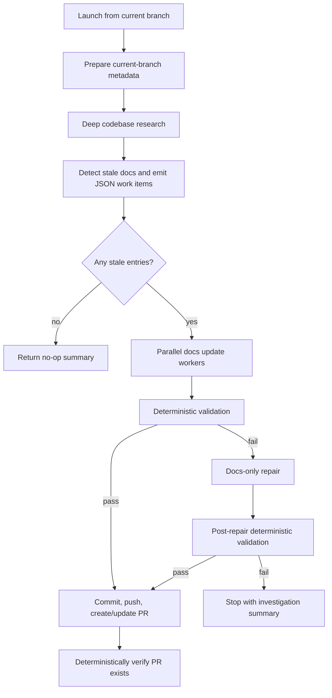

# Release Docs Workflow Technical Design

| Document Metadata | Details |
| --- | --- |
| Author(s) | Norin Lavaee |
| Status | Updated after simplification |
| Team / Owner | Atomic developers |
| Created / Last Updated | 2026-06-07 |

## 1. Executive Summary

Create a project workflow at `.atomic/workflows/release-docs.ts` named `release-docs` that automates release documentation refreshes for Atomic developers. The simplified workflow has **no inputs**. It assumes the developer launches it from the branch that already contains the code changes that need documentation. It researches the current codebase, compares current behavior against docs under `packages/coding-agent/docs`, identifies stale or missing docs, updates grouped docs tasks in parallel, validates the Mintlify/docs checks, then commits, pushes, and opens a PR only after validation passes.

## 2. Context and Motivation

Release prep currently requires developers to manually connect code changes and hosted docs. The workflow should not require a target release ref or a baseline release tag because the current branch is the source of truth for the code that needs documentation. The repo already has documented release docs checks in `docs/ci.md`: `cd packages/coding-agent && bun run docs:check`, `cd packages/coding-agent/docs && bunx --bun mintlify@latest validate`, and `cd packages/coding-agent/docs && bunx --bun mintlify@latest broken-links`.

## 3. Goals and Non-Goals

### Goals

- Create a reusable workflow named `release-docs` under `.atomic/workflows`.
- Declare no workflow inputs; the current branch/check-out is the target.
- Do not create or switch branches.
- Research current Atomic code behavior and compare it to docs under `packages/coding-agent/docs`.
- Detect stale or missing docs only under `packages/coding-agent/docs`.
- Fan out independent docs update tasks in parallel.
- Run deterministic docs validation before PR creation, invoking repair only when validation fails.
- Commit, push, and create/update a GitHub PR targeting `main` only when validation passes, docs changed, and the PR can be verified deterministically.

### Non-Goals

- Do not publish releases or push release tags.
- Do not update changelogs or package versions.
- Do not prompt for human input during the workflow run.
- Do not accept `target_ref` or model a baseline-vs-target release range.
- Do not create or switch to a dedicated docs branch.
- Do not open an empty/no-op PR when no docs changes are needed.
- Do not edit docs outside `packages/coding-agent/docs` unless validation fixes require generated references in the same docs tree.

## 4. Proposed Solution

### 4.1 Starter Pattern

Use **fan-out-and-synthesize** for stale-doc updates, followed by **adversarial verification** through a validation/repair gate.



### 4.2 Key Components

| Component | Responsibility |
| --- | --- |
| Deterministic helpers | Ensure the worktree is clean, reject base-branch runs, capture the current branch, create artifact directories, parse stale-doc JSON, verify update artifacts, run validation commands, and verify PR existence. |
| `deep-research-codebase` child workflow | Research current code behavior and write a reusable research artifact. |
| Stale-doc detector stage | Inspect docs and research, then produce grouped JSON update tasks with non-overlapping owning docs files. |
| Parallel update stages | Apply doc edits only to each task's owning docs files for independent stale-doc groups. |
| Validation/repair stage | Run repo docs checks deterministically, invoke docs-only repair only on failure, then rerun deterministic checks. |
| PR stage | Commit, push, create/update the PR against `main`, then verify the open PR exists for the current branch and base. |

### 4.3 Door Set at a Glance

- `prepare_release_docs_current_branch` ⚠
- `research_current_code_docs_gaps`
- `identify_stale_docs`
- `update_stale_docs_in_parallel` ⚠
- `validate_release_docs`
- `open_release_docs_pr` ⚠

## 5. Detailed Design

### 5.1 Entrypoint Contracts

```ts
release_docs(): ReleaseDocsResult
```

Guarantee: refreshes Atomic hosted docs for the current branch and opens/updates a PR only after docs validation passes.

Failures/refusals:
- Refuses to run when the working tree is dirty before docs edits begin.
- Refuses to run directly on the PR base branch (`main`).
- Refuses PR creation when validation cannot be made green.
- Refuses concurrent docs file conflicts by grouping stale entries by owning docs files before fan-out and requiring workers to edit only those owning docs files.
- Refuses to report `pr_created` unless an open PR for the current branch and `main` can be verified deterministically.

### 5.2 Branch Rules

- The workflow runs on the current branch.
- The workflow refuses to run when the current branch is `main`, because the PR stage pushes the current branch and targets `main`.
- The workflow does not create, switch, or track branches.
- The current branch should already contain the code changes whose docs need refreshing.
- The final PR stage pushes the current branch and creates/updates a PR targeting `main`, then the workflow verifies an open PR exists for the current branch and base.

### 5.3 Artifacts

Use `.atomic/workflows/runs/release-docs/<current-branch-slug>/` for durable handoffs:

- `release-metadata.json`
- `stale-doc-tasks.json`
- `updates/*.md`
- `validation.md`
- `validation-repair.md` when repair is needed
- `pr.md`

The metadata artifact records:

```json
{
  "current_branch": "feature/example",
  "docs_root": "packages/coding-agent/docs",
  "pr_base": "main",
  "mode": "current-branch-docs-refresh"
}
```

### 5.4 Validation Gate

The validation stage discovers checks from repo docs/scripts, with known commands from `docs/ci.md` as the default contract:

```sh
cd packages/coding-agent && bun run docs:check
cd packages/coding-agent/docs && bunx --bun mintlify@latest validate
cd packages/coding-agent/docs && bunx --bun mintlify@latest broken-links
```

Before validation, the workflow verifies every parallel update worker produced its expected non-empty `updates/*.md` artifact; missing or empty artifacts stop the run before validation and PR creation. The workflow then runs these checks deterministically before invoking any repair model. If the initial deterministic validation passes, the repair stage is skipped and the workflow proceeds to PR creation. If validation fails, the workflow writes the command output to `validation.md`, invokes a docs-only repair stage using that report, then deterministically reruns the same checks. If failures remain after repair, the workflow stops before commit/push/PR and returns an investigation summary.

## 6. Alternatives Considered

| Option | Pros | Cons | Decision |
| --- | --- | --- | --- |
| Require `target_ref` and compare to latest stable tag | Precise release-range analysis | Too much ceremony; branch already carries the target changes | Rejected after simplification. |
| Create a dedicated docs branch | Isolates docs commits | Adds branch churn and does not match current-branch workflow | Rejected. |
| Use current branch with no inputs | Fully headless and matches how developers run release prep | Requires developers to launch from the correct branch | Accepted. |
| Single docs update worker | Avoids conflicts | Slower and less isolated | Rejected; use grouped parallel workers. |

## 7. Test Plan

- Reload workflows with `workflow({ action: "reload" })`.
- Inspect inputs for `release-docs` and confirm there are no required inputs.
- Run repository typecheck with `bun run typecheck`.
- Do not execute the full workflow during implementation because it intentionally edits docs, commits, pushes, and opens PRs.

## 8. Backwards Compatibility

This is a project-only developer workflow. Removing `target_ref`, baseline outputs, and release-version outputs changes the workflow contract, but the workflow is new and not a published runtime API.

## 9. Open Questions / Resolved Decisions

- Workflow name: `release-docs`.
- Inputs: none.
- Branch behavior: use current branch; do not create/switch branch.
- Code/docs comparison: current codebase behavior vs current docs under `packages/coding-agent/docs`.
- Artifact path: `.atomic/workflows/runs/release-docs/<current-branch-slug>/`.
- Mintlify/docs checks: run deterministically first, repair only on failure, then rerun deterministically.
- Validation failure policy: repair failures before commit/PR only when deterministic validation fails; stop with investigation summary if still failing.
- PR base: `main`.
- No-op policy: skip commit/push/PR and return a no-op summary when there are no docs changes.
