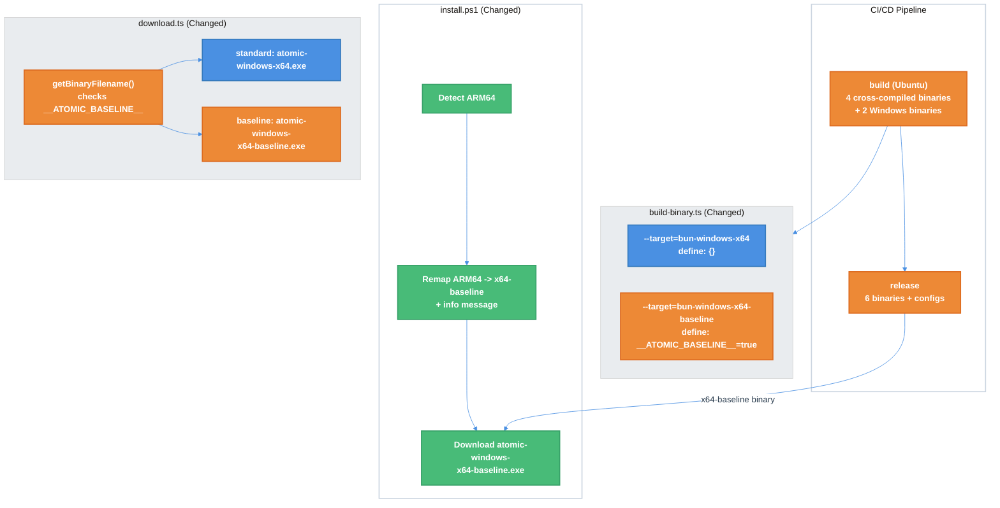

# Windows ARM64 Support Technical Design Document

| Document Metadata      | Details     |
| ---------------------- | ----------- |
| Author(s)              | flora131    |
| Status                 | Draft (WIP) |
| Team / Owner           | Atomic CLI  |
| Created / Last Updated | 2026-03-23  |

## 1. Executive Summary

Windows ARM64 users cannot install or run Atomic CLI due to two issues: (1) `install.ps1` detects ARM64 and requests `atomic-windows-arm64.exe`, which is never built or published -- resulting in a 404 ([#388](https://github.com/bastani/atomic/issues/388)); (2) even if a native ARM64 binary were built, it would crash because `bun:ffi`/TinyCC has no Windows ARM64 backend, breaking OpenTUI's native renderer ([#389](https://github.com/bastani/atomic/issues/389)).

The solution is to ship **two** Windows binaries: a **standard x64** build (with AVX) for the majority of native x64 users, and an **x64-baseline** build (without AVX) for ARM64 users running via Windows 11's Prism x64 emulation. The standard x64 build uses AVX/AVX2 instructions that Prism cannot emulate, but the **`bun-windows-x64-baseline`** compile target (with Bun >= v1.3.11) is guaranteed AVX-free by Bun's static verifier ([PR #27801](https://github.com/oven-sh/bun/pull/27801)). A build-time discriminator flag (`__ATOMIC_BASELINE__`) ensures the baseline binary self-updates to itself, not the standard binary.

**MVP scope (this PR):** 5 files:

1. `install.ps1` — ARM64-to-x64-baseline remapping (fixes #388)
2. `publish.yml` — two Windows build targets (standard + baseline) + baseline in release files (fixes #389)
3. `install.sh` — pass version/prerelease args on Windows delegation (pre-existing bug fix)
4. `build-binary.ts` — auto-derive `__ATOMIC_BASELINE__` flag from `--target` string containing `"baseline"`
5. `download.ts` — `getBinaryFilename()` respects `__ATOMIC_BASELINE__` flag for self-update artifact resolution

**Deferred to follow-up PR:** `build-binary.ts` (`inferTargetArch()` + ARM64 guard for local dev) and `prepare-opentui-bindings.ts` (`win32-arm64` removal). These are defensive hardening for local ARM64 Windows development, not required for the user-facing fix.

## 2. Context and Motivation

### 2.1 Current State

The Atomic CLI build pipeline produces binaries for 5 platform-architecture combinations via `.github/workflows/publish.yml`:

| Platform    | Binary                   | Build Location            |
| ----------- | ------------------------ | ------------------------- |
| Linux x64   | `atomic-linux-x64`       | Ubuntu (cross-compile)    |
| Linux arm64 | `atomic-linux-arm64`     | Ubuntu (cross-compile)    |
| macOS x64   | `atomic-darwin-x64`      | Ubuntu (cross-compile)    |
| macOS arm64 | `atomic-darwin-arm64`    | Ubuntu (cross-compile)    |
| Windows x64 | `atomic-windows-x64.exe` | `windows-latest` (native) |

**No Windows ARM64 binary is built, uploaded, or released.**

The installer scripts (`install.ps1`, `install.sh`) handle platform detection and binary download. `install.sh` already has a Rosetta 2 detection precedent that remaps x64 to arm64 on macOS Apple Silicon ([research: binary-distribution-installers](../research/docs/2026-01-21-binary-distribution-installers.md)).

OpenTUI's native renderer uses `bun:ffi` / `dlopen()` to load platform-specific DLLs. The dynamic import at `@opentui/core/index-nkrr8a4c.js:11227` resolves the binding using `process.platform` and `process.arch` ([research: opentui-distribution-ci-fix](../research/docs/2026-02-12-opentui-distribution-ci-fix.md)).

**Architecture:**

```
+------------------------------------------------------------+
|                   .github/workflows/publish.yml            |
+------------------------------------------------------------+
|  +---------------------------+  +--------------------------+|
|  |  build (ubuntu-latest)    |  | build-windows (win-x64)  ||
|  |  Cross-compiles 4 bins    |  | Native x64 build (1 bin) ||
|  |  + prepare:opentui-       |  | No --target flag         ||
|  |    bindings (5 platforms)  |  |                          ||
|  +------------+--------------+  +------------+-------------+|
|               +----------+------------------+              |
|                          v                                 |
|  +---------------------------------------------------------+|
|  |  release (ubuntu-latest)                                ||
|  |  5 binaries + configs + checksums -> GitHub Release     ||
|  |  MISSING: atomic-windows-arm64.exe                      ||
|  +---------------------------------------------------------+|
+------------------------------------------------------------+
          |
          v
+------------------------------------------------------------+
|  install.ps1 on ARM64 Windows                              |
|  1. $env:PROCESSOR_ARCHITECTURE = "ARM64"                  |
|  2. $Target = "windows-arm64.exe"                          |
|  3. Download URL -> 404 FAILURE                            |
+------------------------------------------------------------+
```

### 2.2 The Problem

**User Impact (Issue #388):** Windows ARM64 users cannot install Atomic CLI. The installer constructs a download URL for `atomic-windows-arm64.exe` which returns 404. Even if the download succeeded, `checksums.txt` has no entry for that file, so verification would also fail.

**Runtime Impact (Issue #389):** Even if a native ARM64 binary were built via `--target=bun-windows-arm64`, it would crash at startup. `bun:ffi` depends on TinyCC for JIT-compiled FFI bridges, and TinyCC has **no Windows ARM64 backend** (`cmake/Options.cmake`: `ENABLE_TINYCC=OFF` for Windows ARM64). OpenTUI's native renderer cannot load its platform DLL without `dlopen()` ([research: windows-arm64-support](../research/docs/2026-03-20-388-389-windows-arm64-support.md), Section 3).

**AVX/Prism Constraint:** Windows ARM64's Prism emulation layer does **not** support AVX/AVX2 instructions. The standard x64 Bun build (`bun-windows-x64`) uses AVX via `highway.zig` SIMD routines, causing `"CPU lacks AVX support"` crashes under Prism ([Bun #21869](https://github.com/oven-sh/bun/issues/21869)). The **x64-baseline** build target (`bun-windows-x64-baseline`) avoids AVX, and Bun >= v1.3.11 includes a static verifier ([PR #27801](https://github.com/oven-sh/bun/pull/27801)) that guarantees baseline builds are AVX-free at the CI level ([research: windows-arm64-support](../research/docs/2026-03-20-388-389-windows-arm64-support.md), Section 3.3).

**Local Developer Impact (Issue #389, deferred):** If a developer runs `bun run build` on a Windows ARM64 machine without `--target`, `process.arch` = `"arm64"` causes the build to embed `@opentui/core-win32-arm64`, which cannot be loaded at runtime. This is addressed in a follow-up PR via `inferTargetArch()` + ARM64 guard in `build-binary.ts`.

**Technical Root Cause:** The installer has no emulation-aware architecture remapping for Windows. The CI publishes a standard x64 build (with AVX) rather than a baseline build (without AVX). Additionally, the build script (`src/scripts/build-binary.ts`) has `inferTargetOs()` but no `inferTargetArch()` (addressed in follow-up PR).

## 3. Goals and Non-Goals

### 3.1 Functional Goals (MVP)

- [ ] Windows ARM64 users can install Atomic CLI via `install.ps1` without errors
- [ ] The installed baseline binary runs correctly on Windows ARM64 via Prism x64 emulation (AVX-free)
- [ ] Native x64 Windows users continue to receive the standard AVX-optimized binary
- [ ] `install.ps1` displays an informational message when remapping ARM64 to x64-baseline
- [ ] Checksum verification succeeds on ARM64 Windows installs
- [ ] CI uses the latest Bun version to guarantee the static AVX verifier (introduced in v1.3.11) is active
- [ ] CI produces two Windows binaries: `atomic-windows-x64.exe` (standard) and `atomic-windows-x64-baseline.exe` (AVX-free)
- [ ] The baseline binary self-updates to the baseline artifact (not the standard one) via a build-time `__ATOMIC_BASELINE__` flag
- [ ] `install.sh` passes version/prerelease args when delegating to `install.ps1` on Windows

### 3.2 Deferred Goals (Follow-Up PR)

- [ ] `inferTargetArch()` + ARM64 Windows guard: local builds on ARM64 Windows auto-remap to x64-baseline
- [ ] The build script prevents accidental native ARM64 Windows builds that would crash
- [ ] Remove unused `win32-arm64` binding from CI download list

### 3.3 Non-Goals (Out of Scope)

- [ ] Building a native `atomic-windows-arm64.exe` (blocked by TinyCC/`bun:ffi` limitation -- [Bun #28055](https://github.com/oven-sh/bun/issues/28055))
- [ ] Adding ARM64 Windows to the CI build matrix (no native binary to build)
- [ ] Modifying OpenTUI's FFI layer or TinyCC (upstream dependency)
- [ ] Supporting Windows 10 on ARM (Prism x64 emulation requires Windows 11)
- [ ] Performance optimization of x64 emulation via Prism

## 4. Proposed Solution (High-Level Design)

### 4.1 Strategy: Dual-Binary with Build-Time Discriminator

Since native ARM64 binaries are non-functional due to the TinyCC limitation, and standard x64 binaries crash under Prism due to AVX instructions, the solution ships **two** Windows binaries:

1. **`atomic-windows-x64.exe`** -- compiled with `--target=bun-windows-x64` (standard, with AVX). For native x64 users (the majority).
2. **`atomic-windows-x64-baseline.exe`** -- compiled with `--target=bun-windows-x64-baseline` (AVX-free). For ARM64 users via Prism emulation.

The critical design challenge is **self-update correctness**: under Prism, `process.arch === "x64"` — identical to native x64. There is no reliable runtime signal to distinguish the two environments. A **build-time discriminator flag** (`__ATOMIC_BASELINE__`) solves this using a Strategy-like pattern:

3. **`build-binary.ts` auto-derives `__ATOMIC_BASELINE__`** from the `--target` string — if it contains `"baseline"`, the flag is injected via `Bun.build()`'s `define` block. No new CLI flags needed.
4. **`download.ts` checks `__ATOMIC_BASELINE__`** in `getBinaryFilename()` — the baseline binary self-updates to `atomic-windows-x64-baseline.exe`, the standard binary self-updates to `atomic-windows-x64.exe`. No cross-contamination.
5. **`install.ps1` remaps ARM64 to the baseline artifact** — ARM64 users download `atomic-windows-x64-baseline.exe`.
6. **Fix `install.sh` Windows delegation** -- pass version/prerelease args to `install.ps1` (pre-existing bug discovered during this research).

Architecture inference in `build-binary.ts` (`inferTargetArch()` + ARM64 guard for local development) is deferred to a follow-up PR.

This approach mirrors the **inverse** of the macOS Rosetta 2 pattern already in `install.sh:155-161`, where x64 is remapped to arm64 because the native binary is preferred. On Windows ARM64, the x64-baseline binary is the only working option ([research: windows-arm64-support](../research/docs/2026-03-20-388-389-windows-arm64-support.md), Approach D; [research: dual-binary-windows-approach](../research/docs/2026-03-23-dual-binary-windows-approach.md)).

### 4.2 System Architecture (Post-Change)



### 4.3 Key Components (MVP)

| Component                         | Change                                                                                         | Justification                                                                      |
| --------------------------------- | ---------------------------------------------------------------------------------------------- | ---------------------------------------------------------------------------------- |
| `install.ps1`                     | Remap ARM64 to `windows-x64-baseline.exe` with informational message                           | Fixes #388: ARM64 users download the AVX-free baseline binary                      |
| `.github/workflows/publish.yml`   | Build two Windows binaries: standard x64 + x64-baseline; add baseline to release files         | Preserves AVX for native x64 users; provides AVX-free binary for ARM64 Prism users |
| `src/scripts/build-binary.ts`     | Auto-derive `__ATOMIC_BASELINE__` from `--target` containing `"baseline"`; inject via `define` | Build-time discriminator: baseline binary knows it's baseline for self-update      |
| `src/services/system/download.ts` | `getBinaryFilename()` checks `__ATOMIC_BASELINE__` to select correct artifact                  | Self-update correctness: baseline updates to baseline, standard to standard        |
| `install.sh`                      | Pass version/prerelease args to `install.ps1` on Windows delegation                            | Fixes pre-existing edge case where `install.sh` on MSYS/Cygwin loses version info  |

### 4.4 Deferred Components (Follow-Up PR)

| Component                                 | Change                                        | Justification                                                                        |
| ----------------------------------------- | --------------------------------------------- | ------------------------------------------------------------------------------------ |
| `src/scripts/build-binary.ts`             | Add `inferTargetArch()` + ARM64 Windows guard | Defensive: local ARM64 Windows builds auto-remap to x64-baseline instead of crashing |
| `src/scripts/prepare-opentui-bindings.ts` | Remove `win32-arm64` from `DEFAULT_PLATFORMS` | CI optimization: avoids downloading an unusable binding; trivial to re-add later     |

## 5. Detailed Design (MVP)

### 5.1 `install.ps1` -- Architecture Remapping

**File:** `install.ps1:198-208`

**Current code:**

```powershell
$Arch = $env:PROCESSOR_ARCHITECTURE
switch ($Arch) {
    "AMD64" { $Target = "windows-x64.exe" }
    "ARM64" { $Target = "windows-arm64.exe" }
    default {
        Write-Err "Unsupported architecture: $Arch"
        exit 1
    }
}
```

**Proposed change:**

```powershell
$Arch = $env:PROCESSOR_ARCHITECTURE
switch ($Arch) {
    "AMD64" { $Target = "windows-x64.exe" }
    "ARM64" {
        Write-Info "Windows ARM64 detected -- installing x64-baseline binary (runs via x64 emulation; requires Windows 11)"
        $Target = "windows-x64-baseline.exe"
    }
    default {
        Write-Err "Unsupported architecture: $Arch"
        Write-Err "Atomic CLI requires 64-bit Windows (x64 or ARM64)"
        exit 1
    }
}
```

**Rationale:**

- ARM64 maps to `windows-x64-baseline.exe` — the AVX-free binary safe for Prism emulation
- Native x64 users (`AMD64`) continue to get `windows-x64.exe` — the standard AVX-optimized binary
- An informational message tells the user what's happening and why, including that Windows 11 is required
- Checksum verification succeeds because `checksums.txt` contains entries for both `windows-x64.exe` and `windows-x64-baseline.exe` (generated by `sha256sum *`)
- No changes needed to the download URL construction logic at line 292 — it uses `$Target` directly
- No separate Windows version detection block — the message is self-documenting. Users on Windows 10 ARM64 will see the Windows 11 requirement and understand.

### 5.2 `publish.yml` -- Dual Windows Binaries + Latest Bun

**File:** `.github/workflows/publish.yml`

**Change 1: Use latest Bun version** in the `build` job (line 38-40):

```yaml
- name: Setup Bun
  uses: oven-sh/setup-bun@v2
  with:
      bun-version: latest
```

**Why `latest` (not an exact pin):** The static AVX verifier was introduced in Bun v1.3.11 ([PR #27801](https://github.com/oven-sh/bun/pull/27801)) and is present in all subsequent versions. Using `latest` ensures we always have the verifier while also picking up bug fixes and performance improvements without manual version bumps. The tradeoff is that a future Bun release could theoretically introduce breaking changes, but Bun has a strong backwards-compatibility track record and the CI test suite provides a safety net.

**Change 2: Two Windows build lines** (in the `build` job, after the macOS arm64 line):

Current code (on this branch):

```yaml
# Windows x64 (baseline -- AVX-free for ARM64 Prism compatibility)
bun run src/scripts/build-binary.ts --minify --target=bun-windows-x64-baseline --outfile dist/atomic-windows-x64.exe
```

Proposed change:

```yaml
# Windows x64 (standard -- with AVX for native x64 users)
bun run src/scripts/build-binary.ts --minify --target=bun-windows-x64 --outfile dist/atomic-windows-x64.exe

# Windows x64-baseline (AVX-free for ARM64 Prism compatibility)
bun run src/scripts/build-binary.ts --minify --target=bun-windows-x64-baseline --outfile dist/atomic-windows-x64-baseline.exe
```

**Change 3: Add baseline to release files list** (line 166):

```yaml
files: |
    dist/atomic-linux-x64
    dist/atomic-linux-arm64
    dist/atomic-darwin-x64
    dist/atomic-darwin-arm64
    dist/atomic-windows-x64.exe
    dist/atomic-windows-x64-baseline.exe
    dist/atomic-config.tar.gz
    dist/atomic-config.zip
    dist/checksums.txt
```

**Rationale:**

- Native x64 users keep the AVX-optimized standard binary — no performance regression for the majority
- ARM64 Prism users get the AVX-free baseline binary — guaranteed safe by Bun's static verifier ([PR #27801](https://github.com/oven-sh/bun/pull/27801))
- Checksums auto-include both binaries via `sha256sum *` — no manual checksum logic changes needed
- The `__ATOMIC_BASELINE__` flag is auto-derived by `build-binary.ts` from the target string containing `"baseline"` — the CI invocation syntax requires no special flags

**Tradeoff vs single-baseline:** One additional build step (~30s) and one additional release artifact (~80MB). Negligible CI cost for preserving AVX performance for the x64 majority. The cocoindex-code embedding workload runs in a separate Python process unaffected by the Bun binary's compile target, but other Bun-internal SIMD paths (string parsing, HTTP handling via `highway.zig`) do benefit from AVX on native x64 hardware.

### 5.3 `install.sh` -- Windows Delegation Fix

**File:** `install.sh:140-144`

**Current code:**

```bash
mingw*|msys*|cygwin*)
    info "Windows detected -- delegating to install.ps1"
    powershell -c "irm https://raw.githubusercontent.com/${GITHUB_REPO}/main/install.ps1 | iex"
    exit $?
    ;;
```

**Proposed change:**

```bash
mingw*|msys*|cygwin*)
    info "Windows detected -- delegating to install.ps1"
    local ps_args=""
    if [[ -n "${VERSION:-}" ]]; then ps_args="$ps_args -Version $VERSION"; fi
    if [[ "${PRERELEASE:-false}" == "true" ]]; then ps_args="$ps_args -Prerelease"; fi
    powershell -Command "& { irm https://raw.githubusercontent.com/${GITHUB_REPO}/main/install.ps1 | iex } $ps_args"
    exit $?
    ;;
```

**Rationale:** Currently `install.sh` drops version/prerelease arguments when delegating to `install.ps1`. This is a pre-existing bug unrelated to ARM64 but discovered during this research. Included in this PR since the code is being touched and the fix is minimal.

### 5.4 `build-binary.ts` -- `__ATOMIC_BASELINE__` Build-Time Discriminator

**File:** `src/scripts/build-binary.ts`

**Proposed change** (between `const compileTargetOs = ...` at line 78 and `const result = await Bun.build(...)` at line 80):

```typescript
const isBaseline = options.target?.includes("baseline") ?? false;
```

And in the `define` block of `Bun.build()`:

```typescript
define: {
  OTUI_TREE_SITTER_WORKER_PATH: JSON.stringify(`${getBunfsRoot(compileTargetOs)}${workerRelativePath}`),
  ...(isBaseline ? { __ATOMIC_BASELINE__: JSON.stringify(true) } : {}),
},
```

**How it works:** Bun's `define` performs global text substitution at bundle time (identical to esbuild's `define`). When `--target=bun-windows-x64-baseline` is passed, the target string contains `"baseline"`, so `isBaseline = true`, and `__ATOMIC_BASELINE__` is replaced with `true` (boolean) in all bundled source code. In the standard build (`--target=bun-windows-x64`), the flag is never defined, so `typeof __ATOMIC_BASELINE__` evaluates to `"undefined"` at runtime.

**Design decision -- auto-derive vs explicit flag:** The `isBaseline` check derives from the existing `--target` string. No new `--baseline` CLI flag is needed. This follows the principle of not adding flags for information already present in existing parameters. If a future compile target contains `"baseline"` in its name, it will automatically get the flag — which is the correct behavior.

### 5.5 `download.ts` -- Self-Update Artifact Resolution

**File:** `src/services/system/download.ts:307-340`

**Current code:**

```typescript
export function getBinaryFilename(): string {
    const platform = process.platform;
    const arch = process.arch;

    // ... platform and arch switch statements ...

    const ext = platform === "win32" ? ".exe" : "";
    return `atomic-${os}-${archStr}${ext}`;
}
```

**Proposed change:**

```typescript
declare const __ATOMIC_BASELINE__: boolean | undefined;

export function getBinaryFilename(): string {
    const platform = process.platform;
    const arch = process.arch;

    // ... platform and arch switch statements (unchanged) ...

    const ext = platform === "win32" ? ".exe" : "";
    const baselineSuffix =
        typeof __ATOMIC_BASELINE__ !== "undefined" && __ATOMIC_BASELINE__
            ? "-baseline"
            : "";
    return `atomic-${os}-${archStr}${baselineSuffix}${ext}`;
}
```

**How it works:**

- **Standard build:** `__ATOMIC_BASELINE__` is never defined → `typeof` returns `"undefined"` → `baselineSuffix = ""` → returns `atomic-windows-x64.exe`
- **Baseline build:** `__ATOMIC_BASELINE__` is replaced with `true` at bundle time → `typeof` returns `"boolean"` → `baselineSuffix = "-baseline"` → returns `atomic-windows-x64-baseline.exe`

**Why `declare const` + `typeof` guard:** The `declare` tells TypeScript the identifier may exist as a global constant (injected by `define`). The `typeof` guard prevents a `ReferenceError` at runtime when the identifier is not defined (standard builds). This is the idiomatic pattern for build-time feature flags in Bun/esbuild.

**Self-update correctness:** The baseline binary always self-updates to `atomic-windows-x64-baseline.exe`, and the standard binary always self-updates to `atomic-windows-x64.exe`. No cross-contamination is possible because the flag is baked in at compile time.

**Checksum verification:** `verifyChecksum()` receives `expectedFilename` from `getBinaryFilename()`, so it automatically verifies against the correct checksum entry. No changes needed to verification logic.

### 5.6 Self-Update Flow (Summary)

```
User runs `atomic update`
  -> update.ts:242 calls getBinaryFilename()
    -> checks typeof __ATOMIC_BASELINE__
      -> STANDARD build: undefined -> "atomic-windows-x64.exe"
      -> BASELINE build: true     -> "atomic-windows-x64-baseline.exe"
  -> getDownloadUrl(version, filename) -> GitHub release URL
  -> downloadFile() + verifyChecksum()
  -> replace current binary
```

No other changes to `download.ts` or `update.ts` are needed. The existing flow works correctly once `getBinaryFilename()` returns the right filename.

## 6. Deferred Design (Follow-Up PR)

The following changes are defensive hardening for local ARM64 Windows development. They are **not required** for the user-facing fix (dual-binary + `__ATOMIC_BASELINE__` self-update) but improve the developer experience on ARM64 Windows machines.

### 6.1 `build-binary.ts` -- `inferTargetArch()` Function + ARM64 Guard

**File:** `src/scripts/build-binary.ts`

**New function** (adjacent to existing `inferTargetOs()` at line 45):

```typescript
function inferTargetArch(target: string | undefined): NodeJS.Architecture {
    if (target) {
        const t = target.toLowerCase();
        if (t.includes("arm64")) return "arm64";
        if (t.includes("x64")) return "x64";
    }
    return process.arch;
}
```

**Build entry point modification** (around line 71, before `inferTargetOs()`):

The ARM64 guard must run **before** any target inference to avoid temporal coupling between `options.target` mutation and derived values:

```typescript
const options = parseBuildOptions(Bun.argv.slice(2));

// ARM64 Windows guard: remap before any inference
if (
    !options.target &&
    process.platform === "win32" &&
    process.arch === "arm64"
) {
    console.warn(
        "Warning: Windows ARM64 host detected. bun:ffi is unavailable on ARM64. " +
            "Auto-remapping to --target=bun-windows-x64-baseline (runs via Prism emulation).",
    );
    options.target = "bun-windows-x64-baseline";
}
if (options.target && /windows.*arm64|arm64.*windows/i.test(options.target)) {
    console.error(
        `Error: --target=${options.target} is not supported. ` +
            `bun:ffi/TinyCC has no Windows ARM64 backend, so the resulting binary would crash.\n` +
            `Use --target=bun-windows-x64-baseline instead (runs via Prism emulation on ARM64 Windows).`,
    );
    process.exit(1);
}

const compileTargetOs = inferTargetOs(options.target);
const compileTargetArch = inferTargetArch(options.target);
```

**Design notes:**

- The guard runs **before** `inferTargetOs()` / `inferTargetArch()` so all derived values see the final effective target — no temporal coupling.
- `inferTargetArch()` returns `NodeJS.Architecture` (not `string`) for type safety, consistent with `inferTargetOs()` returning `NodeJS.Platform`.
- When `--target=bun-windows-x64-baseline` is injected, Bun's `CompileTarget.defineValues()` sets `process.platform = "win32"` and `process.arch = "x64"` at bundle time, so the OpenTUI dynamic import resolves to `@opentui/core-win32-x64` — the correct, working binding.

### 6.2 `prepare-opentui-bindings.ts` -- Remove Unused Binding

**File:** `src/scripts/prepare-opentui-bindings.ts:7-13`

**Current code:**

```typescript
const DEFAULT_PLATFORMS = [
    "darwin-x64",
    "darwin-arm64",
    "linux-arm64",
    "win32-x64",
    "win32-arm64",
] as const;
```

**Proposed change:**

```typescript
const DEFAULT_PLATFORMS = [
    "darwin-x64",
    "darwin-arm64",
    "linux-arm64",
    "win32-x64",
] as const;
```

**Decision: Remove `"win32-arm64"`.** No binary targeting that platform is built, so downloading the binding is wasted CI work. Re-adding it later is trivial (single string in an array) and carries no tech debt risk.

## 7. Alternatives Considered

| Option                                           | Pros                                                                                                                       | Cons                                                                                                                                 | Reason for Rejection                                                                                                              |
| ------------------------------------------------ | -------------------------------------------------------------------------------------------------------------------------- | ------------------------------------------------------------------------------------------------------------------------------------ | --------------------------------------------------------------------------------------------------------------------------------- |
| **A: Build native ARM64 binary**                 | Native performance, no emulation                                                                                           | Crashes immediately -- `bun:ffi`/TinyCC has no ARM64 backend ([Bun #28055](https://github.com/oven-sh/bun/issues/28055))             | Fundamentally broken; TinyCC limitation is upstream and unfixable by Atomic                                                       |
| **B: Publish x64 binary as `windows-arm64.exe`** | No installer changes needed; ARM64 users get "their" binary                                                                | Misleading naming; two identical binaries in release; larger release size; confusing checksum entries                                | Deceptive; creates maintenance burden of keeping two names in sync                                                                |
| **C: Use standard x64 build (without baseline)** | No CI changes; simplest path                                                                                               | Standard x64 uses AVX/AVX2 that Prism cannot emulate -- crashes on ARM64 ([Bun #21869](https://github.com/oven-sh/bun/issues/21869)) | Broken on ARM64. This was the gap in the original spec.                                                                           |
| **D: Ship single x64-baseline**                  | AVX-free; single binary; simple                                                                                            | Native x64 users lose AVX optimizations; Bun-internal SIMD paths (`highway.zig` string parsing, HTTP) run slower                     | Penalizes the x64 majority for ARM64 minority; AVX matters for Bun internals even in a TUI                                        |
| **E: Error on ARM64 with "unsupported"**         | Simple to implement                                                                                                        | Blocks all ARM64 Windows users; hostile UX                                                                                           | Unnecessarily restrictive when x64-baseline emulation works                                                                       |
| **F: Ship two Windows binaries (Selected)**      | Native x64 users keep AVX; ARM64 users get AVX-free baseline; self-update stays on correct track via `__ATOMIC_BASELINE__` | One additional build step (~30s); one extra release artifact (~80MB); requires build-time discriminator for self-update              | **Selected:** Preserves AVX for the majority while unblocking ARM64. Build-time flag solves self-update cleanly. Minimal CI cost. |

## 8. Cross-Cutting Concerns

### 8.1 Security and Privacy

- **No new security surface:** The x64-baseline binary is the same code as the standard x64 binary, just compiled without AVX optimizations; no new code paths or permissions
- **Checksum integrity preserved:** ARM64 users verify the same `atomic-windows-x64.exe` checksum that x64 users verify -- no special-casing needed
- **No code signing changes:** The binary is identical in content (different compilation flags), so existing signing (if any) applies unchanged

### 8.2 Observability Strategy

- **Installer log message:** `install.ps1` prints an informational message when remapping ARM64 to x64, visible in the user's terminal
- **Build script warning/error (deferred):** `build-binary.ts` will print a `console.warn` when auto-remapping on ARM64 Windows (implicit), or `console.error` + exit when `--target=bun-windows-arm64` is explicitly passed (follow-up PR)
- **No telemetry changes:** The existing telemetry pipeline (if any) will report `process.arch = "x64"` since the binary runs as x64 under Prism -- this is expected and correct

### 8.3 Compatibility

- **Windows 11 ARM64:** Fully supported via Prism x64 emulation (24H2+). Prism is built into the OS and requires no user configuration
- **Windows 10 ARM64:** x64 emulation is available starting with Windows 10 Insider Build 21277 (November 2020). May have reduced performance compared to Prism. `install.ps1` notes that Windows 11 is required in its ARM64 info message, but does not block installation
- **Native x64 Windows:** Fully supported. Baseline binary has no AVX optimizations, but performance impact is negligible for a TUI application
- **CI/CD:** Requires Bun >= v1.3.11 (using `latest`) in all CI jobs; the static AVX verifier is present in v1.3.11 and all subsequent versions
- **Future TinyCC support:** If TinyCC gains ARM64 Windows support ([Bun #28055](https://github.com/oven-sh/bun/issues/28055)), the remapping logic can be reverted and a native ARM64 binary added to the CI matrix. Changes are isolated and easily reversible.

### 8.4 Bun Version Dependency

This approach requires **Bun >= v1.3.11** for the CI build environment. Without this version (or later), baseline builds may still contain AVX instructions (the leak through `highway.zig` that caused crashes in v1.2.19). Setting Bun to `latest` in `publish.yml` ensures we always have the static AVX verifier while also benefiting from ongoing Bun improvements.

Key Bun PRs that enable this approach:

- [PR #27121](https://github.com/oven-sh/bun/pull/27121) (merged Feb 21, 2026) -- CI verification for baseline CPU instructions on Windows
- [PR #27801](https://github.com/oven-sh/bun/pull/27801) (merged Mar 11, 2026) -- **Static baseline CPU instruction verifier** that fails the build if AVX/AVX2 instructions are found

## 9. Migration, Rollout, and Testing

### 9.1 Deployment Strategy

- [ ] **Phase 1 — MVP (this PR):** Implement `install.ps1`, `publish.yml`, `build-binary.ts`, `download.ts`, and `install.sh` changes. CI produces two Windows binaries.
- [ ] **Phase 2 — Merge + Release:** Merge to `main`. The next release includes both `atomic-windows-x64.exe` (standard) and `atomic-windows-x64-baseline.exe` (AVX-free). ARM64 Windows installs now download the baseline binary instead of 404.
- [ ] **Phase 3 — Hardening (follow-up PR):** Add `inferTargetArch()` + ARM64 guard to `build-binary.ts`. Remove `win32-arm64` from `prepare-opentui-bindings.ts`.

### 9.2 Rollback Plan

All changes are backwards-compatible. If issues arise:

- Revert the `publish.yml` changes to remove the baseline build step and release asset (native x64 users unaffected)
- Revert the `install.ps1` ARM64 case to restore the previous behavior (404 on ARM64 -- same as current broken state)
- Revert `build-binary.ts` and `download.ts` changes (no effect on standard builds since `__ATOMIC_BASELINE__` is only injected for baseline targets)

No data migration is needed. The standard `atomic-windows-x64.exe` asset name is unchanged.

### 9.3 Test Plan

**Integration Tests (MVP):**

- [ ] `publish.yml` change: CI build job succeeds with both `--target=bun-windows-x64` and `--target=bun-windows-x64-baseline`
- [ ] Both `atomic-windows-x64.exe` and `atomic-windows-x64-baseline.exe` appear in the release assets
- [ ] `checksums.txt` contains entries for both Windows binaries
- [ ] `install.ps1` on ARM64 Windows: `$Target` resolves to `"windows-x64-baseline.exe"` (not `"windows-arm64.exe"`)
- [ ] `install.ps1` on native x64 Windows: `$Target` resolves to `"windows-x64.exe"` (unchanged)
- [ ] `build-binary.ts` with `--target=bun-windows-x64-baseline`: `__ATOMIC_BASELINE__` is injected into the define block
- [ ] `build-binary.ts` with `--target=bun-windows-x64`: `__ATOMIC_BASELINE__` is NOT injected
- [ ] `download.ts`: baseline binary's `getBinaryFilename()` returns `"atomic-windows-x64-baseline.exe"`
- [ ] `download.ts`: standard binary's `getBinaryFilename()` returns `"atomic-windows-x64.exe"`

**E2E Tests (ARM64 Windows):**

- [ ] Run `install.ps1` on ARM64 Windows -> downloads `atomic-windows-x64-baseline.exe` successfully
- [ ] Verify checksum passes on ARM64 Windows install
- [ ] Run installed `atomic` binary on ARM64 Windows -> TUI renders correctly via Prism emulation
- [ ] Basic TUI operations work: chat, init, update commands
- [ ] Self-update (`atomic update`) downloads `atomic-windows-x64-baseline.exe` (not `atomic-windows-x64.exe`)
- [ ] Run `install.sh` from Git Bash on ARM64 Windows -> delegates to `install.ps1` with correct behavior and version args

**E2E Tests (Native x64 Windows):**

- [ ] Run `install.ps1` on native x64 Windows -> downloads `atomic-windows-x64.exe` (standard, with AVX)
- [ ] Self-update (`atomic update`) downloads `atomic-windows-x64.exe` (not baseline)

**Unit Tests (deferred — follow-up PR):**

- [ ] `inferTargetArch()` returns `"x64"` for `--target=bun-windows-x64`
- [ ] `inferTargetArch()` returns `"x64"` for `--target=bun-windows-x64-baseline`
- [ ] `inferTargetArch()` returns `"arm64"` for `--target=bun-linux-arm64`
- [ ] `inferTargetArch()` returns `"arm64"` for `--target=bun-darwin-arm64`
- [ ] `inferTargetArch()` returns `process.arch` when no `--target` is provided
- [ ] ARM64 + Windows guard with explicit `--target=bun-windows-arm64` exits with error
- [ ] ARM64 + Windows guard without `--target` on ARM64 host remaps to `bun-windows-x64-baseline`
- [ ] ARM64 + non-Windows does NOT remap (Linux/macOS ARM64 builds are valid)

## 10. Open Questions / Unresolved Issues

- [x] **Q1: Should `win32-arm64` be removed from `DEFAULT_PLATFORMS` in `prepare-opentui-bindings.ts`?** **Resolved: Yes, remove it — deferred to follow-up PR.** No binary targeting that platform is built, so downloading the binding is wasted CI work. Re-adding is trivial (single string in an array) with no tech debt risk.

- [x] **Q2: Should `install.ps1` include a minimum Windows version check?** **Resolved: Inline message only.** The ARM64 info message mentions Windows 11 is required (`"runs via x64 emulation; requires Windows 11"`). No separate version detection block — keeps the code simple and the message is self-documenting. Users on Windows 10 ARM64 will understand.

- [x] **Q3: Should the build script error or auto-remap when `--target=bun-windows-arm64` is passed explicitly?** **Resolved: Error with explanation — deferred to follow-up PR.** When `--target=bun-windows-arm64` is explicitly passed, the build script should exit with a clear error. When no `--target` is passed on ARM64 Windows host, auto-remap to x64-baseline with a warning. Both behaviors are deferred since they only affect local ARM64 Windows development.

- [x] **Q4: Should `install.sh` Windows delegation be fixed in this PR or tracked separately?** **Resolved: Include in this PR.** The `install.sh` -> `install.ps1` delegation currently drops version/prerelease arguments. Since the code is being touched anyway, fix it in the same PR. Minimal additional risk.

- [x] **Q5: Should Bun be pinned to a specific version or use `latest`?** **Resolved: Use `latest` in all CI jobs.** Set Bun to `latest` across both `build` and `build-windows` jobs for consistency. The static AVX verifier was introduced in v1.3.11 and is present in all subsequent versions, so `latest` always includes it. Using `latest` avoids manual version bumps and ensures we benefit from ongoing Bun bug fixes and improvements. The CI test suite provides a safety net against potential breaking changes.

- [x] **Q6: Should CI produce two Windows binaries (standard + baseline) to preserve AVX optimizations for native x64 users?** **Resolved: Yes, dual binary.** Ship both `atomic-windows-x64.exe` (standard, with AVX) and `atomic-windows-x64-baseline.exe` (AVX-free for ARM64 Prism). While the TUI itself doesn't heavily use AVX, Bun's internal SIMD paths (`highway.zig` string parsing, HTTP handling) do benefit from AVX on native x64 hardware. A build-time `__ATOMIC_BASELINE__` flag ensures the baseline binary self-updates to itself. The added CI cost is one additional build step (~30s) and one extra release artifact.

- [x] **Q7: Is empirical ARM64 hardware validation required before merge, or can we ship based on the theoretical guarantee from Bun's static AVX verifier?** **Resolved: Ship it.** Bun's static AVX verifier (PR #27801) provides sufficient confidence. Build and ship, then test on ARM64 hardware post-release.

## Appendix A: Research References

| Document                             | Path                                                             | Relevance                                                                                                               |
| ------------------------------------ | ---------------------------------------------------------------- | ----------------------------------------------------------------------------------------------------------------------- |
| Windows ARM64 Support Research       | `research/docs/2026-03-20-388-389-windows-arm64-support.md`      | Primary research; documents all findings for #388 and #389, including Bun v1.3.10/v1.3.11 impact and baseline viability |
| Dual-Binary Windows Approach         | `research/docs/2026-03-23-dual-binary-windows-approach.md`       | Detailed mechanics of shipping two Windows binaries with `__ATOMIC_BASELINE__` build-time discriminator                 |
| Binary Distribution & Installers     | `research/docs/2026-01-21-binary-distribution-installers.md`     | Original installer design; first raised ARM64 as open question                                                          |
| Cross-Platform Support               | `research/docs/2026-01-20-cross-platform-support.md`             | Platform detection patterns in `src/utils/detect.ts`                                                                    |
| OpenTUI Distribution CI Fix          | `research/docs/2026-02-12-opentui-distribution-ci-fix.md`        | OpenTUI `optionalDependencies` pattern; `prepare-opentui-bindings` script                                               |
| OpenTUI Library Research             | `research/docs/2026-01-31-opentui-library-research.md`           | OpenTUI FFI architecture; `bun:ffi` + Zig native layer                                                                  |
| Install/Postinstall Analysis         | `research/docs/2026-02-25-install-postinstall-analysis.md`       | Multi-stage installation infrastructure                                                                                 |
| Bun Migration & Startup Optimization | `research/docs/2026-03-03-bun-migration-startup-optimization.md` | Bun build optimization context                                                                                          |

## Appendix B: Files to Modify

### MVP (This PR)

| File                              | Change Type | Description                                                                         |
| --------------------------------- | ----------- | ----------------------------------------------------------------------------------- |
| `install.ps1`                     | Edit        | Remap ARM64 to `windows-x64-baseline.exe` with informational message                |
| `.github/workflows/publish.yml`   | Edit        | Two Windows build lines (standard + baseline); add baseline to release files        |
| `src/scripts/build-binary.ts`     | Edit        | Auto-derive `__ATOMIC_BASELINE__` from target string; inject via `define` block     |
| `src/services/system/download.ts` | Edit        | `getBinaryFilename()` checks `__ATOMIC_BASELINE__` for correct self-update artifact |
| `install.sh`                      | Edit        | Pass version/prerelease args on Windows delegation                                  |

### Deferred (Follow-Up PR)

| File                                      | Change Type | Description                                                                                          |
| ----------------------------------------- | ----------- | ---------------------------------------------------------------------------------------------------- |
| `src/scripts/build-binary.ts`             | Edit        | Add `inferTargetArch()` + ARM64 Windows guard (error on explicit, remap on implicit to x64-baseline) |
| `src/scripts/prepare-opentui-bindings.ts` | Edit        | Remove `win32-arm64` from `DEFAULT_PLATFORMS`                                                        |

## Appendix C: Platform Coverage Matrix (Post-Change)

| Platform      | Installer Behavior                         | CI Build Target            | Release Artifact                  | Self-Update Target                    | Works?              |
| ------------- | ------------------------------------------ | -------------------------- | --------------------------------- | ------------------------------------- | ------------------- |
| Linux x64     | `linux-x64`                                | `bun-linux-x64`            | `atomic-linux-x64`                | `atomic-linux-x64`                    | Yes                 |
| Linux arm64   | `linux-arm64`                              | `bun-linux-arm64`          | `atomic-linux-arm64`              | `atomic-linux-arm64`                  | Yes                 |
| macOS x64     | `darwin-x64`                               | `bun-darwin-x64`           | `atomic-darwin-x64`               | `atomic-darwin-x64`                   | Yes                 |
| macOS arm64   | `darwin-arm64` (Rosetta remaps x64->arm64) | `bun-darwin-arm64`         | `atomic-darwin-arm64`             | `atomic-darwin-arm64`                 | Yes                 |
| Windows x64   | `windows-x64.exe`                          | `bun-windows-x64`          | `atomic-windows-x64.exe`          | `atomic-windows-x64.exe`              | Yes                 |
| Windows arm64 | **`windows-x64-baseline.exe` (remapped)**  | `bun-windows-x64-baseline` | `atomic-windows-x64-baseline.exe` | **`atomic-windows-x64-baseline.exe`** | **Yes (via Prism)** |

## Appendix D: External References

| Reference        | Link                                                                                  | Relevance                                                   |
| ---------------- | ------------------------------------------------------------------------------------- | ----------------------------------------------------------- |
| Bun #28055       | [Support bun:ffi on Windows ARM64](https://github.com/oven-sh/bun/issues/28055)       | Blocks native ARM64 path; Open, no milestone                |
| Bun #21869       | [x64 Bun crashes under Prism (AVX)](https://github.com/oven-sh/bun/issues/21869)      | Documents why standard x64 builds fail under Prism          |
| Bun PR #27801    | [Static baseline CPU instruction verifier](https://github.com/oven-sh/bun/pull/27801) | **Critical fix** -- guarantees baseline builds are AVX-free |
| Bun PR #27121    | [CI baseline verification for Windows](https://github.com/oven-sh/bun/pull/27121)     | CI-level AVX detection for baseline builds                  |
| Bun v1.3.11 Blog | [Bun v1.3.11](https://bun.sh/blog/bun-v1.3.11)                                        | Release containing the static AVX verifier                  |

## Appendix E: Future -- Native ARM64 Support

When [Bun #28055](https://github.com/oven-sh/bun/issues/28055) is resolved (TinyCC gains ARM64 Windows backend), the following changes would enable native ARM64 support:

1. `publish.yml` -- Add `--target=bun-windows-arm64` build step; remove `bun-windows-x64-baseline` build step
2. Release files -- Add `atomic-windows-arm64.exe`; remove `atomic-windows-x64-baseline.exe`
3. `build-binary.ts` -- Remove ARM64 Windows guard (if added in follow-up PR); `__ATOMIC_BASELINE__` logic can remain (harmless if no baseline target is built)
4. `install.ps1` -- Revert ARM64 -> x64-baseline remap; map ARM64 to `windows-arm64.exe`
5. `prepare-opentui-bindings.ts` -- Re-add `win32-arm64` to `DEFAULT_PLATFORMS` (if removed in follow-up PR)
6. `download.ts` (self-update) -- Already handles ARM64 via `process.arch`; remove `__ATOMIC_BASELINE__` check (or leave it -- harmless if no baseline binary is published)
